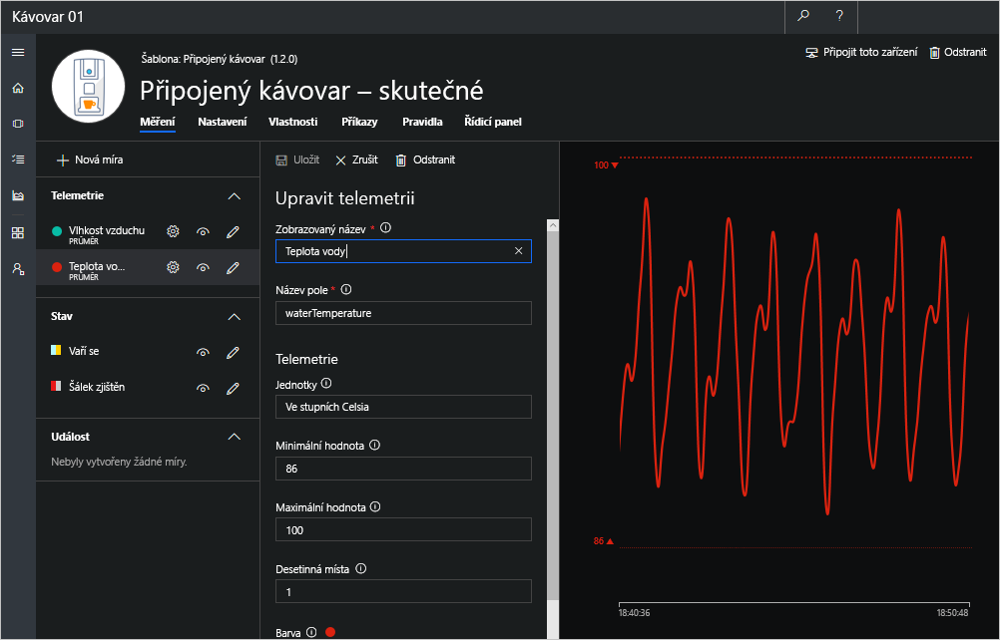

V Azure IoT Central jsou data, která si zařízení může vyměňovat s vaší aplikací, zadaná v šabloně zařízení, která definuje jeho chování a schopnosti – v tomto případě se jedná o kávovar. Když vytvoříte šablonu zařízení, vygeneruje se z této šablony simulované zařízení.

Toto simulované zařízení generuje telemetrická data, která umožňují otestovat chování vaší aplikace, než připojíte fyzické nebo skutečné zařízení. 

V této lekci vytvoříte pro kávovar šablonu zařízení, která specifikuje následující schopnosti a chování:

### Měření

Měření jsou data pocházející z vašeho zařízení. Do šablony zařízení můžete přidat několik měření, která budou odpovídat schopnostem zařízení.

* **Telemetrická měření:** Číselné datové body, které zařízení postupně shromažďuje. Jsou reprezentované jako nepřetržitý datový proud. Telemetrická měření v tomto scénáři zahrnují vlhkost vzduchu a teplotu vody. 

* **Měření stavu:** Stav zařízení nebo jeho součásti za časové období. V tomto scénáři nastavíte stavy Vaří se / Nevaří se a Šálek zjištěn / Šálek nezjištěn.

### Nastavení

Nastavení použijete k odeslání konfiguračních dat do zařízení z aplikace. V tomto scénáři upravíte v nastavení optimální teplotu vody a odešlete ji do kávovaru. Když se nastavení aktualizuje, bude v uživatelském rozhraní označené jako čekající, dokud zařízení nepotvrdí, že na změnu nastavení zareagovalo.

### Vlastnosti

Metadata zařízení přidružená k tomuto zařízení. Existují dva typy vlastností.

* *Vlastnosti aplikace* použijete k zaznamenání informací o zařízení v aplikaci. V tomto scénáři použijete vlastnosti aplikace k nastavení ideálního rozsahu teplot vody v kávovaru. Vlastnosti aplikace se ukládají do aplikace a se zařízením se nesynchronizují. 

* *Vlastnosti zařízení* použijete k tomu, abyste zařízení umožnili odeslat hodnoty vlastností do aplikace. Tyto vlastnosti může měnit jenom zařízení. V tomto scénáři nakonfigurujete v IoT Central vlastnost zařízení s názvem Zařízení po konci záruky. Pole Zařízení po konci záruky zůstane prázdné, dokud se kávovar k IoT Central nepřipojí. Jakmile se připojí, kávovar odešle stav záruky do aplikace. 

### Příkazy

Příkazy použijete ke vzdálené správě zařízení z aplikace. Příkazy můžete spouštět z cloudu přímo na zařízení a ovládat ho. V tomto scénáři spustíte na kávovaru příkazy ke spuštění údržby nebo vaření. 

## Vytvoření šablony zařízení pro kávovar
Šablona zařízení definuje chování a schopnosti zařízení – v tomto případě kávovaru.

1. Přejděte na **domovskou** stránku vaší aplikace na portálu Azure IoT Central a zvolte možnost **Vytvořit šablonu zařízení**.

> [!TIP]
> Na domovskou stránku se dostanete kliknutím na ikonu Domů v nabídce na levé straně.

1. Jako název vlastní šablony zařízení zadejte *Připojený kávovar*. 
 
1. Vyberte **Vytvořit**. Vytvořili jste pro kávovar prázdnou šablonu zařízení, ve které definujete chování a schopnosti tohoto přístroje. 

## Definování telemetrických měření teploty a vlhkosti
1. V šabloně zařízení **Připojený kávovar** zkontrolujte, že jste při definování telemetrických dat na stránce **Měření**. 

1. Pokud chcete přidat měření telemetrických dat teploty, zvolte **Upravit šablonu** a pak zvolte **+ Nové měření**. Potom jako typ měření zvolte **Telemetrie**.

1. Každý typ telemetrických dat, který pro šablonu zařízení definujete, zahrnuje možnosti konfigurace, jako jsou:
    * Možnosti zobrazení
    * Podrobnosti o telemetrických datech
    * Parametry simulace

    Ke konfiguraci telemetrických dat pro teplotu a vlhkost použijte informace v následující tabulce. Když vytváříte položky telemetrie, budete muset u každé položky v tabulce přidat nové měření – **+ Nové měření**.
    
    |Zobrazovaný název|Název pole|Jednotky|Minimum|Maximum|Desetinná místa|
    |---|---|---|---|---|---|
    |Teplota vody|waterTemperature|Ve stupních Celsia|86|100|1|
    |Vlhkost vzduchu|airHumidity|%|20|100|0|
   
    Můžete také zvolit barvu pro zobrazení telemetrických dat. Pokud chcete definici telemetrických dat uložit, zvolte **Save** (Uložit). Když budete v této lekci vytvářet další definice měření, nastavení, vlastností a příkazů, nezapomeňte je vždy po dokončení uložit.  

    > [!NOTE]
    > Názvy polí zadejte do šablony zařízení přesně tak, jak je uvedeno v tabulce. Pokud se názvy polí nebudou shodovat s názvy vlastností v odpovídajícím kódu zařízení, nepůjde telemetrická data v aplikaci zobrazit. Stejným způsobem postupujte, když zadáváte informace o nastavení a vlastnostech.

    

## Definování měření stavu pro Vaří se / Nevaří se a Šálek zjištěn / Šálek nezjištěn
Na stránce **Měření** přidejte po výběru možností **Upravit šablonu** a **+ Nové měření** následující stavy. Potom jako typ měření zvolte **Stav**:

Na stránce **Stav** > **Vaří se** přidejte hodnotu jako true. Kliknutím na **+** vedle **Hodnoty** přidejte jako druhou hodnotu false s volitelným zobrazovaným názvem Nevaří se. Nezapomeňte vybrat **Uložit**, abyste uložili provedené změny.

   |Zobrazovaný název|Název pole|Hodnota 1|Zobrazovaný název 1|Hodnota 2|Zobrazovaný název 2|
   |---|---|---|---|---|---|
   |Vaří se|stateBrewing|true|Vaří se|false|Nevaří se|
   |Šálek zjištěn|stateCupDetected|true|Šálek zjištěn|false|Šálek nezjištěn|

> [!NOTE]
> Po nadefinování telemetrických dat a stavu uvidíte na obrazovce zařízení simulovaná data generovaná ze šablony zařízení. Tato simulovaná data vám umožňují otestovat chování aplikace, než fyzické zařízení připojíte k IoT Central. 

## Nastavení optimální teploty kávovaru
Přejděte na stránku **Settings** (Nastavení) na kartě vedle **Measurements** (Měření). Klikněte na **Upravit šablonu**. Na stránce **Nastavení** přidejte v části **Knihovna** následující nastavení pro **Číslo**:

|Zobrazovaný název|Název pole|Jednotky|Desetinná místa|Minimum|Maximum|Počáteční|
|---|---|---|---|---|---|---|---|
|Optimální teplota|setTemperature|Ve stupních Celsia|1|86|100|95|

## Použití vlastností k uložení informací o záruce a teplotním rozsahu vody

Zvolením možnosti **Upravit šablonu** přidejte na stránce **Vlastnosti** následující vlastnosti pro **Číslo**:

|Zobrazovaný název|Název pole|Jednotky|Desetinná místa|Minimum|Maximum|Počáteční
|---|---|---|---|---|---|---|
|Minimální teplota kávovaru|propertyMinTemperature|Ve stupních Celsia|1|88|92|90|
|Maximální teplota kávovaru|propertyMaxTemperature|Ve stupních Celsia|1|96|99|98| 

Na stránce **Vlastnosti ** přidejte následující **Vlastnost zařízení**:

   |Zobrazovaný název|Název pole|Datový typ|
   |---|---|---|
   |Zařízení po konci záruky|propertyWarrantyExpired|číslo|

> [!NOTE]
> Vlastnost zařízení je odesílána vaším zařízením, v tomto případě kávovarem. Po připojení kávovaru k Azure IoT Central se vlastnost zařízení Warranty (Záruka) odešle do aplikace a zobrazí se v poli Zařízení po konci záruky. 

## Použití příkazů k nastavení režimu údržby a spuštění vaření

Zvolením možnosti **Upravit šablonu** přidejte na stránce **Příkazy** následující příkazy.

|Zobrazovaný název|Název pole|Výchozí časový limit|Datový typ|
|---|---|---|---|---|---|---|
|Nastavit režim údržby|cmdSetMaintenance|30|text| 
|Spustit vaření|cmdStartBrewing|30|text|