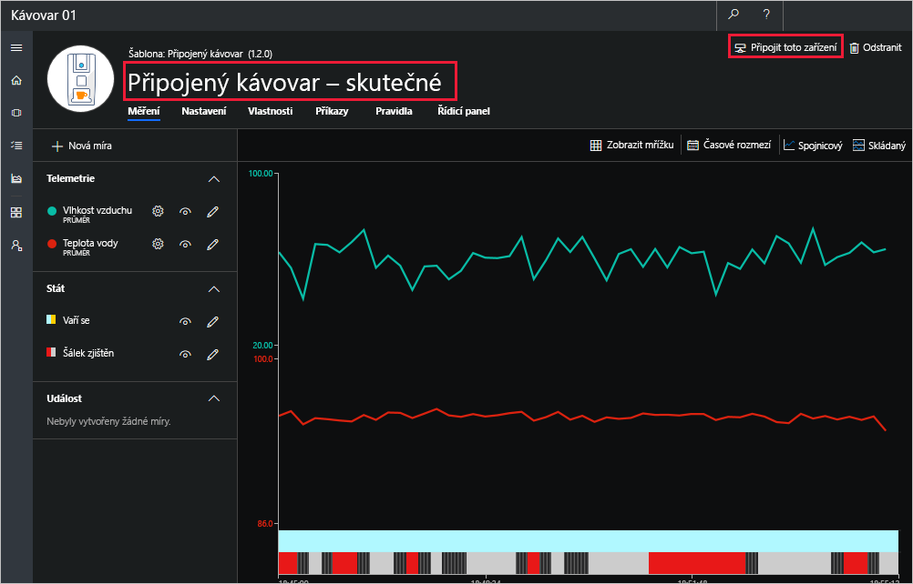

[!include[](../../../includes/azure-sandbox-activate.md)]

V praxi připojíte Azure IoT Central k fyzickému zařízení, t.j. kávovar s podporou IoT. V tomto případě budete simulovat zařízení s aplikací Node.js a připojíte ho k aplikaci Azure IoT Central. Naměřená telemetrie ze simulovaného kávovaru se bude odesílat do IoT Central pro účely monitorování a analýzy.

 

## <a name="add-the-coffee-machine-in-iot-central"></a>Přidání kávovaru v IoT Central 
K přidání svého kávovaru do aplikace použijete šablonu zařízení **Connected Coffee Maker** (Připojený kávovar), kterou jste vytvořili v předchozí lekci.

1. Pokud chcete přidat nové zařízení, zvolte v levé navigační nabídce možnost **Device Explorer**.

    Pokud chcete zahájit připojování vašeho kávovaru, zvolte **+ New** (+ Nový), **Real** (Skutečný) a potom **Vytvořit**. Jakmile budete hotovi, zobrazí se seznam zařízení, která jste vytvořili s použitím stejné šablony Connected Coffee Maker (Připojený kávovar).
   
    *   Po zvolení možností **+ New** (+ Nový) a pak **Real** (Skutečný) se do seznamu přidá zařízení Connected Coffee Maker (Připojený kávovar). 
    *   IoT Central automaticky vytvoří zařízení Connected Coffee Maker (Simulate) (Připojený kávovar (Simulace)) pro účely testování. 

1.  Volitelně můžete nově přidaný kávovar odlišit tím, že k jeho názvu přidáte slovo Real (Skutečný). Pokud chcete nové zařízení přejmenovat, zvolte zařízení a upravte název v poli s názvem. 

     

    Všimněte si umístění možnosti **Connect this device** (Připojit toto zařízení), kterou použijete k připojení kávovaru v další části. Protože jste se zatím ke kávovaru nepřipojili, prozatím se na obrazovce zobrazuje text „Missing Data“ (Chybějící data). Po připojení se obrazovka začne naplňovat skutečnými telemetrickými daty. 
 
## <a name="generate-connection-string-for-the-coffee-machine-from-your-application"></a>Generujte připojovací řetězec pro kávovar z vaší aplikace
Připojovací řetězec pro skutečný kávovar vložíte do kódu, který běží na zařízení. Připojovací řetězec umožňuje, aby se kávovar bezpečně připojil k aplikaci Azure IoT Central. Každá instance zařízení má jedinečný připojovací řetězec. V dalších krocích vygenerujte připojovací řetězec jako součást vytváření vaší aplikace node.js.

## <a name="create-a-nodejs-application"></a>Vytvoření aplikace Node.js
Následující kroky ukazují, jak vytvořit klientskou aplikaci implementující kávovar, který jste přidali do aplikace.

> [!TIP]
> V tomto cvičení vytvoříme aplikaci ve službě Azure Cloud Shell, takže na místním počítači nebudete muset nic instalovat. 

1. Spuštěním následujícího příkazu ve službě Azure Cloud Shell vytvořte složku `coffee-maker` a přejděte do ní:

    ```azurecli
    mkdir ~/coffee-maker
    cd ~/coffee-maker
    ```

1. Ze složky `coffee-maker` ve službě Cloud Shell spustíte následující příkaz k instalaci generátoru klíče Microsoft System Center Data Protection Manager: 

   ```azurecli
    npm install dps-keygen
   ```
    Tento příkaz nainstaluje balíček dps-keygen na naši místní složku `coffee-maker`. Necháme možnost `-g`, protože nemáme oprávnění k instalaci ve formě globálního balíčku.

    <!-- TODO: Add more information about the DPS key generator and what it's used for -->
 
1. Spuštěním následujícího příkazu ve službě Cloud Shell můžete stáhnout nástroj připojovacího řetězce služby DPS z Githubu: 

    ```azurecli
    wget https://github.com/Azure/dps-keygen/blob/master/bin/linux/dps_cstr?raw=true -O dps_cstr 
    ```

    > [!NOTE]
    > Stáhli jsme verzi Linuxu **dps_cstr**, protože máme spuštěnou službu Cloud Shell.

1. Spusťte následující příkaz a poskytněte `dps_cstr` oprávnění ke spouštění:

    ```azurecli
    chmod +x dps_cstr
    ```

    Pokud chcete generovat připojovací řetězec pro naše zařízení, budete potřebovat tři údaje z portálu Azure IoT Central:
    - **ID Oboru**
    - **ID zařízení**
    - **Primární klíč**

1. Vraťte se na portál IoT Central. Na obrazovce zařízení *Připojený kávovar – skutečný* vyberte v horní části obrazovky možnost **Připojit**.

1. V dialogovém okně připojení zařízení, které se otevře, si někam uložte příslušné hodnoty **ID oboru**, **ID zařízení** a **Primární klíč**, protože je použijeme později v tomto cvičení. 

1. Spusťte následující příkaz v Azure Cloud Shellu, nahraďte **< scope_id >**, **< device_id >**, a **< primary_key >** hodnotami, které jste si uložili v posledním kroku. 

   ```azurecli
   ./dps_cstr [scope_id] [device_id] [primary_key] > connection.txt
   ```
  
    Tento příkaz vygeneruje připojovací řetězec založený na hodnotách, které jste mu přiřadili, a zapisuje je do souboru, který jsme pojmenovali **connection.txt**.

    > [!IMPORTANT]
    > Příkaz `dps_cstr` není v CESTĚ v prostředí. Proto se přesvědčte o souladu s `./dps_cstr`

1. Otevřete editor integrovaného kódu v Azure Cloud Shellu spuštěním následujícího příkazu: 

    ```azurecli
    code
    ```
1. Vyberte **connection.txt** ze seznamu souborů v nabídce editoru **soubory**.

1. Ověřte, že **connection.txt** obsahuje připojovací řetězec, který začíná ``HostName=``.

1. Zavřete editor tak, že vyberete **Ukončit Editor** z nabídky (*... *) v pravé horní části editoru. 

1. Spuštěním následujícího příkazu ve službě Cloud Shell inicializujete projekt Node.js v naší složce `coffee-maker`:

    ```azurecli
    npm init
    ```
    > [!NOTE]
    > Skript init zobrazí výzvu k zadání vlastností projektu. Pro účely tohoto cvičení stiskněte klávesu ENTER a použijte všechny výchozí hodnoty.

1. Potřebné balíčky nainstalujte spuštěním následujícího příkazu v naší složce `coffee-maker`:

    ```azurecli
    npm install azure-iot-device azure-iot-device-mqtt --save
    ```

1. V prostředí Cloud Shell vytvořte spuštěním následujícího příkazu nový virtuální soubor v Cloud Shellu:

    ```azurecli
    touch coffeeMaker.js
    ```
1. Otevřete editor integrovaného kódu spuštěním následujícího příkazu na příkazovém řádku v Azure Cloud Shellu: 

     ```azurecli
    code
    ```
    
1. Když se otevře editor kódu, vyberte tlačítko aktualizace na seznamu **SOUBORY** a vyberte náš nový soubor **coffeeMaker.js**. 

1. Zkopírujte a vložte následující kód do prázdného okna editoru:

    ```js
    "use strict";

    // Use the Azure IoT device SDK for devices that connect to Azure IoT Central
    var clientFromConnectionString = require('azure-iot-device-mqtt').clientFromConnectionString;
    var Message = require('azure-iot-device').Message;

    // Connection string (TODO: CHANGE HERE)
    const connectionString = `{your device connection string}`;

    // Global variables
    var client = clientFromConnectionString(connectionString);
    var optimalTemperature = 96;
    var cupState = true;
    var brewingState = false;
    var cupTimer = 20;
    var brewingTimer = 0;
    var maintenanceState = false;
    var warrantyState = Math.random() < 0.5?0:1;

    // Helper function to produce nice numbers (##.#)
    function niceNumber(value) 
    {
        var number = (Math.round(value * 10.0)).toString();
        return number.substr(0, 2) + '.' + number.substr(2, 1);
    }

    // Send device simulated telemetry measurements
    function sendTelemetry() 
    {   
        // Simulate the telemetry values
        var temperature = optimalTemperature + (Math.random() * 4) - 2;
        var humidity = 20 + (Math.random() * 80);
        
        // Cup timer - every 20 seconds randomly decide if the cup is present or not
        cupTimer--;
        
        if (cupTimer == 0)
        {
            cupTimer = 20;
            cupState = Math.random() < 0.5?false:true;
        }
        
        // Brewing timer
        if (brewingTimer > 0)
        {
            brewingTimer--;
            
            // Finished brewing
            if (brewingTimer == 0)
            {
                brewingState = false;
            }
        }
    
        // Create the data JSON package
        var data = JSON.stringify(
        { 
            waterTemperature: temperature, 
            airHumidity: humidity, 
        });

        // Create the message with the above defined data
        var message = new Message(data);
        
        // Set the state flags
        message.properties.add('stateCupDetected', cupState);
        message.properties.add('stateBrewing', brewingState);
        
        // Show the information in console
        var infoTemperature = niceNumber(temperature);
        var infoHumidity = niceNumber(humidity);
        var infoCup = cupState ? 'Y' :'N';
        var infoBrewing = brewingState ? 'Y':'N';
        var infoMaintenance = maintenanceState ? 'Y':'N';
        
        console.log('Telemetry send: Temperature: ' + infoTemperature + 
                    ' Humidity: ' + infoHumidity + '%' + 
                    ' Cup Detected: ' + infoCup + 
                    ' Brewing: ' + infoBrewing + 
                    ' Maintenance Mode: ' + infoMaintenance);
        
        // Send the message
        client.sendEvent(message, function (errorMessage) 
        {
            // Error
            if (errorMessage) 
            {
                console.log('Failed to send message to Azure IoT Hub: ${err.toString()}');
            }
        });
    }

    // Send device properties
    function sendDeviceProperties(deviceTwin) 
    {
        var properties = 
        {
            propertyWarrantyExpired: warrantyState
        };
        
        console.log(' * Property - Warranty State: ' + warrantyState.toString());
        
        deviceTwin.properties.reported.update(properties, (errorMessage) => 
            console.log(` * Sent device properties ` + (errorMessage ? `Error: ${errorMessage.toString()}` : `(success)`)));
    }

    // Optimal temperature setting
    var settings = 
    {
        'setTemperature': (newValue, callback) => 
        {
            setTimeout(() => 
            {
                optimalTemperature = newValue;
                callback(optimalTemperature, 'completed');
            }, 1000);
        }
    };

    // Handle settings changes that come from Azure IoT Central via the device twin.
    function handleSettings(deviceTwin) 
    {
        deviceTwin.on('properties.desired', function (desiredChange) 
        {
            // Iterate all settings looking for the defined one
            for (let setting in desiredChange) 
            {
                // Setting we defined
                if (settings[setting]) 
                {
                    // Console info
                    console.log(` * Received setting: ${setting}: ${desiredChange[setting].value}`);
                    
                    // Update 
                    settings[setting](desiredChange[setting].value, (newValue, status, message) => 
                    {
                        var patch = 
                        {
                            [setting]: 
                            {
                                value: newValue,
                                status: status,
                                desiredVersion: desiredChange.$version,
                                message: message
                            }
                        }
                        deviceTwin.properties.reported.update(patch, (err) => console.log(` * Sent setting update for ${setting} ` +
                        (err ? `error: ${err.toString()}` : `(success)`)));
                    });
                }
            }
        });
    }

    // Maintenance mode command
    function onCommandMaintenance(request, response) 
    {
        // Display console info
        console.log(' * Maintenance command received');

        // Console warning
        if (maintenanceState)
        {
            console.log(' - Warning: The device is already in the maintenance mode.');
        }
        
        // Set state
        maintenanceState = true;

        // Respond
        response.send(200, 'Success', function (errorMessage) 
        {
            // Failure
            if (errorMessage) 
            {
                console.error('[IoT hub Client] Failed sending a method response:\n' + errorMessage.message);
            }
        });
    }

    function onCommandStartBrewing(request, response) 
    {
        // Display console info
        console.log(' * Brewing command received');

        // Console warning
        if (brewingState == true)
        {
            console.log(' - Warning: The device is already brewing.');
        }
        
        if (cupState == false)
        {
            console.log(' - Warning: The cup has not been detected.');
        }
        
        if (maintenanceState == true)
        {
            console.log(' - Warning: The device is in maintenance state.');
        }
        
        // Set state - brew for 30 seconds
        if ((cupState == true) && (brewingState == false) && (maintenanceState == false))
        {
            brewingState = true;
            brewingTimer = 30;
        }
        
        // Respond
        response.send(200, 'Success', function (errorMessage) 
        {
            // Failure
            if (errorMessage) 
            {
                console.error('[IoT hub Client] Failed sending a method response:\n' + errorMessage.message);
            }
        });
    }

    // Handle device connection to Azure IoT Central
    var connectCallback = (errorMessage) => 
    {
        // Connection error
        if (errorMessage) 
        {
            console.log(`Device could not connect to Azure IoT Central: ${errorMessage.toString()}`);
        } 
        // Successfully connected
        else 
        {
            // Notify the user
            console.log('Device successfully connected to Azure IoT Central');

            // Send telemetry measurements to Azure IoT Central every 1 second.
            setInterval(sendTelemetry, 1000);
            
            // Set up device command callbacks
            client.onDeviceMethod('cmdSetMaintenance', onCommandMaintenance);
            client.onDeviceMethod('cmdStartBrewing', onCommandStartBrewing);
            
            // Get device twin from Azure IoT Central
            client.getTwin((errorMessage, deviceTwin) => 
            {
                // Failed to retrieve device twin
                if (errorMessage) 
                {
                    console.log(`Error getting device twin: ${errorMessage.toString()}`);
                } 
                // Success
                else 
                {
                    // Notify the user
                    console.log('Device Twin successfully retrieved from Azure IoT Central');
                
                    // Send device properties once on device startup
                    sendDeviceProperties(deviceTwin);
                    
                    // Apply device settings and handle changes to device settings
                    handleSettings(deviceTwin);
                }
            });
        }
    };

    // Start the device (connect it to Azure IoT Central)
    client.open(connectCallback);

    ```

    Náš kávovar je zapsán do Node.js. Nejdříve se připojí k Azure IoT Central. Poté aplikace odešle počáteční vlastnosti do Azure IoT Central, synchronizuje nastavení, zaregistruje dvě obslužné rutiny příkazů pro provádění údržby a vaření kávy a nakonec spustí časovač pro odesílání telemetrických dat každou sekundu.

1.  Aktualizujte zástupný text `{your device connection string}` v horní části tohoto kódu s připojovacím řetězcem, který jste vytvořili dříve a uložili do **connection.txt**. Připojovací řetězec začíná `HostName=`.

1. Vyberte tři tečky `...` v pravé horní části editoru a rozbalte nabídku editoru. Potom vyberte možnost **Uložit** k uložení úprav, které jsme provedli v `coffeeMaker.js'

1. V okně Cloud Shell spusťte následující příkaz, abyste spustili aplikaci:

    ```azurecli
    node coffeeMaker.js
    ```
1. Ověřte, že se aplikace spustí v okně služby Cloud Shell se zprávou *Zařízení bylo úspěšně připojeno k Azure IoT Central* a *Odesílání telemetrických dat:* zprávy. Blahopřejeme! Vaše aplikace je v provozu, spuštěná a komunikuje s IoT Central!