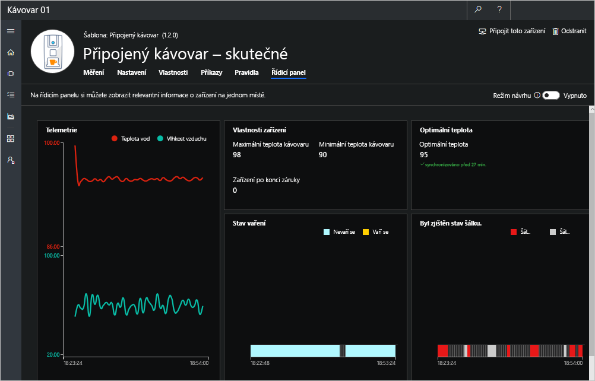

Pracovali jste s aplikací Azure IoT Central a připojili jste kávovar k Azure IoT Central. Jste na dobré cestě, abyste mohli začít vzdáleně monitorovat a spravovat svůj kávovar. V této lekci věnujete chvilku ověření nastavení a připojení s využitím šablony Connected Coffee Maker (Připojený kávovar), kterou jste definovali dříve. V nastavení aktualizujete optimální teplotu, spuštěním příkazů zkontrolujete stav zařízení a zobrazíte připojený kávovar na řídicím panelu. 

## Aktualizace nastavení pro synchronizaci aplikace s kávovarem

Na stránce **Settings** (Nastavení) odešlete ze své aplikace do kávovaru konfigurační data. 

V tomto scénáři změňte optimální teplotu a zvolte **Update** (Aktualizovat). Když se nastavení změní, bude toto nastavení v uživatelském rozhraní označené jako čekající, dokud kávovar nepotvrdí, že reagoval na změnu nastavení. 

> [!NOTE]
> Úspěšné aktualizace v nastavení indikují tok dat a ověří připojení. Telemetrické měrné systémy zareagují aktualizací optimální teploty. Změnu můžete sledovat na stránce **Measurements** (Měření). 

## Spouštění příkazů v kávovaru 
Pro účely následujícího cvičení přejděte na stránku **Commands** (Příkazy). Nastavení příkazů ověříte tak, že z IoT Central vzdáleně spustíte příkazy v kávovaru. V případě, že se příkazy provedou úspěšně, odešlou se z kávovaru potvrzující zprávy.

1. Spusťte vzdáleně vaření kávy tím, že zvolíte **Run** (Spustit). 
    
    Kávovar se spustí, pokud budou splněny tyto tři podmínky:
    - Byl zjištěn šálek.
    - Kávovar není ve stavu údržby.
    - Právě se nevaří káva.  

    > [!NOTE]
    > Jakmile úspěšně spustíte vaření kávy, stav zařízení se změní na žlutou barvu, jak je vidět zde: **Measurements** (Měření)  > **State** (Stav). 
    
    Vyhledejte potvrzující zprávy v protokolu konzoly na simulovaném kávovaru node.js. 

    

1. Nastavte režim údržby tím, že zvolíte **Run** (Spustit). Kávovar se nastaví do režimu údržby, pokud ještě v režimu údržby *není*.
    
    Vyhledejte potvrzující zprávy v protokolu konzoly na kávovaru. 

    > [!NOTE]
    > Stejně jako v reálném životě, když technik zařízení vyřadí z provozu, aby mohl provést nezbytné opravy, než ho zase zapne a zprovozní, i kávovar zůstane dál v režimu údržby, dokud nerestartujete klientský kód.

    

> [!IMPORTANT]
> Doporučuje se nenechávat aplikaci Node.js spuštěnou déle než přibližně 60 minut, aby vám aplikace neodesílala nežádoucí upozornění nebo e-maily. Zastavení aplikace v době, kdy právě nepracujete na modulu, vám také umožní vyhnout se vyčerpání denní kvóty zpráv.

## Zobrazení kávovaru na řídicím panelu

1. Přejděte na kartu **Dashboard** (Řídicí panel).

1. Výběrem položky **Edit Template** (Úprava šablony) upravte řídicí panel.

1. V postranní nabídce zvolte **spojnicový graf**.

1. V nabídce **Configure Chart** (Konfigurovat graf) zadejte `Telemetry` do pole **Title** (Název). Pomocí tohoto grafu můžeme zobrazit naše telemetrická data. 

1. Jako **Time Range** (Časový rozsah) zvolte **Past 30 minutes** (Posledních 30 minut). 

1. V oblasti **Measures** (Měření) vyberte ikonu viditelnosti vpravo od každého měření, chcete-li je zviditelnit v našem grafu. 

1. Výběrem možnosti **Save** (Uložit) můžete uložit konfiguraci a zobrazit spojnicový graf. 

    

1. Zvolte položku **Settings and Properties** (Nastavení a vlastnosti) v levé nabídce a otevřete panel **Configure Device Details** (Konfigurovat podrobnosti o zařízení). 

1. Zadejte `Device properties` do pole **Title** (Název).

1. V části **Add/Remove** (Přidat/odebrat) zvolte **Coffee Makers Max Temperature** (Maximální teplota kávovaru), **Coffee Makers Min Temperature** (Minimální teplota kávovaru) a **Device Warranty Expired** (Zařízení po konci záruky) a poté dokončete výběr pomocí tlačítka **OK**.

1. Výběrem možnosti **Save** (Uložit) vytvořte nový panel *Device properties* (Vlastnosti zařízení) na našem řídicím panelu. 

1. Zvolte položku **Settings and Properties** (Nastavení a vlastnosti) a znovu zadejte `Optimal Temperature` jako název. V části **Add/Remove** (Přidat/odebrat) zvolte možnost **Optimal Temperature** (Optimální teplota).

1. Výběrem možnosti **Save** (Uložit) uložte svou práci a zobrazte nové podokno na našem řídicím panelu. 

1. Výběrem možnosti **Done** (Hotovo) ukončete režim úprav. Zobrazí se nový řídicí panel. 