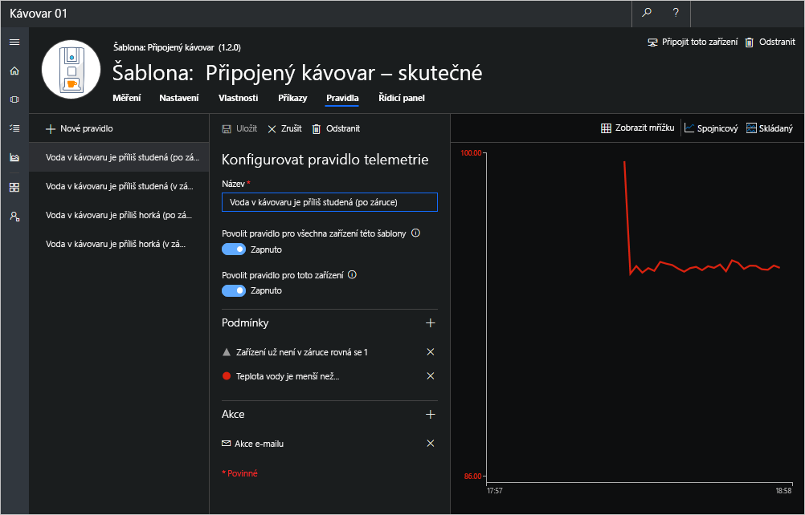

Zatím jste připojili svůj kávovar k aplikaci Azure IoT Central a povolili jste tak výměnu dat, která umožňuje jeho monitorování a správu. V této lekci vytvoříte pravidla, která aktivují akce, když je teplota vody v kávovaru mimo standardní rozsah. 

## Vytvoření pravidel v aplikaci IoT Central, u kterých je akcí e-mail

Azure IoT Central má nativní možnosti pro odesílání oznámení e-mailem. Pokud je teplota kávovaru mimo optimální rozsah a kávovar už není v záruce, IoT Central v tomto scénáři odešle oddělení údržby klienta e-mail.

1. Přejděte na stránku **Rules** (Pravidla), kde najdete cvičení v této lekci, a přejděte do režimu úprav výběrem možnosti **Edit Template** (Upravit šablonu) vpravo. 
1. Vyberte možnost **+ New Rule** (+ Nové pravidlo) a potom **Telemetry** (Telemetrie). 

1. Zadejte název `Coffee Maker Water Too Cold (Expired)`.

1. Přidejte následující podmínky pro pravidlo tak, že vyberete znaménko plus (**+**) vpravo od položky **Conditions** (Podmínky) a potom kliknete na tlačítko **Save** (Uložit):      
    - Teplota vody je menší než Minimální teplota kávovaru.
    - Zařízení už není v záruce rovná se 1

    

1. Přejděte dolů na panel **Configure Telemetry Rule** (Konfigurovat pravidlo telemetrie), zvolte možnost **+** vedle možnosti **Actions** (Akce) a poté vyberte **Email** (E-mail).

1. Zadejte e-mailovou adresu, kterou jste použili pro přihlášení k aplikaci IoT Central a přidejte poznámku `Coffee maker's water is too cold. Maintenance is required.  Warranty has expired.`.

1. Zvolte možnost **Save** (Uložit). Vaše pravidlo je uvedené na stránce **Rules** (Pravidla).

Teď můžeme tento postup zopakovat pro případ příliš horké vody. 

1. Vyberte možnost **+ New Rule** (+ Nové pravidlo) a potom **Telemetry** (Telemetrie).

1. Přidejte nové pravidlo a přiřaďte mu název `Coffee Maker Water Too Hot (Expired)`.

1. Přidejte následující podmínky pro pravidlo tak, že vyberete znaménko plus (**+**) vpravo od položky **Conditions** (Podmínky) a potom kliknete na tlačítko **Save** (Uložit):      
    - Teplota vody je větší než Maximální teplota kávovaru.
    - Zařízení už není v záruce rovná se 1

1. Přejděte dolů na panel **Configure Telemetry Rule** (Konfigurovat pravidlo telemetrie), zvolte možnost **+** vedle možnosti **Actions** (Akce) a poté vyberte **Email**.

1. Zadejte e-mailovou adresu, kterou jste použili pro přihlášení k aplikaci IoT Central a přidejte poznámku `Coffee maker's water is too cold. Maintenance is required.  Warranty has expired.`.

1. Zvolte možnost **Save** (Uložit). Vaše pravidlo je uvedené na stránce **Rules** (Pravidla).

Pokud chcete pravidlo aktivovat, nastavte v části **Settings** (Nastavení) optimální teplotu mimo rozsah zadaný v části **Properties** (Vlastnosti). Až budete s ověřováním hotoví, vypněte tato pravidla, abyste předešli zahlcení vaší poštovní schránky e-maily.