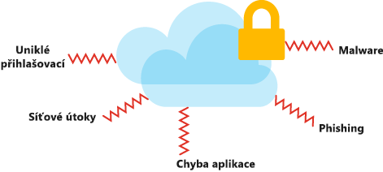

Cloud změnil způsob, jak organizace řeší své podnikatelské výzvy, a změnil i způsob návrhu aplikací a systémů. Role architekta řešení nespočívá jenom v dodání obchodní hodnoty tím, že splní funkční požadavky na aplikaci. Musí také zajistit, aby navržené řešení bylo škálovatelné, odolné, efektivní a bezpečné. Architektura řešení spočívá v plánování, návrhu, implementaci a neustálém zlepšování technologického systému. Architektura systému musí vyvažovat a slaďovat obchodní požadavky s technickými možnostmi potřebnými pro splnění těchto požadavků. To zahrnuje vyhodnocení rizik, nákladů a možností v rámci celého systému i jeho součástí.

#### Navržení vhodné architektury Azure

<!-- TODO: revisit this video after Ignite -->
<!-- > VIDEO: https://www.microsoft.com/videoplayer/embed/RE2yEv2 -->

Žádný univerzální přístup k návrhu architektury neexistuje, ale existují některé univerzální principy, které platí bez ohledu na architekturu, technologii nebo poskytovatele cloudových služeb. Tyto principy nejsou vyčerpávající, ale pokud se na ně zaměříte, pomůžou vám vytvořit spolehlivý, bezpečný a flexibilní základ vaší aplikace.

Vhodná architektura začíná na pevných základech, které se opírají o čtyři pilíře:

* Zabezpečení
* Výkon a škálovatelnost
* Dostupnost a obnovitelnost
* Efektivita a provoz

## Zabezpečení

Po technické stránce jsou data nejcennější částí vaší organizace. U tohoto pilíře se zaměříte na zabezpečení přístupu k architektuře prostřednictvím ověřování a také na ochranu aplikace a dat proti chybám v zabezpečení sítě. Chráněna by měla být i integrita dat pomocí nástrojů, jako je šifrování.

Na zabezpečení je potřeba myslet po celou dobu životního cyklu aplikace – od návrhu a implementace až po nasazení a provoz. Cloud nabízí ochranu před různými hrozbami, jako je napadení sítě nebo útoky DDoS, ale zabezpečení musíte začlenit i do svých procesů, aplikace a organizační kultury.

## Výkon a škálovatelnost

Aby byla architektura dostatečně výkonná a škálovatelná, musí na vyžádání odpovídat kapacitě prostředků. V cloudové architektuře se toho tradičně dosahuje dynamickým škálováním aplikací na základě aktivity aplikace. Poptávka po službách se mění, a proto je důležité, aby se vaše architektura dokázala této poptávce přizpůsobovat. Když budete při návrhu architektury přihlížet k výkonu a škálovatelnosti, zajistíte zákazníkům skvělé prostředí, které bude zároveň hospodárné.

## Dostupnost a obnovitelnost

Každý architekt se nejvíc bojí, že se jeho architektura zhroutí, a nepůjde zotavit. Úspěšné cloudové prostředí je navržené tak, aby předcházelo selhání na všech úrovních. V rámci předcházení těmto selháním je potřeba navrhnout takový systém, který se po selhání podaří zotavit ve lhůtě požadované zúčastněnými stranami a zákazníky.

## Efektivita a provoz

Chcete navrhnout takové cloudové prostředí, které je hospodárné z hlediska provozu i vývoje. Je důležité identifikovat nedostatky a plýtvání za cloud, abyste měli jistotu, že z vynaložených peněz máte co největší užitek. Potřebujete dobrou monitorovací architekturu, abyste dokázali rozpoznat selhání a problémy dříve, než nastanou, nebo minimálně před tím, než vás na ně upozorní zákazníci. Musíte mít také přehled o tom, jak vaše aplikace využívá dostupné prostředky. K tomu potřebujete odolné monitorovací prostředí.

# Společná odpovědnost

Přechodem do cloudu vznikl model společné odpovědnosti. U tohoto modelu bude váš poskytovatel cloudu spravovat určité stránky vaší aplikace a vy budete zodpovídat za zbytek. V místním prostředí zodpovídáte za všechno. S tím, jak přecházíte od infrastruktury jako služby (IaaS) k platformě jako službě (PaaS) a k softwaru jako službě (SaaS), má poskytovatel cloudu stále větší odpovědnost. Tato společná odpovědnost bude hrát svou roli v rozhodnutích, která se týkají architektury, protože tato rozhodnutí ovlivňují náklady, provozní možnosti, zabezpečení a technické možnosti aplikace. Když tyto povinnosti přenesete na poskytovatele, můžete se zaměřit na vytváření hodnoty pro firmu, protože se nebudete zabývat činnostmi, které nejsou její hlavní funkcí.

# Volby návrhu

V ideální architektuře bychom vytvořili nejbezpečnější možné prostředí s nejvyšším možným výkonem, které je vysoce dostupné a co nejefektivnější. Jako všude jsou i tady potřeba určité kompromisy. Pokud chceme vybudovat prostředí se všemi těmito pilíři na nejvyšší úrovni, bude to něco stát. Tyto náklady můžou být finanční nebo může jít o čas potřebný k dodání řešení nebo o provozní flexibilitu. Každá organizace bude mít různé priority, které budou mít vliv na volby návrhu u každého z těchto pilířů. Při návrhu architektury je potřeba určit, jaké kompromisy jsou ještě přijatelné, a které už nikoliv.

Při vytváření architektury Azure je tu celá řada aspektů, které je potřeba vzít v úvahu. Chcete, aby vaše architektura byla bezpečná, škálovatelná, dostupná a obnovitelná. Aby to bylo možné, budete se muset rozhodovat podle nákladů, priorit organizace a rizika.
