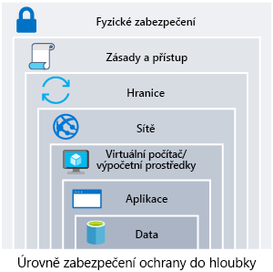
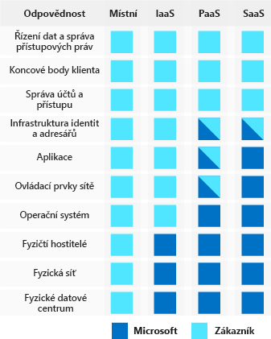

Vaše organizace poskytující zdravotní péči ukládá osobní a potenciálně citlivá data klientů. Bezpečnostní incident může citlivá data zpřístupnit, což by mohlo způsobit osobnostní újmu nebo finanční škodu. Jak zajistit integritu jejich dat a bezpečnost vašich systémů? 

Budeme zde mluvit o tom, jak přistupovat k zabezpečení architektury.

## Co je potřeba zabezpečit?

Data, která vaše organizace ukládá nebo zpracovává, jsou v samém centru zabezpečitelných prostředků. Tato data můžou tvořit citlivá data o zákaznících, finanční informace o vaší organizaci nebo důležitá obchodní data podporující vaši organizaci. Spolu s daty je také kriticky důležité zabezpečení infrastruktury, na které existují, a identit používaných pro přístup k ní.

Vaše data mohou být předmětem dalších právních i regulačních požadavků v závislosti na tom, kde se nacházíte, na typu ukládaných dat nebo na odvětví, ve kterém vaše aplikace funguje. Například ve zdravotnictví v USA existuje zákon nazývaný Health Insurance Portability and Accountability Act (HIPAA). Ve finančním odvětví se používá soubor bezpečnostních standardů PCI DSS (Payment Card Industry Data Security Standard) cílených na zpracování údajů platebních karet. Organizace ukládající data, na které se tyto zákony a standardy vztahují, musí zajistit určitá bezpečnostní opatření pro ochranu těchto dat. V Evropě stanoví Obecné nařízení o ochraně osobních údajů (GDPR) pravidla, jak jsou chráněné osobní údaje, a definuje práva jednotlivců související s uloženými daty. Některé země vyžadují, aby určité typy dat neopustily jejich hranice.

Pokud dojde k narušení zabezpečení, může to mít podstatný dopad na finance a pověst organizací a zákazníků. To naruší důvěru, kterou zákazníci do vaší organizace vkládají, a může to mít vliv na její dlouhodobý stav.

## Hloubková ochrana

Pokud chcete své prostředí více zabezpečit, použijte přístup založený na více vrstvách. Vrstvy zabezpečení, často označované jako _hloubková ochrana_, můžeme rozdělit následujícím způsobem:

* Data
* Aplikace
* Virtuální počítače/výpočetní prostředky
* Sítě
* Hranice
* Zásady a přístup
* Fyzické zabezpečení

Každá vrstva se zaměřuje na jiné oblasti, kde může dojít k útokům, a přidává hloubku ochrany pro případ, kdy jedna vrstva selže nebo je útočníkem překonána. Kdybychom se měli zaměřili jenom na jednu vrstvu, útočník by měl po jejím překonání neomezený přístup k vašemu prostředí. Řešení zabezpečení ve vrstvách zvyšuje úsilí, které musí útočník vynaložit, aby získal přístup k vašim systémům a datům. Každá vrstva bude mít použité různé kontroly zabezpečení, technologie a funkce. Při určování implementované ochrany se často náklady neberou v potaz. Bude potřeba je sladit s obchodními požadavky a celkovým rizikem pro firmu.

Systém zabezpečení, kontrola nebo technologie, které by plně chránily vaši architekturu, neexistují. Zabezpečení je víc než jenom technologie, zahrnuje také lidi a procesy. Nejzabezpečenější prostředí pro svou organizaci vytvoříte, když budete zabezpečení řešit komplexně a budete ho všude povinně vyžadovat.

## Běžné útoky

V každé vrstvě existuje několik běžných útoků, před kterými se budete chtít bránit. Výčet není úplný, ale může vám poskytnout představu, jak lze jednotlivé vrstvy napadnout a na jaké typy ochrany se budete muset soustředit.

* **Datová vrstva:** Uniknutí šifrovacího klíče nebo použití slabého šifrování může ponechat vaše data při neoprávněném přístupu zranitelná.
* **Aplikační vrstva:** Injektáž a spuštění škodlivého kódu jsou klasickými útoky v aplikační vrstvě. Mezi běžné útoky patří útok prostřednictvím injektáže SQL a skriptování mezi weby (XSS).
* **Vrstva virtuálních počítačů/výpočetních prostředků:** Malware je běžnou metodou napadení prostředí, který zahrnuje spuštění škodlivého kódu, aby ohrozil bezpečnost systému. Jakmile se v systému nachází malware, může dojít k dalším útokům vedoucím k odhalení přihlašovacích údajů a laterálnímu pohybu v celém prostředí.
* **Síťová vrstva:** Zbytečně otevřené porty do internetu jsou běžnou metodu útoku. Může mezi ně patřit ponechání otevřeného přístupu SSH nebo RDP k virtuálním počítačům. Při otevírání mohou umožnit útoky hrubou silou na vaše systémy, kdy se útočníci pokouší získat přístup.
* **Hraniční vrstva:** V této vrstvě se často objevují útoky typu DoS (Denial-of-service). Při těchto útocích dochází k pokusům zahlcení síťových prostředků, vynucení jejich přechodu do režimu offline nebo zabránění reagovat na oprávněné požadavky.
* **Vrstva zásad a přístupu:** Zde dochází k ověřování pro vaši aplikaci. To může zahrnovat moderní ověřovací protokoly jako OpenID Connect, OAuth nebo ověřování pomocí protokolu Kerberos, jako je Active Directory. Prozrazené přihlašovací údaje zde představují riziko a je důležité omezit oprávnění identit. Chceme také mít zřízené monitorování kvůli vyhledávání možného zneužití prozrazených účtů, jako jsou například přihlášení z neobvyklých míst.
* **Fyzická vrstva:** V této vrstvě může docházet k neoprávněným přístupům do objektů metodami, jako je držení dveří nebo odcizení přístupových karet.

## Sdílená odpovědnost za zabezpečení

Když přehodnotíme model společné odpovědnosti, můžeme ho přepracovat do kontextu zabezpečení. V závislosti na vybraném typu služby budou některá bezpečnostní opatření do služby integrovaná, ale za ostatní budete stále odpovídat vy. Abyste své architektuře zajistili vhodné prvky zabezpečení, musíte pečlivě vyhodnotit vybrané služby a technologie.

