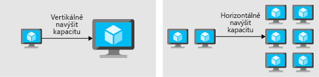

Představte si, že ve zprávách právě zveřejnili převratný pokrok vaší organizace při léčbě rakoviny. Jedná se o skvělý milník a nepochybně přinese obrovský nárůst provozu na vašem webu. Zvládne váš web toto zvýšení provozu, nebo nápor způsobí, že se web zpomalí nebo přestane reagovat?

Podíváme se na některé základní principy zajištění skvělého výkonu aplikací s využitím principů škálování a optimalizace.

## Co je škálování a optimalizaci výkonu?

Škálování a optimalizaci výkonu se týkají sladění prostředků dostupných pro aplikaci s požadavky, které přijímá. Optimalizace výkonu zahrnuje škálování prostředků, identifikaci a optimalizaci potenciálních slabých míst a optimalizaci kódu aplikace pro zajištění výkonu ve špičkách.

### Škálování

Výpočetní prostředky je možné škálovat ve dvou různých směrech:

* *Vertikální* navýšení kapacity je akce, kdy se přidají další prostředky jedné instanci.
* *Horizontální* navýšení kapacity znamená přidávání instancí.

Vertikální navýšení kapacity se týká přidání více prostředků, jako CPU a paměť, jedné instanci. Touto instancí může být virtuální počítač nebo služba PaaS. Přidání další kapacity instanci zvyšuje počet prostředků dostupných pro vaši aplikaci, ale má svoje omezení. Virtuální počítače jsou omezené kapacitou hostitele, na kterém běží, a hostitelé sami mají fyzická omezení. Nakonec při škálování instance můžete narazit na tato omezení, což limituje možnost přidávat instanci další prostředky.

Horizontální navýšení kapacity spočívá v přidávání dalších instancí službě. Mohou to být virtuální počítače nebo služby PaaS, ale místo přidání větší kapacity tak, že je jedna instance výkonnější, přidáváme kapacitu zvýšením celkového počtu instancí. Výhodou horizontálního navýšení kapacity je, že můžete kapacitu navyšovat donekonečna, pokud máte další počítače, které přidáváte do architektury. Horizontální navýšení kapacity vyžaduje určitý typ distribuce zatížení. To může mít formu nástroje pro vyrovnávání zatížení, který distribuuje požadavky mezi dostupné servery, nebo mechanismus zjišťování služeb, který identifikuje aktivní servery, kterým lze požadavky odeslat.

V obou případech lze prostředky snížit, což přináší optimalizaci nákladů.

### Optimalizace výkonu

Při optimalizaci výkonu budete sledovat síť a úložiště, abyste se ujistili, že je výkon přijatelný. Obojí může ovlivnit odezvu vaší aplikace. Výběr správné technologie sítě a úložiště pro vaši architektury vám pomůže zajistit, že poskytujete nejlepší prostředí pro zákazníky.

Optimalizace výkonu bude také zahrnovat pochopení, jak fungují samotné aplikace. Chyby, nedostatečný výkon kódu a kritické body v závislých systémech lze odhalit pomocí nástroje pro správu výkonu aplikací. Tyto problémy můžou být často pro koncové uživatele, vývojáře i správce skryté nebo nezřetelné, ale můžou mít negativní dopad na celkový výkon vaší aplikace.

## Vzory a postupy týkající se škálovatelnosti a výkonu

Pojďme se podívat na některé vzory a postupy, které se dají využít ke zlepšení škálovatelnosti a výkonu vaší aplikace.

### Dělení dat

V mnoha velkých řešeních jsou data rozdělená do samostatných oddílů, které můžete samostatně spravovat a ke kterým můžete samostatně získat přístup. Strategii rozdělení je potřeba vybrat pečlivě, aby se maximalizovaly výhody a současně minimalizovaly nežádoucí účinky. Rozdělení dat může vylepšit škálovatelnost, omezit kolize a optimalizovat výkon.

### Ukládání do mezipaměti

Zvýšit výkon může pomoct použití ukládání do mezipaměti ve vaší architektuře. Ukládání do mezipaměti je mechanismus ukládání často používaných dat nebo prostředků (webových stránek, obrázků) pro rychlejší načítání. Ukládání do mezipaměti je možné využít v různých vrstvách vaší aplikace. Můžete použít ukládání do mezipaměti mezi aplikačními servery a databází, aby se zkrátila doba načítání dat. Ukládání do mezipaměti můžete také použít mezi koncovými uživateli a webovými servery, čímž umístíte statický obsah blíž uživateli a zkrátíte čas potřebný k vrácení webových stránek koncovému uživateli. Má to také vedlejší efekt snížení počtu požadavků na databázi nebo webové servery, což zvýší výkon pro ostatní požadavky.

### Automatické škálování

Automatické škálování je proces dynamického přidělování prostředků tak, aby odpovídaly požadavkům na výkon. S tím, jak roste objem práce, může aplikace potřebovat k udržení požadovaných úrovní výkonu a plnění smluv o úrovni služeb (SLA) další prostředky. S klesajícími požadavky, když už další prostředky nejsou potřeba, je možné zrušit jejich přidělení a minimalizovat tak náklady.

Automatické škálování využívá výhody elasticity prostředí hostovaných v cloudu, přičemž snižuje režii na správu. Operátor díky tomu už nemusí soustavně monitorovat výkon systému a rozhodovat se, jestli je potřeba přidat nebo odebrat prostředky.

### Oddělení úloh náročných na prostředky jako úloh na pozadí

Mnoho typů aplikací vyžaduje úlohy na pozadí, které běží nezávisle na uživatelském rozhraní (UI). Patří mezi ně dávkové úlohy, úlohy náročné na zpracování a dlouho běžící procesy, jako jsou pracovní postupy. Úlohy na pozadí se můžou provádět bez nutnosti zásahu uživatele – aplikace může spustit úlohu a potom pokračovat ve zpracování interaktivních požadavků od uživatelů. To může pomoct minimalizovat zatížení uživatelského rozhraní aplikace, což může zlepšit dostupnost a zkrátit interaktivní odezvy.

### Použití vrstvy zasílání zpráv mezi službami

Výkon a škálovatelnost může zlepšit i přidání vrstvy zasílání zpráv mezi službami. Přidání vrstvy zasílání zpráv vytvoří vyrovnávací paměť pro požadavky mezi službami, aby bylo možné požadavky plynule přijímat, i když aplikace nedokáže držet krok. Protože aplikace funguje prostřednictvím požadavků, budou zodpovězené v pořadí, ve kterém byly přijaty.

### Implementace jednotek škálování

Škálování jako jednotka. Pro každý prostředek určete dopad, který může mít aktivita škálování na závislé systémy. Operace horizontálního navýšení kapacity díky tomu budou jednodušší a méně náchylné k negativnímu dopadu na aplikaci. Například přidání „x“ webových a pracovních rolí může vyžadovat „y“ dalších front a „z“ účtů úložiště pro zpracování dodatečného zatížení vygenerovaného rolemi. Jednotka škálování se může skládat z „x“ webových a pracovních rolí, „y“ front a „z“ účtů úložiště. Navrhněte aplikaci tak, aby se snadno škálovala přidáním jedné nebo více jednotek škálování.

### Sledování výkonu

Distribuované aplikace a služby běžící v cloudu jsou ze své podstaty složité softwary obsahující řadu pohyblivých částí. V produkčním prostředí je důležité moct sledovat způsob využití systému jednotlivými uživateli a využití prostředků a obecně monitorovat stav a výkon vašeho systému. Tyto informace můžete použít jako diagnostickou pomůcku k rozpoznání a opravě problémů a také k tomu, abyste si všimli potenciálních problémů a zabránili jejich výskytu.

Prohlédněte všechny vrstvy vaší aplikace a identifikujte a odstraňte kritické body výkonu ve vaší aplikaci. Tyto kritické body může způsobit špatná práce s pamětí v aplikaci nebo dokonce proces přidávání indexů do databáze. Může se jednat o iterativní proces, kdy uvolníte jeden kritický bod a pak odhalíte další, o kterém jste ještě nevěděli.

Díky důkladnému přístupu ke sledování výkonu budete moct určit, jaké typy vzorů a postupů budou pro vaši architekturu přínosné.