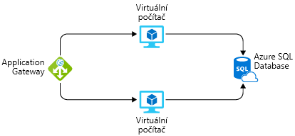

Představte si, že vás požádali, abyste sestavili systém Azure a zároveň poskytli odhad nákladů na provoz na následujících 12 měsíců. Už víte, že ceny Azure jsou úplně transparentní a že se vám budou každý měsíc účtovat jenom ty služby, které používáte. Jak tedy sestavíte odhad, aniž byste tyto služby nasazovali a spouštěli nebo museli ručně sčítat ceny jednotlivých služeb z ceníků Azure?

## Představujeme cenovou kalkulačku Azure

Microsoft vyvinul **cenovou kalkulačku Azure**, která usnadňuje zákazníkům odhadování nákladů. Cenová kalkulačka Azure je bezplatný webový nástroj, do kterého můžete zadat služby Azure a upravovat jejich vlastnosti a možnosti. Výsledkem je kompletní odhad nákladů na jednotlivé služby a souhrnných nákladů.

Otevřete [cenovou kalkulačku Azure](https://azure.microsoft.com/pricing/calculator/) v jiném okně nebo záložce prohlížeče. Na stránce cenové kalkulačky uvidíte tři karty:

1. **Produkty.** Na této kartě budete provádět většinu činností. Tato karta obsahuje seznam všech služeb Azure a vy na ní budete přidávat nebo odebírat služby, pro které chcete vytvořit odhad.
2. **Odhady.** Tato karta obsahuje všechny dříve uložené odhady. Tomuto procesu se budeme věnovat za chvíli.
3. **Časté otázky.** Jak napovídá název, tato karta obsahuje odpovědi na některé nejčastější dotazy.

Začněme kartou **Produkty**. Na levé straně uvidíte kompletní seznam kategorií služeb. Kliknutím na některou kategorii zobrazíte služby, které obsahuje. K dispozici je také pole hledání, pomocí kterého můžete vyhledávat ve všech službách. Kliknutím na některou službu přidáte tuto službu do odhadu. Můžete přidat jenom jednu službu nebo tolik služeb, kolik potřebujete, včetně násobků stejné služby (například více virtuálních počítačů).

Po přidání služeb vás bude zajímat jejich cena. Když se na stránce posunete dolů, uvidíte přizpůsobitelné podrobnosti dané služby, které ovlivňují cenu. Třeba u virtuálních počítačů můžete vybrat možnosti, jako je oblast, operační systém a velikost instance, které mají vliv na cenu virtuálního počítače. Zobrazí se vám dílčí součet za danou službu. Když se posunete ještě níž, uvidíte celkový součet za všechny služby zahrnuté v odhadu. Vedle součtu se nacházejí tlačítka, která umožňují odhad exportovat, uložit nebo sdílet.

## Odhad řešení

Na základě našeho původního scénáře si představte, že tento systém poběží na dvou virtuálních počítačích Azure a bude se připojovat k instanci Azure SQL Database. Chceme také ve vrstvě 7 použít bránu firewall, abychom měli jistotu, že budeme mít k dispozici rozšířené možnosti vyrovnávání zatížení. Následující obrázek ukazuje aplikační bránu připojenou ke dvěma virtuálním počítačům, které jsou připojené k jedné instanci Azure SQL Database.

Pomocí cenové kalkulačky Azure můžeme zjistit, kolik bude řešení stát, a odhad exportovat a sdílet ho s týmem.

> [!TIP]
> Ujistěte se, že je kalkulačka vynulovaná a odhad neobsahuje žádné položky. Pokud už odhad něco obsahuje, klikněte u každé položky na ikonu odpadkového koše a odhad resetujte.

V cenové kalkulačce Azure přidejte na kartě **Produkty** do odhadu následující služby tím, že na ně kliknete:

* Virtual Machines v kategorii Služba Compute
* Azure SQL Database v kategorii Databáze
* Application Gateway v kategorii Sítě

U každé služby můžeme nakonfigurovat podrobnosti na kartě **Odhady**, abychom získali realistický odhad nákladů. Pro všechny prostředky použijte oblast **Západní USA**.

* **Virtual Machines.** Jedná se o aplikaci ASP.NET, proto budeme muset použít virtuální počítač s **operačním systémem Windows**. Tato aplikace nevyžaduje nijak vysoký výpočetní výkon, takže vyberte velikost instance **D2 verze 3**. Budeme potřebovat dva virtuální počítače, které budou pořád spuštěné (730 hodin za měsíc). Pro tyto virtuální počítače použijeme úložiště SSD standardní úrovně a na jeden virtuální počítač budeme potřebovat jenom jeden disk o velikosti **E10**, celkem tedy dva disky.

* **SQL Database** V případě databáze zřídíme typ **Jediná databáze** s modelem **vCore**. Chceme databázi pro obecné účely generace Gen 5 s 8 virtuálními jádry. Budeme potřebovat 32 GB úložiště.

* **Application Gateway** Pro službu Application Gateway použijeme vrstvu Web Application Firewall, aby bylo naše prostředí chráněné. Vystačíme si se dvěma instancemi a velikostí Medium, protože nebudeme mít velkou zátěž. Očekáváme, že budeme zpracovávat 1 TB dat měsíčně. Očekáváme, že nebudeme zpracovávat data v Evropě (Zóna 1).

Když se podíváte na svůj odhad, měli byste vidět shrnutí nákladů na každou přidanou službu a celkový součet celého odhadu. V takovém případě by měl být odhadu kolem **2 100,00 $ měsíčně**. Můžete si pohrát s některou z možností – zejména _umístění_ prostředků bude mít dopad na částku odhadu. 

> [!TIP]
> Pokud máte prostředky, které nejsou závislé na umístění, můžete ušetřit spoustu peněz jejich umístěním do levnějších oblastí. Použitím cenové kalkulačky můžete zjistit cenově nejvýhodnější umístění těchto služeb.

## Sdílení a uložení odhadu

Získali jsme cenový odhad našeho řešení. Můžeme odhad uložit, abychom se k němu mohli později vrátit a v případě potřeby upravit. Můžeme ho také exportovat do Excelu k další analýze nebo sdílet odhad prostřednictvím adresy URL.

Pokud chcete odhad exportovat, klikněte na tlačítko `Export` v dolní části odhadu. Odhad se stáhne ve formátu Excelu (**XLSX**) a bude obsahovat všechny služby, které jste do něj přidali.

Potom můžeme buď sdílet tabulku Excelu, nebo kliknout na tlačítko `Share` v kalkulačce. Získáme tak adresu URL, která umožňuje odhad sdílet. Bude k němu moct získat přístup každý, komu pošlete odkaz, což usnadňuje sdílení v týmu.

Pokud jste přihlášení pomocí svého účtu Azure, můžete odhad uložit a vrátit se k němu později. Klikněte na tlačítko **Uložit**. Pokud jste přihlášení, mělo by se zobrazit oznámení, že se odhad uložil. Pokud nejste přihlášení, zobrazí se výzva k přihlášení a uložení odhadu. Po uložení odhadu se posuňte zpátky do horní části stránky a vyberte kartu **Odhady**. Tady uvidíte svůj odhad. Můžete ho vybrat a znovu načíst, případně ho odstranit, pokud už ho nepotřebujete.

Úplně zadarmo jsme získali odhad nákladů na sadu služeb Azure. Nic jsme nevytvořili, ale máme odhad, který můžeme sdílet a provádět v něm další analýzu nebo úpravy. Tento nástroj můžete použít nejen k vytváření odhadů nákladů na systémy, u kterých víte, jaké služby chcete použít, ale také k porovnání toho, jaký dopad můžou mít různé služby na celkové náklady. Příkladem může být Microsoft SQL Server na virtuálním počítači vs. Azure SQL Database.