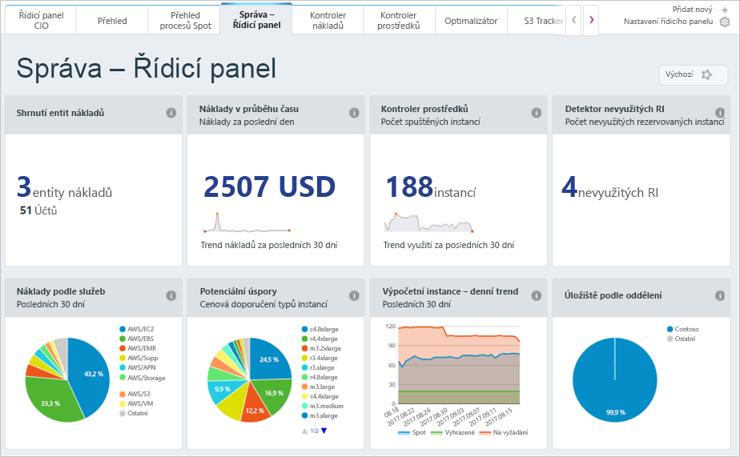

Dozvěděli jsme se, jak před nasazením služeb do Azure odhadnout vaše náklady. Co když už ale máte prostředky nasazené? Jak získáte přehled o nákladech, které se vám už účtují? Kdybychom naše předchozí řešení nasadili do Azure a teď se chtěli ujistit, že jsme zvolili správnou velikost virtuálních počítačů, a zjistit, jak vysoká bude naše faktura, jak to uděláme? Podíváme se na pár nástrojů v Azure, které vám s tím můžou pomoct.

## Co je Azure Advisor?

**Azure Advisor** je bezplatná služba integrovaná do Azure, která poskytuje doporučení týkající se vysoké dostupnosti, zabezpečení, výkonu a nákladů. Advisor analyzuje nasazené služby a hledá způsoby, jak vylepšit vaše prostředí v těchto čtyřech oblastech. My se zaměříme na doporučení týkající se nákladů, ale určitě se vyplatí udělat si čas i na prohlédnutí ostatních doporučení.

Advisor poskytuje doporučení týkající se nákladů v následujících oblastech:

1. **Snížení nákladů odstraněním nezřízených okruhů Azure ExpressRoute.**
    Tato funkce identifikuje okruhy ExpressRoute, které jsou už déle než měsíc ve stavu poskytovatele *Nezřízeno*, doporučí jejich odstranění, pokud nemáte v plánu daný okruh zřídit u svého poskytovatele připojení.

1. **Kupování rezervovaných instancí s průběžnými platbami za účelem finanční úspory.**
    Tento nástroj zkontroluje vaše využití virtuálních počítačů za posledních 30 dní a určí, jestli můžete v budoucnu ušetřit nákupem rezervovaných instancí. Advisor vám ukáže oblasti a velikosti, ve kterých se pro vás skrývají největší potenciální úspory, a poskytne vám odhad úspor, které byste mohli získat nákupem rezervovaných instancí.

1. **Nastavení správné velikosti nebo vypnutí nevyužitých virtuálních počítačů.**
    Tento nástroj monitoruje využití vašich virtuálních počítačů po dobu 14 dní a potom identifikuje ty, které se málo využívají. Za virtuální počítače s nízkým využitím se považují ty, které mají po dobu nejméně čtyř dnů průměrné využití CPU do 5 procent a využití sítě do 7 MB. Prahová hodnota průměrného využití CPU se dá nastavit až na 20 procent. Když zjistíte, které virtuální počítače jsou nedostatečně využité, můžete se je rozhodnout převést na menší typ instance a snížit si tak náklady.

[!include]

Podívejme se, kde najdete Azure Advisor na portálu. 

1. Přihlaste se na portálu [Azure Portal](https://portal.azure.com?azure-portal=true) pomocí svého účtu Microsoft. 

1. Klikněte na **Všechny služby** a v kategorii **Nástroje pro správu** uvidíte nástroj **Advisor**. Také můžete zadat `Advisor` do pole filtru a vyfiltrovat jenom tuto službu.

1. Klikněte na Advisor. Zobrazí se řídicí panel doporučení Advisoru, kde uvidíte všechna doporučení pro vaše předplatné. Každá kategorie doporučení je uvedená ve zvláštním poli.

> [!NOTE]
> Je možné, že vám Advisor nezobrazí žádná doporučení týkající se nákladů. Mohlo by to být tím, že ještě neproběhlo posouzení, nebo jednoduše tím, že pro vás Advisor žádná doporučení nemá.

Kliknutím na pole **Náklady** zobrazíte podrobná doporučení Advisoru pro tuto kategorii.

Kliknutím na kterékoli doporučení přejdete na jeho podrobnosti. Potom můžete podniknout konkrétní kroky, třeba změnit velikost virtuálních počítačů a snížit tak náklady.

Tato doporučení se týkají všech oblastí, kde možná utrácíte peníze neefektivním způsobem. Představují skvělý výchozí bod, ke kterému se můžete stále vracet, když budete chtít snížit náklady. V našem příkladu máme příležitost ušetřit asi 700 USD měsíčně, pokud se budeme doporučeními řídit. Úspory se sčítají, takže nezapomeňte pravidelně kontrolovat doporučení ve všech čtyřech oblastech.

## Azure Cost Management

Azure Cost Management je další bezplatný integrovaný nástroj Azure, pomocí kterého můžete získat větší přehled o tom, co získáváte za své peníze investované do cloudu. Můžete si zobrazit historické rozpisy toho, za jaké služby utrácíte a jak se to projevuje na nastavených rozpočtech. Můžete nastavovat rozpočty, plánovat sestavy a analyzovat oblasti nákladů.

## Cloudyn

Pobočka Microsoftu Cloudyn umožňuje sledovat využití cloudu a výdaje za prostředky Azure a další poskytovatele cloudu, včetně Amazon Web Services a Google. Snadno pochopitelné sestavy řídicího panelu pomáhají s přidělováním nákladů i vracením peněz. Cost Management pomáhá optimalizovat výdaje za cloud díky identifikaci nevyužitých prostředků, které následně můžete spravovat a upravovat. Využití pro Azure je zdarma, existují ale i placené možnosti podpory na úrovni Premium a zobrazení dat z jiných cloudů.

Jak vidíte, v Azure je zdarma k dispozici několik nástrojů, které můžete použít ke sledování vaší útraty v cloudu, jejímu předvídání a zjišťování toho, kde je vaše prostředí neefektivní z hlediska nákladů. Doporučujeme vám zvyknout si pravidelně kontrolovat sestavy a doporučení poskytované těmito nástroji, můžete tím totiž ušetřit za různé způsoby využívání cloudu.