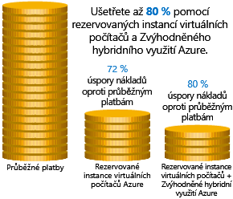
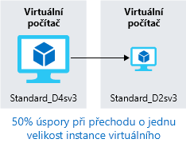
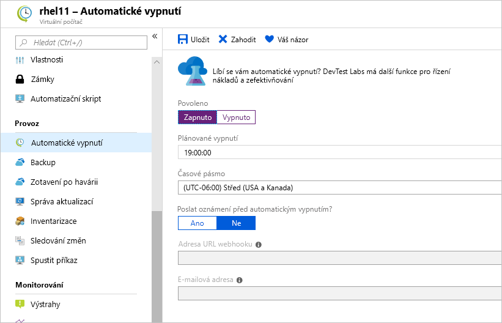

Dozvěděli jsme se, jak vytvářet odhady nákladů na prostředí, které plánujete sestavit, a prošli jsme si některé nástroje, které umožňují získat podrobné informace o oblastech nákladů a prognóze budoucích výdajů. Naším dalším úkolem bude podívat se, jak snížit náklady na infrastrukturu.

## Použití rezervovaných instancí

Pokud máte úlohy virtuálních počítačů, které jsou ze své povahy statické a předvídatelné, především pokud běží nepřetržitě, použití rezervovaných instancí je vynikající způsob, jak v závislosti na velikosti virtuálního počítače ušetřit až 70 až 80 % nákladů. Následující obrázek ukazuje, že použitím rezervovaných instancí Azure ušetříte až 72 % a použitím rezervované instance a licenční výhody Zvýhodněné hybridní využití Azure ušetříte až 80 % nákladů.

Rezervované instance se kupují na dobu jednoho roku nebo tří let a vždycky je potřeba předem uhradit částku za celé období. Po nákupu Microsoft porovná rezervaci s běžícími instanci a sníží počet hodin o zakoupenou rezervaci. Rezervace se dají zakoupit prostřednictvím webu Azure Portal. Vzhledem k tomu, že rezervované instance nabízejí slevu na výpočetní prostředky, jsou k dispozici pro virtuální počítače s Linuxem i Windows.

## Nastavení správné velikosti nevyužitých virtuálních počítačů

V předchozím výkladu jsme si vysvětlili, že vám Azure Cost Management a Azure Advisor můžou doporučit nastavení správné velikosti nebo vypnutí některých virtuálních počítačů. Nastavení správné velikosti virtuálního počítače je proces, při kterém zvolíte jeho správnou velikost. Představme si, že máte server fungující jako řadič domény, který má velikost **Standard_D4sv3**, ale váš virtuální počítač je většinu času z 90 % nečinný. Změnou velikosti tohoto virtuálního počítače na **Standard_D2sv3** snížíte své náklady na výpočetní prostředky o 50 %. Náklady rostou lineárně a u každé další velikosti ve stejné řadě se zdvojnásobují. V tomto případě by vám mohla prospět i změna řady instance na méně nákladnou řadu virtuálních počítačů. Následující obrázek ukazuje 50% úspory dosažené přechodem o jednu velikost dolů v rámci stejné řady.

Virtuální počítače nadměrné velikosti jsou často zodpovědné za zbytečné výdaje za Azure, naštěstí se to ale dá snadno napravit. Velikost virtuálního počítače můžete změnit prostřednictvím webu Azure Portal, Azure PowerShellu nebo Azure CLI.

> [!TIP]
> Při změně velikosti je potřeba virtuální počítač zastavit, změnit jeho velikost a potom restartovat. To může pár minut trvat, podle toho, o jak výraznou změnu velikosti se jedná. Kvůli provádění tohoto úkolu si proto naplánujte výpadek nebo přesuňte datový provoz do jiné instance.

## Zrušení přidělení virtuálních počítačů mimo špičku

Pokud máte úlohy virtuálních počítačů, které se využívají jenom v určitou dobu, ale přesto nepřetržitě běží každý den, zbytečně plýtváte penězi. Tyto virtuální počítače představují skvělé kandidáty na to, aby se vypnuly, když se nepoužívají, a potom se podle nastaveného plánu znovu zapnuly. Když tyto virtuální počítače zrovna nejsou přidělené, šetříte náklady na výpočetní prostředky.

Tento přístup představuje skvělou strategii pro vývojová prostředí. Vývoj často probíhá jenom v pracovní době, takže mimo pracovní dobu můžete zrušit přidělení těchto systémů a zabránit zbytečnému navyšování nákladů na výpočetní prostředky. Azure teď nabízí [řešení automatizace](https://docs.microsoft.com/azure/automation/automation-solution-vm-management), které můžete ve svém prostředí plně využít.

Můžete také k plánování automatického vypnutí používat funkci automatického vypínání virtuálního počítače.

## Odstranění nepoužívaných virtuálních počítačů

 I když vám tato rada může připadat jako samozřejmost, pokud nějakou službu nepoužíváte, vypněte ji. Není zase tak vzácné, že po ukončení nějakého projektu zůstanou v provozu neprodukční systémy nebo systémy pro testování konceptu. Pravidelně své prostředí kontrolujte, abyste na takové systémy přišli. Jejich vypnutí vám může přinést řadu výhod – nejenže tak ušetříte náklady na infrastrukturu, ale potenciálně můžete ušetřit i na licencích a provozu.

## Migrace na služby PaaS nebo SaaS

Také je třeba zmínit, že když přesouváte úlohy do cloudu, je přirozené začít službami typu infrastruktura jako služba (IaaS) a potom se podle potřeby postupně přesouvat ke službám typu platforma jako služba (PaaS).

Služby PaaS většinou nabízejí značné úspory nákladů na prostředky i provoz. Jistá překážka spočívá v tom, že v závislosti na typu služby má přesun těchto služeb různou náročnost z hlediska času a prostředků. Můžete snadno přesunout databázi SQL Serveru do Azure SQL Database, ale přesun vícevrstvé aplikace do kontejnerové architektury nebo architektury bez serveru už může být mnohem náročnější. K osvědčeným postupům patří průběžně vyhodnocovat architekturu vašich aplikací, abyste zjistili, jestli vám služby PaaS nemůžou přinést větší efektivitu.

Azure usnadňuje testování těchto služeb s minimálním rizikem, takže máte možnost si nové modely architektury relativně snadno vyzkoušet. Přesto je nutné dodat, že se obvykle jedná o dlouhodobý proces, který vám z hlediska úspory nákladů nemusí přinést okamžité výhody. Azure Architecture Center je skvělé místo, kde můžete načerpat podněty k transformaci vaší aplikace a dozvědět se osvědčené postupy pro nejrůznější architektury a služby Azure.