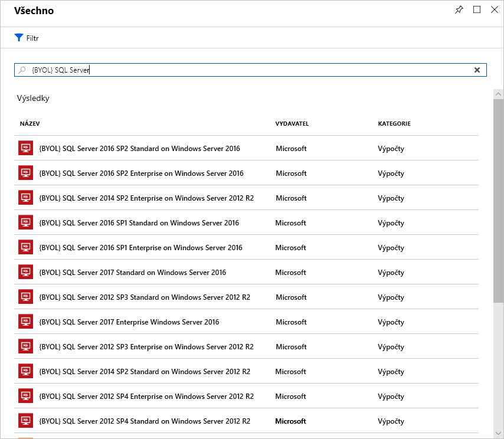

Správa licencí je další oblast, která může mít výrazný dopad na vaše výdaje za cloud. Podívejme se na některé způsoby, jak snížit vaše náklady na správu licencí.

## Zvýhodněné hybridní využití Azure pro Windows Server

Mnoho zákazníků investovalo do licencí Windows Serveru a chtějí tuto investici zužitkovat i v Azure. Zvýhodněné hybridní využití Azure poskytuje zákazníkům právo využívat tyto licence na virtuální počítače v Azure. To znamená, že se jim nebudou účtovat licence Windows Serveru a místo toho se jim bude účtovat sazba pro Linux.

Na tuto výhodu mají nárok jenom licence Windows s programem Software Assurance. Kromě toho platí následující pokyny:

- Každá dvouprocesorová licence nebo každá sada 16jádrových licencí má nárok na dvě instance maximálně s 8 jádry nebo jednu instanci maximálně s 16 jádry.
- Licence Standard Edition se dají používat buď v místním prostředí, nebo v Azure. To znamená, že nemůžete použít stejnou licenci pro virtuální počítač Azure a místní počítač.
- Verze Datacenter Edition umožňuje souběžné použití jak v místním prostředí, tak v Azure, takže licence pokryje dva spuštěné počítače s Windows.

> [!NOTE]
> Většina zákazníků obvykle používá licence podle počtu jader, takže při výpočtu budete vycházet z tohoto modelu. Pokud se potřebujete zeptat, jaké licence máte k dispozici, obraťte se na svého prodejce licencí nebo na zákaznický tým Microsoftu.

Uplatnění této výhody je snadné. Můžete ji u existujících virtuálních počítačů kdykoli zapnout nebo vypnout a u nových virtuálních počítačů uplatnit ve chvíli nasazení. Zvýhodněné hybridní využití (hlavně v kombinaci s rezervovanými instancemi) může přinést značné úspory za licence.

## Zvýhodněné hybridní využití Azure pro SQL Server

Zvýhodněné hybridní využití Azure pro SQL Server pomáhá maximálně využít stávající investice do licencí a urychlit vaši migraci do cloudu. Zvýhodněné hybridní využití Azure pro SQL Server je program vhod založený na Azure, který vám umožňuje využívat licence SQL Serveru s aktivním programem Software Assurance a platit sníženou sazbu.

Tuto výhodu můžete uplatnit i na aktivní prostředek Azure, ale snížená sazba bude platit až od chvíle, kdy ji vyberete na portálu. Nevydávají se žádné kredity se zpětnou platností.

### Možnosti založené na virtuálních jádrech v Azure SQL Database

V případě Azure SQL Database funguje Zvýhodněné hybridní využití Azure takto:

- Pokud máte licence Standard Edition na jádro s aktivním programem Software Assurance, můžete za každou licenci jádra, kterou máte v místním prostředí, získat jedno virtuální jádro na úrovni služeb pro obecné účely.
- Pokud máte licence Enterprise Edition na jádro s aktivním programem Software Assurance, můžete za každou licenci jádra, kterou máte v místním prostředí, získat jedno virtuální jádro na úrovni obchodně klíčových služeb. Upozorňujeme, že program Zvýhodněné hybridní využití Azure pro SQL Server pro úroveň obchodně klíčových služeb je dostupný jenom pro zákazníky s licencemi Enterprise Edition.
- Pokud máte vysoce virtualizované licence Standard Edition na jádro s aktivním programem Software Assurance, můžete za každou licenci jádra, kterou máte v místním prostředí, získat čtyři virtuální jádra na úrovni služeb pro obecné účely. Tato jedinečná výhoda pro virtualizované prostředí je dostupná jenom v Azure SQL Database.

Následující obrázek ukazuje možnosti založené na virtuálních jádrech, které jsou k dispozici v jednotlivých úrovních služby se Zvýhodněným hybridním využitím Azure pro licence SQL Serveru.

V případě SQL Serveru ve službě Azure Virtual Machines funguje program Zvýhodněné hybridní využití Azure takto:

- Pokud máte licence Enterprise Edition na jádro s aktivním programem Software Assurance, můžete za každou licenci jádra, kterou máte v místním prostředí, získat jedno jádro SQL Server Enterprise Edition ve službě Azure Virtual Machines.
- Pokud máte licence Standard Edition na jádro s aktivním programem Software Assurance, můžete za každou licenci jádra, kterou máte v místním prostředí, získat jedno jádro SQL Server Standard Edition ve službě Azure Virtual Machines.

To může mít výrazný vliv na vaše výdaje za Azure při použití úloh SQL Serveru.

## Využití nabídek předplatného pro vývoj/testování

K úspoře nákladů na neprodukční prostředí můžete využít nabídky [Enterprise pro vývoj/testování](https://azure.microsoft.com/offers/ms-azr-0148p/) a [Průběžné platby dle aktuálního využití pro vývoj/testování](https://azure.microsoft.com/offers/ms-azr-0023p/). Tyto nabídky poskytují několik slev, především pro úlohy ve Windows, nezahrnují poplatky za licence a virtuální počítače účtují jenom sazbami za Linux. To platí i pro SQL Server a veškerý další software Microsoftu, na který se vztahuje předplatné sady Visual Studio (dříve MSDN). 

Tato výhoda má určité podmínky, například to, že se vztahuje jenom na neprodukční prostředí nebo že všichni uživatelé těchto prostředí (s výjimkou testerů) musejí být krytí předplatným sady Visual Studio. Stručně řečeno, v případě neprodukčních úloh tak ušetříte za Windows, SQL Server a jiné úlohy virtuálních počítačů Microsoftu.

Podrobné informace o jednotlivých nabídkách najdete níže. Pokud jste zákazníkem se smlouvou Enterprise, využijte nabídku Enterprise pro vývoj/testování, a pokud smlouvu Enterprise nemáte a používáte účty s průběžnými platbami, využijte nabídku Průběžné platby dle aktuálního využití pro vývoj/testování.

## Používání vlastní licence SQL Serveru

Pokud jste zákazníkem se smlouvou Enterprise, už jste investovali do licencí SQL Serveru a ty se vám uvolnily díky přesunu prostředků do Azure, můžete použít image **vlastní licence** (BYOL) z Azure Marketplace. Zužitkujete tím tyto nevyužité licence a zároveň snížíte své náklady na virtuální počítače Azure. Vždycky to můžete provést zřízením virtuálního počítače s Windows a ruční instalací SQL Serveru, použití certifikovaných imagí Microsoftu vám ale tento proces usnadní. V Marketplace tyto image najdete pod názvem **BYOL**.

> [!IMPORTANT]
> Použití certifikovaných imagí BYOL vyžaduje předplatné se smlouvou Enterprise.

## Použití systému SQL Server Developer Edition

Řada lidí si vůbec neuvědomuje, že SQL Server Developer Edition je bezplatný produkt určený k použití v **neprodukčním prostředí**. Verze Developer Edition má stejné funkce jako Enterprise Edition, ale je určená pro neprodukční úlohy a umožní vám výrazně ušetřit na nákladech na licence.

Vyhledejte si image SQL Server ve verzi Developer Edition v Azure Marketplace a použijte je k vývoji nebo testování, abyste se vyhnuli zvýšeným nákladům na SQL Server.

> [!TIP]
> Úplné informace o licencích najdete v [doprovodných materiálech k cenám](https://docs.microsoft.com/azure/virtual-machines/windows/sql/virtual-machines-windows-sql-server-pricing-guidance).

## Použití omezených velikostí instance pro úlohy databáze

Řada zákazníků má vysoké požadavky na paměť, úložiště nebo šířku pásma vstupně-výstupních operací, ale malý počet jader procesoru. Na základě tohoto rozšířeného požadavku Microsoft zpřístupnil nejoblíbenější velikosti virtuálních počítačů (DS, ES, GS a MS) v nových velikostech, které omezují počet virtuálních procesorů na polovinu nebo čtvrtinu původní velikosti virtuálního počítače, ale zachovávají stejně velkou paměť, úložiště a šířku pásma vstupně-výstupních operací.

| Velikost virtuálního počítače | Virtuální procesory | Memory (Paměť) | Maximální počet disků | Maximální propustnost vstupně-výstupních operací | Cena roční licence systému SQL Server Enterprise | Celkové náklady za rok (výpočetní prostředky + licence) |
|---------|-------|--------|-----------|--------------------|-----------------------------------------------|---------------------------|
| Standard_DS14v2   | 16 | 112 GB | 32 | 51 200 vstupně-výstupních operací nebo 768 MB/s |           |           |
| Standard_DS14-4v2 | **4**  | 112 GB | 32 | 51 200 vstupně-výstupních operací nebo 768 MB/s | O 75 % nižší | O 57 % nižší |
| Standard_GS5      | 32 | 448    | 64 | 80 000 vstupně-výstupních operací nebo 2 GB/s   |           |           |
| Standard_GS5-8    | **8**  | 448    | 64 | 80 000 vstupně-výstupních operací nebo 2 GB/s   | O 75 % nižší | O 42 % nižší |

Vzhledem k tomu, že se databázové produkty jako SQL Server a Oracle licencují podle počtu procesorů, tato nabídka umožňuje zákazníkům snížit náklady na licence až o 75 procent při zachování vysokého výkonu vyžadovaného jejich databází.