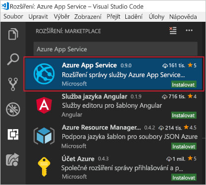

Chcete-li použít Visual Studio Code k vývoji pro Azure, budete muset nainstalovat Visual Studio Code místně spolu s jedním nebo více rozšířeními Azure. V tomto cvičení, přidáme rozšíření **Azure App Service**.

## <a name="install-visual-studio-code"></a>Nainstalujte Visual Studio Code.

::: zone pivot="windows"

### <a name="windows"></a>Windows

1. [Stáhněte si instalační program nástroje Visual Studio Code pro Windows](https://code.visualstudio.com/).

1. Spusťte instalační program.

1. Otevřete Visual Studio Code stisknutím klávesy Windows nebo kliknutím na ikonu Windows na hlavním panelu, zadáním „Visual Studio Code“ a kliknutím na výsledek **Visual Studio Code**.

::: zone-end

::: zone pivot="macos"

### <a name="macos"></a>macOS

1. [Stáhněte si Visual Studio Code pro macOS](https://code.visualstudio.com/).

1. Dvakrát klikněte na stažený archiv a rozbalte jeho obsah.

1. Přetáhněte Visual Studio Code.app do složky Aplikace.

1. Visual Studio Code otevřete kliknutím na ikonu v části Aplikace nebo tak, že vyhledáte Visual Studio Code ve Spotlightu.

::: zone-end

::: zone pivot="linux"

### <a name="linux"></a>Linux 

#### <a name="debian-and-ubuntu"></a>Debian a Ubuntu

1. Stáhněte si a nainstalujte [balíček .deb (64bitový)](https://go.microsoft.com/fwlink/?LinkID=760868) – buď prostřednictvím grafického centra softwaru (pokud je k dispozici), nebo pomocí příkazového řádku (`<file>` nahraďte názvem staženého souboru .deb):

    ```bash
    sudo dpkg -i <file>.deb
    sudo apt-get install -f # Install dependencies
    ```

#### <a name="rhel-fedora-and-centos"></a>RHEL, Fedora a CentOS

1. Nainstalujte klíč a úložiště pomocí tohoto skriptu:

    ```bash
    sudo rpm --import https://packages.microsoft.com/keys/microsoft.asc
    sudo sh -c 'echo -e "[code]\nname=Visual Studio Code\nbaseurl=https://packages.microsoft.com/yumrepos/vscode\nenabled=1\ngpgcheck=1\ngpgkey=https://packages.microsoft.com/keys/microsoft.asc" > /etc/yum.repos.d/vscode.repo'
    ```

1. Aktualizujte mezipaměť balíčků a nainstalujte balíček pomocí dnf (Fedora 22 nebo novější):

    ```bash
    dnf check-update
    sudo dnf install code
    ```

#### <a name="opensuse-and-sle"></a>openSUSE a SLE

1. Úložiště yum funguje také pro systémy založené na openSUSE a SLE. Následující skript nainstaluje klíč a úložiště:

    ```bash
    sudo rpm --import https://packages.microsoft.com/keys/microsoft.asc
    sudo sh -c 'echo -e "[code]\nname=Visual Studio Code\nbaseurl=https://packages.microsoft.com/yumrepos/vscode\nenabled=1\ntype=rpm-md\ngpgcheck=1\ngpgkey=https://packages.microsoft.com/keys/microsoft.asc" > /etc/zypp/repos.d/vscode.repo'
    ```

1. Aktualizujte mezipaměť balíčků a nainstalujte balíček pomocí:

    ```bash
    sudo zypper refresh
    sudo zypper install code
    ```

> [!NOTE]
> Další podrobnosti o instalaci a aktualizaci nástroje Visual Studio Code na různých distribucích Linuxu najdete v článku [Running Visual Studio Code on Linux](https://code.visualstudio.com/docs/setup/linux) (Spuštění nástroje Visual Studio Code v Linuxu).

::: zone-end

## <a name="install-azure-app-service-extension"></a>Instalace rozšíření Azure App Service

1. Pokud jste to ještě neudělali, otevřete Visual Studio Code.

1. Otevřete Prohlížeč rozšíření – je přístupný prostřednictvím nabídky na levé straně.

1. Najděte rozšíření **Azure App Service**.

1. Vyberte výsledek **Azure App Service** a klikněte na tlačítko **Nainstalovat**.

    Následující snímek obrazovky ukazuje rozšíření Azure App Service vybrané ve výsledcích hledání rozšíření Visual Studio Code.

    

Tím se rozšíření nainstaluje. Teď se můžete připojit ke svému předplatnému Azure a nasadit webovou nebo mobilní aplikaci nebo aplikaci API do služby Azure App Service.
