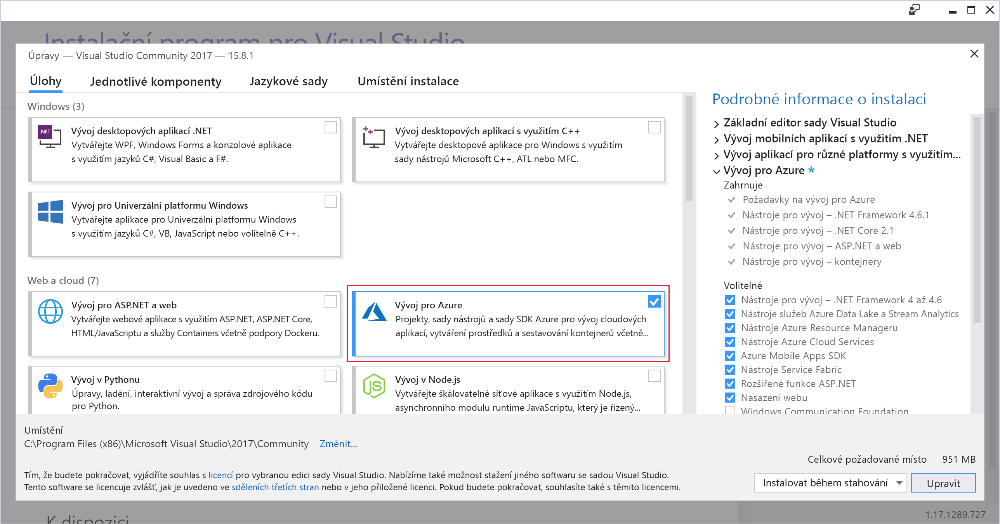
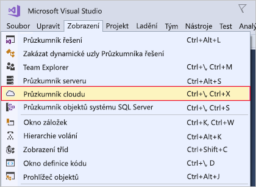
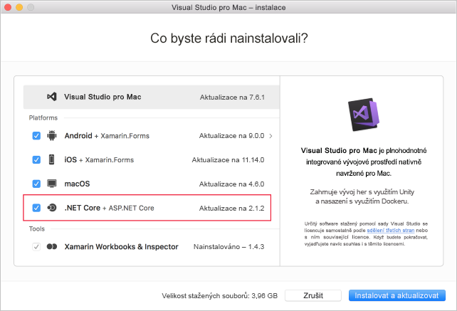

Tady si nainstalujete sadu Visual Studio na počítač pro vývoj se systémem Windows nebo macOS.

## Kroky cvičení

::: zone pivot="windows"

### Windows

1. Stáhněte si instalační program sady Visual Studio z webu https://visualstudio.microsoft.com/downloads/.

1. Spusťte instalační program.

1. Na kartě **Úlohy** vyberte úlohu **Vývoj pro Azure**.

    Následující snímek obrazovky ukazuje instalační program sady Visual Studio s vybranou sadou funkcí umožňující vývoj pro Azure v sadě Visual Studio.

    

1. (Volitelné) Pokud se chcete připravit na vytváření webových aplikací pro Azure, nainstalujte si aplikaci ASP.NET a sadu funkcí Vývoj pro web.

1. Klikněte na **Nainstalovat** a počkejte, až se sada Visual Studio nainstaluje. Pro systémy s již nainstalovanou sadou Visual Studio se může toto tlačítko jmenovat **Upravit**.

1. Po dokončení instalace otevřete Visual Studio.

1. V sadě Visual Studio přejděte do nabídky Zobrazení a zkontrolujte, že máte k dispozici možnost **Průzkumník cloudu**.

    Následující snímek obrazovky ukazuje možnost nabídky Průzkumník cloudu, která bude k dispozici, pokud máte nainstalovanou sadu funkcí Vývoj pro Azure.

    

::: zone-end

::: zone pivot="macos"

### macOS

1. Přejděte na web https://visualstudio.microsoft.com/ a stáhněte si instalační program sady Visual Studio pro Mac.

1. Kliknutím na soubor VisualStudioInstaller.dmg instalační program připojte a potom ho spusťte dvojím kliknutím na logo.

1. Po zobrazení potvrďte podmínky ochrany osobních údajů a licenční podmínky.

1. Instalační program se vás zeptá, které komponenty si přejete nainstalovat. Komponenty Azure už jsou součástí sady Visual Studio pro Mac. Abyste ale mohli vyvíjet webová prostředí pro Azure, doporučuje se nainstalovat platformu **.NET Core**.

    Následující snímek obrazovky ukazuje platformu .NET Core potřebnou k přidání možností vývoje pro Azure do sady Visual Studio pro Mac.

    

1. Jakmile budete s výběrem spokojeni, klikněte na **Nainstalovat a aktualizovat** a počkejte, až se instalační program dokončí.

1. Pokud jste vyzváni ke zvýšení potřebných oprávnění, použijte vaše přihlašovací údaje správce.

1. Po dokončení instalačního programu spusťte Visual Studio pro Mac.

::: zone-end