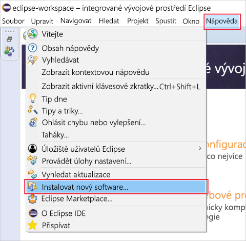
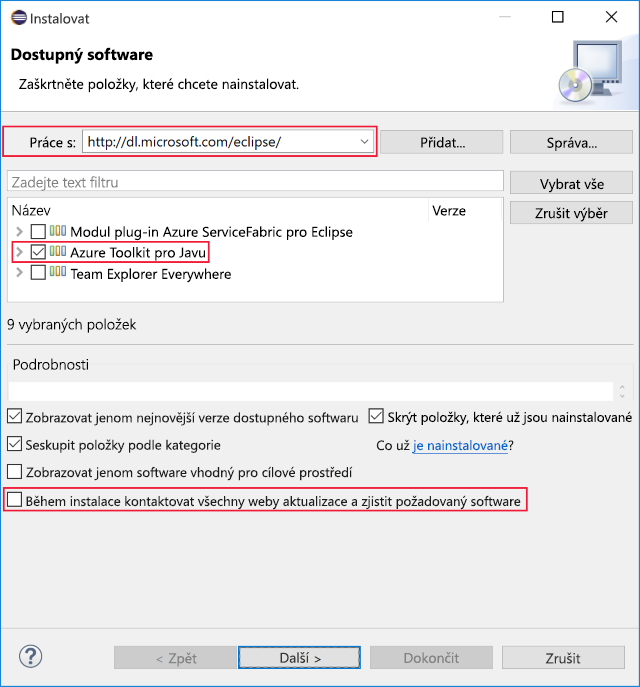

Nyní nainstalujete Eclipse a sadu Azure Toolkit na místní vývojový počítač. Na konci tohoto cvičení budete mít vše, co potřebujete k vytvoření aplikace v Javě, připojené k prostředí Azure.

## Instalace integrovaného vývojového prostředí (IDE) Eclipse

1. Stáhněte si příslušné prostředí [Eclipse IDE pro váš operační systém](https://www.eclipse.org/downloads/packages/installer).

1. Stažený instalační program Eclipse spusťte.

    1. Ve Windows dvakrát klikněte na stažený soubor.

    1. V macOS nebo Linuxu rozbalte instalační program ze staženého souboru a spusťte ho.

        > [!NOTE]
        > Instalační program vás může vyzvat k instalaci sady Java Development Kit, pokud ještě není nainstalovaná.

1. Vyberte balíčky pro instalaci. Jakožto vývojář v Javě zvolte možnost Java nebo Java EE Eclipse IDE.

1. Vyberte cíl instalace na svém počítači.

1. Spusťte prostředí Eclipse, abyste ověřili, že je správně nainstalované.

## Instalace sady Azure Toolkit for Eclipse

Instalace sady Azure Toolkit je stejná ve Windows, macOS i Linuxu.

1. Spusťte Eclipse.

1. Přejděte na **Help** (Nápověda) > **Install New Software...** (Instalovat nový software...).

    Následující snímek obrazovky ukazuje umístění položky **Install New Software...** (Instalace nového softwaru) v nabídce.

    

1. Otevře se dialogové okno **Available Software** (Dostupný software). Do textového pole **Work with:** (Pracovat s:) zadejte `http://dl.microsoft.com/eclipse/` a stiskněte Enter.

1. Ve výsledcích zaškrtněte možnost **Azure Toolkit for Java**. Pokud je možnost **Contact all update sites during install to find required software** (Během instalace kontaktovat všechny weby aktualizace a zjistit požadovaný software) zaškrtnutá, zrušte její zaškrtnutí.

    Následující snímek obrazovky ukazuje konfiguraci instalace **Available Software** (Dostupný software), jak je popsáno výše.

    

1. Klikněte na **Next** (Další).

1. Přečtěte si a přijměte licenční smlouvy a klikněte na **Finish** (Dokončit).

1. Eclipse se stáhne a nainstaluje Azure Toolkit.

1. V případě potřeby Eclipse restartujte.

1. Ověřte instalaci sady Azure Toolkit – v Eclipse musí být k dispozici možnost nabídky **Tools** (Nástroje) > **Azure**.
