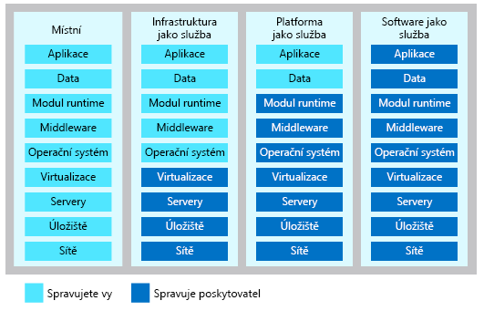

V souvislosti s cloud computingem mluvíme o třech hlavních kategoriích. Je důležité, abyste jim porozuměli, protože se používají v rozhovorech, dokumentaci a školeních.

## Prozkoumejte tři kategorie cloud computingu

#### Porovnání IaaS, Sass a PaaS

> [!VIDEO https://www.microsoft.com/videoplayer/embed/RE2yEbs]

:::row:::
  :::column:::
    
  :::column-end:::
  :::column span="3":::
**Infrastruktura jako služba (IaaS)**

Infrastruktura jako služba je nejflexibilnější kategorií cloudových služeb. Jejím cílem je poskytovat úplnou kontrolu nad hardwarem, na kterém běží vaše aplikace (servery a virtuální počítače infrastruktury IT, úložiště, sítě a operační systémy). Hardware si nemusíte kupovat, s IaaS si ho pronajmete. Je to okamžitě dostupná výpočetní infrastruktura, která se zřizuje a spravuje přes internet.

> [!NOTE]
> Při používání IaaS je zodpovědnost za provozuschopnost služby rozdělená: Poskytovatel cloudu zodpovídá za správné fungování infrastruktury cloudu, zákazník cloudu zodpovídá za správnou konfiguraci používané služby, za její aktuálnost a dostupnost zákazníkům. Je to takzvaný **model sdílené zodpovědnosti**.

IaaS se obvykle používá v následujících scénářích:

- **Migrace úloh.** Zařízení IaaS se obvykle spravují podobně jako místní infrastruktura a umožňují snadnou migraci stávajících aplikací do cloudu.

- **Testování a vývoj.** Týmy můžou testovací a vývojová prostředí rychle vytvářet nebo odstraňovat a rychleji tak přinášet na trh nové aplikace. IaaS umožňuje rychle a úsporně navyšovat nebo snižovat kapacitu testovacích a vývojových prostředí.

- **Hostování webů.** Provozování webů pomocí IaaS může být levnější než tradiční hostování webů.

- **Ukládání, zálohování a obnovení dat.** Organizace se vyhnou kapitálovým výdajům a složitosti správy úložiště – správa dat a splnění právních požadavků a dodržování předpisů obvykle vyžaduje kvalifikovaný personál. IaaS je řešení užitečné pro správu nepředvídatelné poptávky a trvale rostoucích nároků na úložiště. Může také zjednodušit plánování a správu systémů zálohování a obnovy.

  :::column-end:::
:::row-end:::

:::row:::
  :::column:::
    
  :::column-end:::
  :::column span="3":::
**Platforma jako služba (PaaS)**

PaaS poskytuje prostředí pro sestavování, testování a nasazování softwarových aplikací. Cílem PaaS je pomoct vám vytvořit aplikaci co nejrychleji, aniž byste se museli starat o správu základní infrastruktury. Když například nasazujete webovou aplikaci pomocí PaaS, nemusíte instalovat operační systém, webový server nebo dokonce aktualizace systému. 

PaaS je kompletní prostředí pro vývoj a nasazení v cloudu – s prostředky, které organizacím umožňují dodávat všechno od jednoduchých cloudových aplikací až po sofistikované podnikové aplikace s podporou cloudu. Prostředky se nakupují od poskytovatele cloudu na základě průběžných plateb a přistupuje se k nim přes zabezpečené připojení k internetu.

PaaS se obvykle používá v následujících scénářích:

**Vývojový rámec.** PaaS poskytuje rámec, na jehož základě můžou vývojáři vyvíjet nebo přizpůsobovat cloudové aplikace. PaaS umožňuje vývojářům vytvářet aplikace pomocí integrovaných softwarových komponent, podobně jako když vytváříte makro v Microsoft Excelu. Součástí jsou i cloudové funkce, jako je škálovatelnost, vysoká dostupnost a podpora více tenantů, takže vývojáři nemusejí tolik kódovat.

**Analýzy a business intelligence.** Nástroje poskytované u PaaS jako služba umožňují organizacím analyzovat a dolovat data. Organizace můžou získat poznatky a vzorce, které jim pomůžou předvídat výsledky a zlepšit obchodní rozhodnutí, jako jsou prognózy, návrh produktů nebo návratnost investic.

  :::column-end:::
:::row-end:::

:::row:::
  :::column:::
    
  :::column-end:::
  :::column span="3":::
**Software jako služba (SaaS)**

SaaS je software, který se centrálně hostuje a spravuje za koncového zákazníka. Obvykle je založený na architektuře, ve které jedna verze aplikace slouží všem zákazníkům, a je licencovaný jako měsíční nebo roční předplatné. Dokonalými příklady softwaru SaaS jsou Office 365, Skype a Dynamics CRM Online.
  :::column-end:::
:::row-end:::

### Náklady a vlastnictví

> [!div class="mx-tableFixed"]
> | | IaaS | PaaS | SaaS |
> |-|------|------|------|
> | Počáteční náklady | Nejsou žádné počáteční náklady. Uživatelé platí jenom za to, co spotřebují. | Nejsou žádné počáteční náklady. Uživatelé platí jenom za to, co spotřebují. | Uživatelé nemají žádné počáteční náklady – platí předplatné, obvykle měsíčně nebo ročně. |
> | Vlastnictví uživatele | Uživatel zodpovídá za nákup, instalaci, konfiguraci a správu vlastních operačních systémů, middlewaru a aplikací. | Uživatel zodpovídá za vývoj vlastních aplikací. Uživatelé ale nezodpovídají za správu serveru a infrastruktury. Díky tomu se můžou soustředit na aplikace a úlohy, které chtějí používat. | Uživatelé aplikační software jenom používají; nezodpovídají za údržbu takového softwaru. | 
> | Vlastnictví poskytovatele cloudu | Poskytovatel cloudu zodpovídá za to, aby základní cloudová infrastruktura (například virtuální počítače, úložiště a sítě) byla k dispozici uživateli. | Poskytovatel cloudu zodpovídá za správu operačního systému a konfiguraci sítě a služeb. Poskytovatelé cloudu obvykle odpovídají za všechno kromě aplikací, které chce uživatel používat. Poskytují kompletní spravovanou platformu, na které poběží aplikace. | Poskytovatel cloudu zodpovídá za poskytování, správu a údržbu aplikačního softwaru. |

### Zodpovědnost za správu

Je třeba pochopit, že tyto kategorie jsou jako vrstvy ležící jedna nad druhou. PaaS například přidává vrstvu na IaaS tím, že poskytuje úroveň abstrakce. Výhodou abstrakce je, že skrývá podrobnosti, které vás pravděpodobně nezajímají, a umožní vám dostat se rychleji ke kódování. Nevýhodou však je, že máte menší kontrolu nad základním hardwarem. Následující obrázek ukazuje seznam prostředků, které spravujete a které váš poskytovatel služeb spravuje v jednotlivých kategoriích cloudové služby.

- IaaS vyžaduje od uživatelů ze všech cloudových služeb nejvíce správy. Uživatel zodpovídá za správu operačních systémů, dat a aplikací.
- PaaS vyžaduje od uživatelů méně správy. Poskytovatel cloudu spravuje operační systémy a uživatel zodpovídá za aplikace a za data, která tyto aplikace používají a ukládají.
- SaaS vyžaduje nejméně správy. Poskytovatel cloudu zodpovídá za správu všeho a koncový uživatel jenom používá software.

## Shrnutí

IaaS, PaaS a SaaS obsahují různé úrovně spravovaných služeb. Tyto typy infrastruktury můžete snadno kombinovat. Na firemních počítačích můžete třeba používat Office 365 (SaaS), v Azure můžete hostovat virtuální počítače (IaaS) a pro ukládání dat využívat Azure SQL Database (PaaS). Díky flexibilitě cloudu můžete použít libovolnou kombinaci, která vám přinese maximální užitek.
