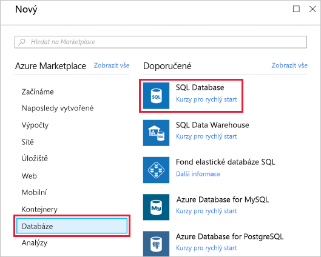
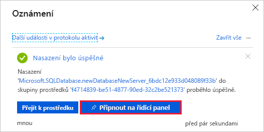
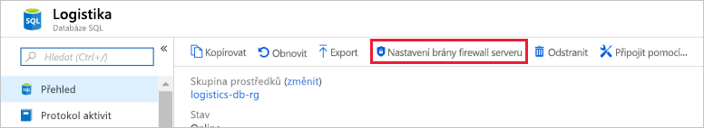
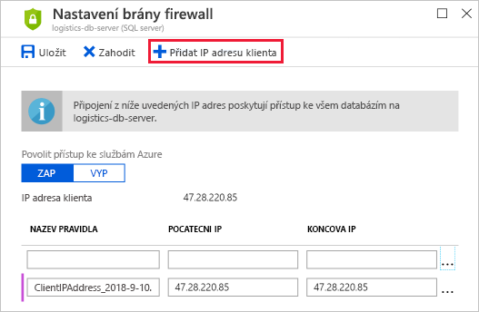

Vaše přepravní společnost se chce odlišit od ostatních společností, aniž by ji to stálo příliš mnoho peněz. Musíte dobře rozumět tomu, jak nastavit databázi, abyste poskytovali nejlepší službu a současně omezili náklady.

[!include]

Tady se naučíte:

- Co je potřeba brát v úvahu při vytváření Azure SQL Database, včetně tohoto:
  - Jak funguje logický server jako kontejner pro vaše databáze
  - Rozdíly mezi modely nákupu
  - Jak elastické fondy umožňují sdílet výkon zpracování mezi databázemi
  - Jak pravidla kolace ovlivňují způsob porovnávání a řazení dat
- Jak vyvolat Azure SQL Database z portálu
- Jak přidat pravidla brány firewall tak, aby vaše databáze byla přístupná jenom z důvěryhodných zdrojů

Pojďme se stručně podívat na několik věcí, které je potřeba zvážit při vytváření Azure SQL Database.

## Jeden server, mnoho databází

Když vytvoříte první Azure SQL Database, vytvoříte také _logický server Azure SQL_. Logický server si představte jako kontejner pro vaše databáze. Přes logický server můžete řídit přihlašování, pravidla brány firewall a zásady zabezpečení. Můžete také tyto zásady v každé databázi na logickém serveru přepsat.

Teď budete potřebovat jenom jednu databázi. Logický server ale umožňuje později přidat další a vyladit výkon mezi všemi databázemi.

## Výběr výkonu: jednotky databázové transakce nebo virtuální jádra

Azure SQL Database má dva modely nákupu: jednotky databázové transakce (DTU) a virtuální jádra.

### Co jsou DTU?

DTU je zkratka jednotky databázové transakce (Database Transaction Unit) a jedná se o kombinaci míry výpočetního výkonu, úložiště a prostředků vstupu/výstupu. Model DTU si můžete představit jako jednoduchou předem nakonfigurovanou možnost nákupu.

Protože logický server může obsahovat více než jednu databázi, existuje také koncept eDTU neboli jednotek elastické databázové transakce. Tato možnost vám umožňuje vybrat jednu cenu, ale s tím, že každá databáze ve fondu může využívat větší nebo menší počet prostředků v závislosti na aktuálním zatížení.

### Co jsou virtuální jádra?

Virtuální jádra vám dávají větší kontrolu nad tím, jaké výpočetní prostředky a prostředky úložiště vytvoříte a za co platíte.

Zatímco model DTU poskytuje pevné kombinace objemu prostředků pro výpočty, úložiště a vstupně-výstupní operace, model virtuálních jader umožňuje konfigurovat prostředky nezávisle na sobě. S modelem virtuálních jader můžete třeba zvýšit kapacitu úložiště, ale zachovat stávající množství výpočetních operací a vstupně-výstupní propustnosti.

Váš přepravní a logistický prototyp potřebuje jenom jednu instanci Azure SQL Database. Rozhodnete se pro možnost DTU, protože poskytuje dobrou rovnováhu mezi výpočetními prostředky, úložištěm a vstupně-výstupním výkonem a je do začátku levnější.

## Co jsou elastické fondy SQL?

Když vytvoříte Azure SQL Database, můžete vytvořit _elastický fond SQL_.

Elastické fondy SQL se vztahují k jednotkám eDTU. Umožňují zakoupit sadu výpočetních a úložných prostředků, které se sdílejí mezi všemi databázemi ve fondu. Každá databáze může používat prostředky, které potřebuje, v rámci omezení, která nastavíte, v závislosti na aktuálním zatížení.

Pro váš prototyp nebude elastický fond SQL potřeba, protože potřebujete jenom jednu databázi SQL.

## Co je kolace?

Kolace znamená pravidla, která řadí a porovnávají data. Kolace vám pomáhá definovat pravidla řazení, když jsou důležité rozlišování velikosti písmen, diakritika a další vlastnosti jazyka.

Věnujme chvilku tomu, abychom zjistili, co znamená výchozí kolace **SQL_Latin1_General_CP1_CI_AS**.

- **Latin1_General** odkazuje na rodinu západoevropských jazyků.
- **CP1** odkazuje na znakovou stránkou 1252, oblíbené kódování znaků latinky.
- **CI** znamená, že se při porovnávání nerozlišují malá a velká písmena. Například „AHOJ“ se při porovnání rovná „ahoj“.
- **AS** znamená, že se při porovnávání rozlišuje diakritika. Například „baňka“ se při porovnání nerovná „banka“.

Protože nemáte specifické požadavky ohledně řazení a porovnávání dat, zvolíte výchozí kolaci.

## Vytvoření Azure SQL Database

Tady nastavíte databázi včetně vytvoření logického serveru. Vyberete nastavení, která podporují vaši aplikaci přepravní logistiky. V praxi byste zvolili nastavení podporující typ aplikace, kterou vytváříte.

Pokud si časem uvědomíte, že potřebujete další výpočetní výkon, abyste udrželi krok s poptávkou, můžete upravit možnosti výkonu nebo i přecházet mezi modely výkonu na základě DTU a virtuálních jader.

1. Pomocí stejného účtu, kterým jste aktivovali sandbox, se přihlaste k webu [portál Microsoft Azure](https://portal.azure.com/learn.docs.microsoft.com?azure-portal=true).

1. Na portálu klikněte v levém horním rohu na **Vytvořit prostředek**. Vyberte **Databáze** a pak vyberte **SQL Database**.

   

1. V části **Server** klikněte na **Konfigurovat požadovaná nastavení**, vyplňte formulář a pak klikněte na **Vybrat**. Tady jsou další informace, jak formulář vyplnit:

    | Nastavení      | Hodnota |
    | ------------ | ----- |
    | **Název serveru** | Globálně jedinečný [název serveru](https://docs.microsoft.com/azure/architecture/best-practices/naming-conventions) |
    | **Přihlašovací jméno správce serveru** | [Identifikátor databáze](https://docs.microsoft.com/sql/relational-databases/databases/database-identifiers), který slouží jako vaše přihlašovací jméno primárního správce. |
    | **Heslo** | Jakékoli platné heslo, které má aspoň osm znaků a obsahuje znaky ze tří z těchto kategorií: velká písmena, malá písmena, číslice a jiné než alfanumerické znaky. |
    | **Umístění** | Jakékoli platné umístění z níže uvedeného seznamu. |

    [!include]

1. Klikněte na **Cenová úroveň** a určete úroveň služby. Vyberte úroveň služby **Základní** a pak klikněte na **Použít**.

1. Pomocí těchto hodnot vyplňte zbývající části formuláře.

    | Nastavení      | Hodnota |
    | ------------ | ----- |
    | **Název databáze** | **Logistika** |
    | **Předplatné** | Vaše předplatné |
    | **Skupina prostředků** |  Použijte existující skupinu <rgn>[název skupiny prostředků sandboxu]</rgn> |
    | **Vybrat zdroj** | **Prázdná databáze** |
    | **Chcete používat elastický fond SQL?** | **Teď ne** |
    | **Kolace** | **SQL_Latin1_General_CP1_CI_AS** |

1. Kliknutím na **Vytvořit** vytvořte Azure SQL Database.

    > [!IMPORTANT]
    > Název serveru, přihlašovací jméno správce a heslo si poznamenejte na později.

1. Na panelu nástrojů klikněte na **Oznámení** a sledujte proces nasazení.

Po dokončení procesu kliknutím na **Připnout na řídicí panel** připněte databázový server na řídicí panel, abyste k němu měli rychlý přístup, až ho budete později potřebovat.

   

## Nastavení brány firewall serveru

Azure SQL Database je teď v provozu. Máte řadu možností, jak novou databázi dál konfigurovat, zabezpečit, monitorovat a řešit případné potíže.

Můžete také určit, které systémy mají přístup k databázi přes bránu firewall. Zpočátku brána firewall brání veškerému přístupu k vašemu databázovému serveru odkudkoli mimo Azure.

Pro váš prototyp potřebujete přístup k databázi jenom ze svého notebooku. Později můžete na seznam povolených přidat další systémy, třeba mobilní aplikaci.

Pojďme teď povolit přístup k databázi přes bránu firewall z vašeho vývojového počítače.

1. Přejděte na kartu přehledu databáze Logistics. Pokud jste předtím databázi připnuli, můžete se na ni dostat kliknutím na dlaždici **Logistics** na řídicím panelu.

1. Klikněte na **Nastavit bránu firewall serveru**.

    

1. Klikněte na **Přidat IP adresu klienta** a pak klikněte na **Uložit**.

    

V další části získáte praktické zkušenosti s novou databází a s službou Azure Cloud Shell. Připojíte se k databázi, vytvoříte tabulku, přidáte ukázková data a spustíte několik příkazů jazyka SQL.