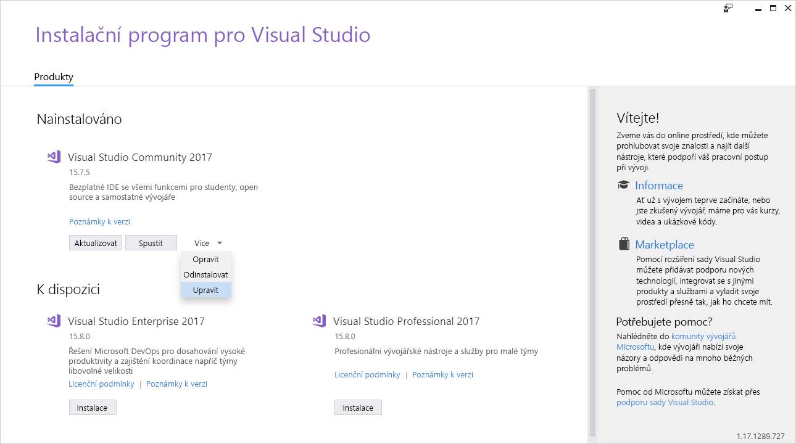
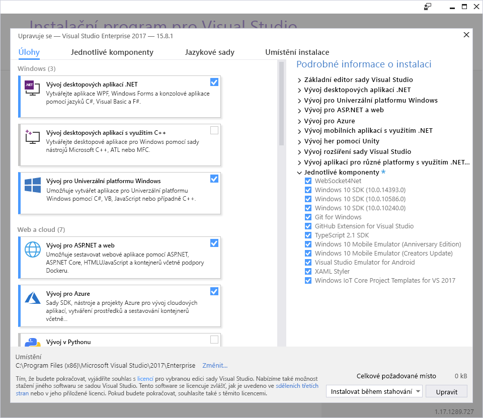

Prvním krokem k novému webu je příprava vývojového prostředí. Vytváření a nasazování webových aplikací ASP.NET vyžaduje mít na místním počítači nainstalované potřebné nástroje. V tomto článku probereme potřebné nástroje a jejich instalaci.


Visual Studio 2017 má dvě sady funkcí, které potřebujete k vytvoření, publikování a nasazení webu do Azure. Tyto sady funkcí zahrnují všechny šablony pro web ASP.NET a umožňují připojení webu k Azure a nasazení webu do Azure.

Musíte se přesvědčit, že máte nainstalované následující sady funkcí:

- **Vývoj pro ASP.NET a web:** Sada funkcí pro vývoj webů v sadě Visual Studio 2017 je navržená tak, aby maximalizovala produktivitu při vývoji webových aplikací s pomocí ASP.NET a technologií založených na standardech, jako jsou jazyky HTML a JavaScript.
- **Vývoj pro Azure:** Sada funkcí pro vývoj Azure v sadě Visual Studio 2017 nainstaluje nejnovější sadu Azure SDK pro .NET a nástroje pro Visual Studio. Po instalaci těchto položek si můžete prostředky prohlédnout v Průzkumníku cloudu, vytvářet prostředky pomocí nástrojů Azure Resource Manageru, vytvářet aplikace pro web Azure a cloudové služby a používat nástroje Azure Data Lake k operacím s velkými objemy dat.


K úpravě komponent nainstalovaných jako součást sady Visual Studio použijete instalační program pro Visual Studio.

1. Instalační program spustíte z nabídky Start systému Windows. Posuňte se dolů na písmeno **V** a potom klikněte na **Instalační program pro Visual Studio**. Případně můžete jednoduše zadáním ```Visual Studio Installer``` do otevřené nabídky Start vyhledat odkaz na instalační program. Potom vyberte **Enter**.

1. Zobrazí se okno instalačního programu pro Visual Studio. Klikněte na tlačítko **Upravit**. Pokud ho nevidíte, můžete možnost **Upravit** vybrat z rozevírací nabídky **Další**.

    

1. Zkontrolujte, že na kartě **Sady funkcí** jsou v části **Web a Cloud** vybrané úlohy **Vývoj pro ASP.NET a web** a **Vývoj pro Azure**.  

1. Dále v pravém dolním rohu instalačního programu klikněte na tlačítko **Upravit**. Instalační program pro Visual Studio stáhne a nainstaluje potřebné součásti.

1. V rámci přípravy na vytvoření aplikace ASP.NET v další části klikněte na **Spustit**.

Ze sady Visual Studio 2017 se sadami funkcí **Vývoj pro ASP.NET a web** a **Vývoj pro Azure** můžete vytvářet, spravovat a publikovat web ASP.NET.
