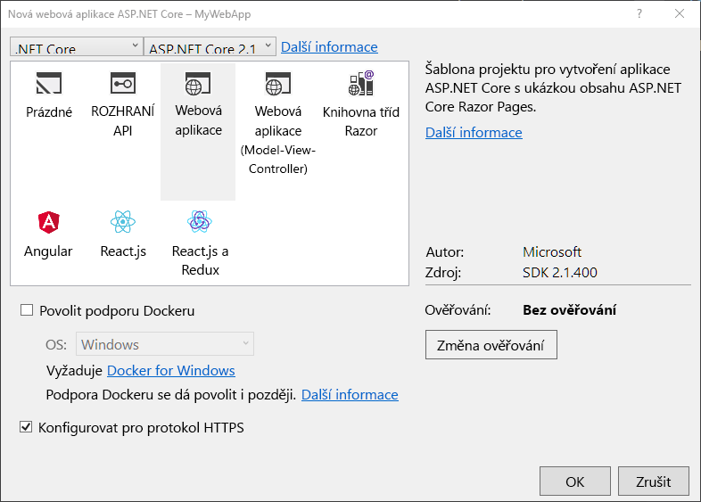
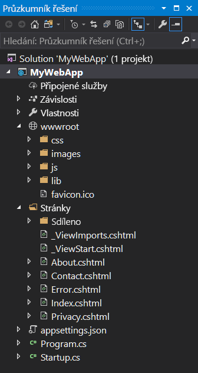
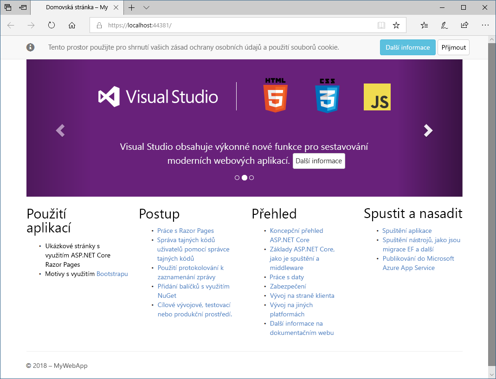

V této lekci vytvoříte, sestavíte a spustíte novou webovou aplikaci využívající ASP.NET na místním počítači.

## Vytvoření projektu

Prvním krokem je spustit Visual Studio a vytvořit místní webovou aplikaci využívající ASP.NET Core.

1. Na úvodní stránce sady Visual Studio vyberte **Soubor**. Klikněte na **Nový** a pak klikněte na **Projekt**.

1. V dialogovém okně **Nový projekt** vyberte v levém podokně možnost **Web**.

1. V prostředním podokně klikněte na **Webová aplikace ASP.NET Core**.

1. Do pole **Název** v dolní části dialogového okna zadejte název **AlpineSkiHouse**.

1. Pak vyberte **umístění** svého nového řešení.

1. Kliknutím na tlačítko **Vytvořit** vytvořte projekt.

1. V dialogovém okně **Nová webová aplikace ASP.NET Core** budete mít na výběr šablony, které vám pomůžou začít. Pro toto cvičení vyberte šablonu **Webová aplikace** a kliknutím na **OK** projekt vytvořte.

    

    > [!NOTE]
    > V tomto dialogovém okně můžete také vybrat různé výchozí šablony v závislosti na vašich požadavcích na vývoj webových aplikací. V horní části dialogového okna máte také možnost vybrat verzi rozhraní ASP.NET Core. Měli byste vybrat verzi ASP.NET Core 2.0 nebo novější.

1. Teď byste měli mít nové řešení webové aplikace využívající ASP.NET Core.

    

## Sestavení a otestování na místním počítači

Před nasazením do Azure aplikaci sestavíme a otestujeme na místním počítači.

1. Spuštění aplikace

    Stisknutím klávesy <kbd>F5</kbd> sestavte projekt a spusťte ladicí režim.

    Stisknutím kláves <kbd>Ctrl+F5</kbd> sestavte projekt a spusťte ho bez připojení ladicího programu.
    
    > [!TIP]
    > Spuštění aplikace v režimu bez ladění umožňuje provést změny kódu, uložit soubor, aktualizovat prohlížeč a zobrazit změny kódu. Řada vývojářů dává přednost používání režimu bez ladění, aby mohli aplikaci rychle spustit a podívat se na změny.

1. Visual Studio spustí webový prohlížeč služby IIS Express a načte aplikaci.

    

    Když Visual Studio vytvoří webový projekt, použije se pro webový server náhodný port. Na předchozím obrázku je vidět číslo portu 44381. Při spuštění aplikace se vám pravděpodobně zobrazí jiné číslo portu.

    > [!IMPORTANT]
    > V horní části webové stránky si můžete všimnout části s místem pro vaše zásady ochrany osobních údajů a použití souborů cookie. Kliknutím na tlačítko **Přijmout** vyjádříte souhlas se sledováním. Tato aplikace nesleduje osobní údaje. Kód vygenerovaný šablonou zahrnuje prostředky, které vám pomohou splnit požadavky obecného nařízení o ochraně osobních údajů (GDPR).

Právě jste z ukázkové šablony vytvořili webovou aplikaci, která se spouští místně. Dalším krokem je její nasazení do Azure.

