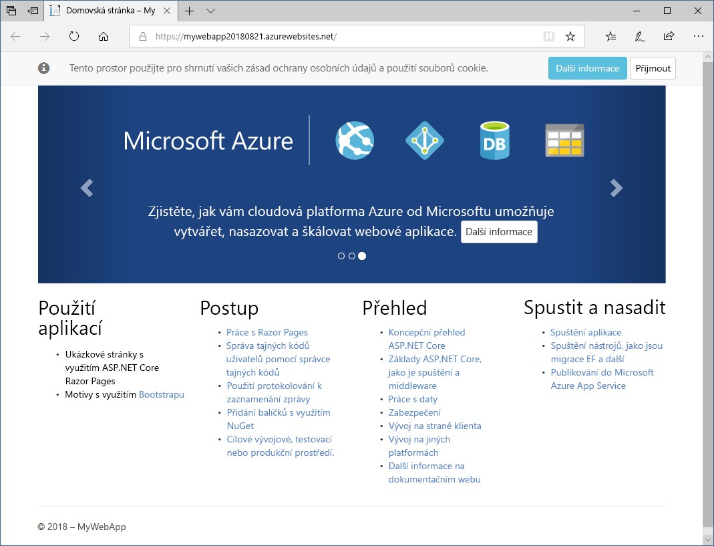

Teď máte webovou aplikaci ASP.NET Core běžící místně. V této části aplikaci publikujete do služby Azure App Service.

1. V Průzkumníku řešení klikněte pravým tlačítkem na projekt a vyberte **Publish** (Publikovat).

1. Klikněte na **Start** (Spustit).

1. V zobrazeném dialogovém okně zvolte vlevo jako cíl publikování službu **App Service**.  Vpravo vyberte **Create New** (Vytvořit novou), abyste vytvořili aplikaci služby App Service.

1. Klikněte na **Publish** (Publikovat).

### Konfigurace nové služby Azure App Service

1. V dialogovém okně **Vytvořit plán App Service** klikněte na **Přidat účet** a přihlaste se k Azure.

1. Zadejte požadované informace o plánu služby App Service.

    V dialogovém okně **Vytvořit plán App Service** zadejte následující údaje:

    - **Název aplikace:** Toto je název vaší aplikace.  Název určuje adresu URL publikované aplikace, která bude vypadat následovně: https://&lt;NazevAplikace&gt;.azurewebsites.net. Tato hodnota musí být jedinečná. Možná budete muset vyzkoušet několik názvů, abyste našli takový, který je jedinečný.

    - **Předplatné:** Předplatné Azure, které chcete použít k nasazení aplikace. Vyberte **předplatné Concierge**, které poskytujeme prostřednictvím sandboxu.

    - **Skupina prostředků:** Vyberte existující skupinu prostředků <rgn>[název skupiny prostředků sandboxu]</rgn>.

    - **Plán hostování:** Plán hostování určuje umístění, velikost a funkce farmy webových serverů, která hostuje vaši aplikaci.  V tomto cvičení vytvoříte nový plán hostování.

        Vedle plánu hostování klikněte na tlačítko **Nový...**

    - **Application Insights:** Určuje, zda chcete u aplikace používat Application Insights. V tomto cvičení doporučujeme zvolit možnost **Žádné**.

1. Publikování aplikace zahájíte kliknutím na tlačítko **Vytvořit**. Zobrazí se průběh nasazení.

1. Blahopřejeme vám. Vaše webová aplikace ASP.NET Core je teď publikovaná a aktivní. Konečná adresa URL webu je ve výstupu sestavení a také na stránce publikování v sadě Visual Studio.

1. Pokud chcete webovou stránku otestovat, přejděte na uvedenou adresu URL.

    

    > [!NOTE]
    > Pokud ve výstupu nemůžete najít adresu URL, přejděte na https://&lt;NazevAplikace&gt;.azurewebsites.net, kde &lt;NazevAplikace&gt; je dříve zadaný název aplikace. Příklad: **https://alpineskihouse123.azurewebsites.net/**.

Teď máte živou webovou aplikaci. Vytvořili jste plán služby Azure App Service. Aplikace běží a je připravená přijímat aktualizace.
  