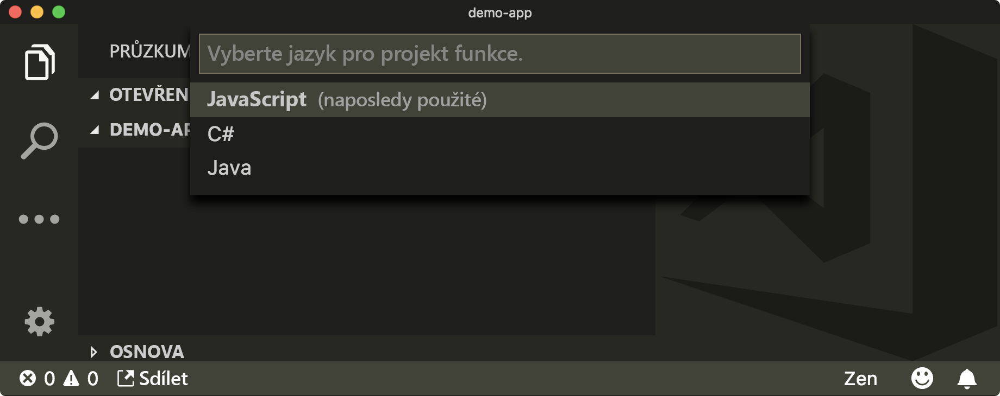
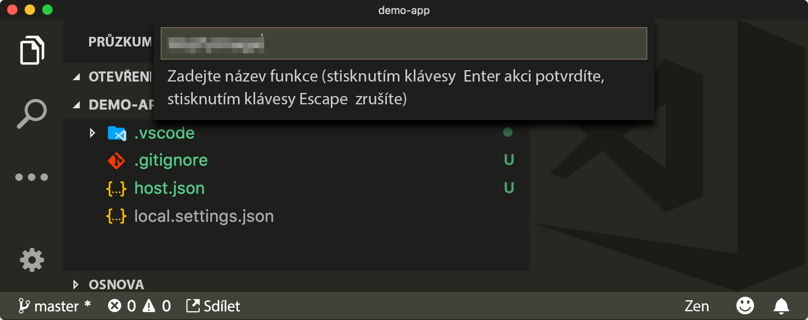
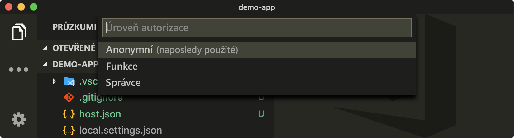

K hostování tohoto kódu použijeme Azure Functions. Vytvoříte aplikaci Azure Function App a triggery HTTP v jazyce `JavaScript` pro jednotlivé funkce a pak budete tyto funkce místně spouštět a ladit.

## <a name="create-an-azure-function-project"></a>Vytvoření projektu funkcí Azure

Funkce Azure je fragment kódu, který se spouští, aniž byste museli konfigurovat jakoukoli cloudovou infrastrukturu.

Projekt funkcí Azure je kontejner pro více funkcí. Funkce se aktivují různými způsoby. Vy budete funkce aktivovat odesláním požadavku HTTP.

Existuje mnoho způsobů, jak vytvářet funkce Azure. Jedním z jednodušších způsobů je použití nástroje Visual Studio Code a rozšíření Azure Functions.

1. Otevřete nástroj Visual Studio Code.

1. V nástroji Visual Studio Code otevřete složku v GitHubu s klonovaným zdrojovým kódem.

    >[!IMPORTANT]
    > V této složce budete vyvíjet své funkce Azure. Kód, který tu najdete, vám poskytne potřebnou strukturu.

1. Klikněte na **View** (Zobrazit), pak na **Command Palette** (Paleta příkazů) a pak vyhledejte a vyberte **Azure Functions: Create New Project...** (Funkce Azure: Vytvořit nový projekt).

   > [!NOTE]
   > Pokud budete vyzváni k přepsání souborů, jako je třeba `.gitignore`, zvolte možnost **No to all** (Ne všem).

   

1. Vyberte složku, ve které chcete vytvořit aplikaci funkcí. Vyberte aktuální složku (složku, kterou jste otevřeli v nástroji Visual Studio Code).

   

1. Jako požadovaný jazyk zvolte **JavaScript**.

   

1. Když se zobrazí dotaz, jestli chcete přepsat soubor `.gitignore`, zvolte **No** (Ne).

1. Ve složce projektu byste měli vidět vytvořené soubory `host.json`,`proxies.json` a `local.settings.json`.

   

## <a name="create-an-azure-function"></a>Vytvoření funkce Azure

Teď vytvoříte samotnou funkci Azure. Toto je část kódu, která odpovídá na požadavek HTTP.

Znovu použijete rozšíření Visual Studio Code.

1. Klikněte na **View** (Zobrazit), pak na **Command Palette** (Paleta příkazů) a pak vyhledejte a vyberte **Azure Functions: Create Function...** (Funkce Azure: Vytvořit funkci).

    

1. Vyberte složku, ve které jste původně vytvořili projekt funkcí.

    

1. Vyberte možnost **HTTP Trigger** (Trigger HTTP).

    

1. Jako název funkce zadejte `MojifyImage`.

    

1. Jako úroveň ověřování zvolte **Anonymous** (Anonymní).

    > [!NOTE]
    > Když zvolíte **Anonymous** (Anonymní), bude funkce dostupná pro kohokoli a nebude zabezpečená. Pokud budete v budoucnosti vytvářet další funkce, není toto doporučené výchozí chování. Protože tady se jedná o cvičení s nízkým rizikem s využitím bezplatných výukových materiálů Azure, není to v této chvíli problém.

    

## <a name="run-the-function-locally"></a>Místní spuštění funkce

Jakmile se tyto příkazy dokončí, budete mít úvodní projekt převedený na projekt funkcí, který bude obsahovat funkci s názvem `MojifyImage` spouštěnou **triggerem HTTP**.

1. Kliknutím na **Terminal** (Terminál) a pak na **New Terminal** (Nový terminál) otevřete terminál sady Visual Studio.

2. Aplikace funkcí spusťte místně na terminálu.

    ```bash
    func host start
    ```

    Tím se místně spustí modul runtime funkce. Pokud vše funguje, měl by se vám zobrazit výstup s adresou URL pro místní `MojifyImage`.

    ```output
    Http Functions:

            MojifyImage: http://localhost:7071/api/MojifyImage
    ```

    > [!TIP]
    > Jednou z výhod používání modulu runtime Azure Functions je, že umožňuje spustit funkci s použitím stejné základní technologie, jaká by se použila ke spuštění této funkce v produkčním prostředí.

3. Pokud si chcete ověřit, že funkce pracuje správně, přejděte na adresu URL zobrazenou na konzole.

    

## <a name="debug-the-function-locally"></a>Ladění funkce místně

> [!Important]
> Nezapomeňte příkaz `func host start` ukončit zadáním <kbd>CTRL-C</kbd> na terminálu, než se ho pokusíte ladit pomocí nástroje Visual Studio Code.

Aplikaci můžete spustit a ladit v nástroji Visual Studio Code.

1. Do souboru `index.js` přidejte zarážku na začátek funkce v JavaScriptu.

    

1. Funkci spusťte v režimu ladění kliknutím na ikonu **Debug** .

    V konfiguraci ladění vyberte **Attach to JavaScript Functions** (Připojit k funkcím v JavaScriptu), než výběrem zeleného trojúhelníku spustíte relaci ladění.

    > [!Note]
    > Konfigurace ladění **Attach to JavaScript Functions** (Připojit k funkcím v JavaScriptu) se automaticky přidá, když vytvoříte projekt funkcí.

1. Spustí se příkaz `func host start` a měl by se otevřít terminál se stejným výstupem.

    ```output
    Http Functions:
    
            MojifyImage: http://localhost:7071/api/MojifyImage
    ```

1. Protože provádíte ladění, měl by se zobrazit panel s nabídkou ladění.

    

Když teď navštívíte tuto adresu URL, zastaví se na určené zarážce a můžete funkcí procházet.
