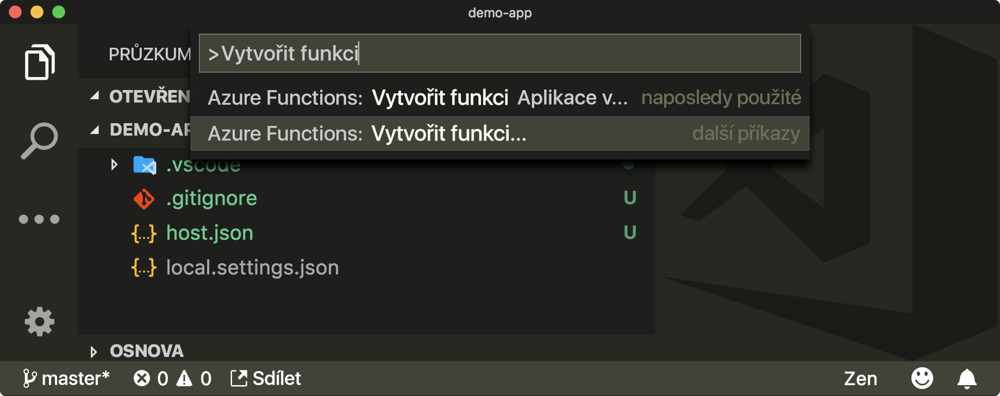
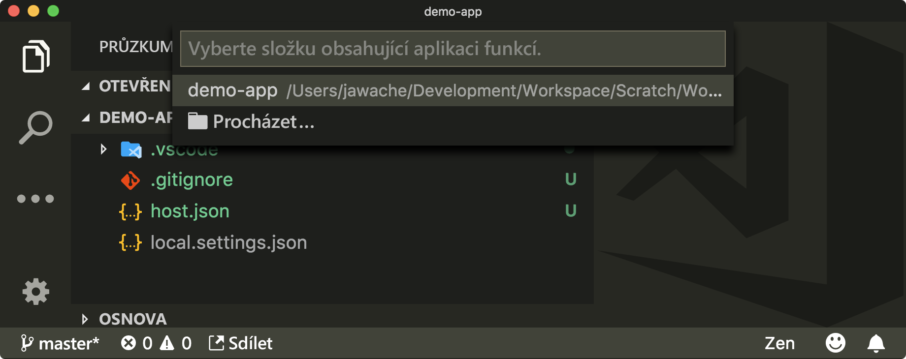
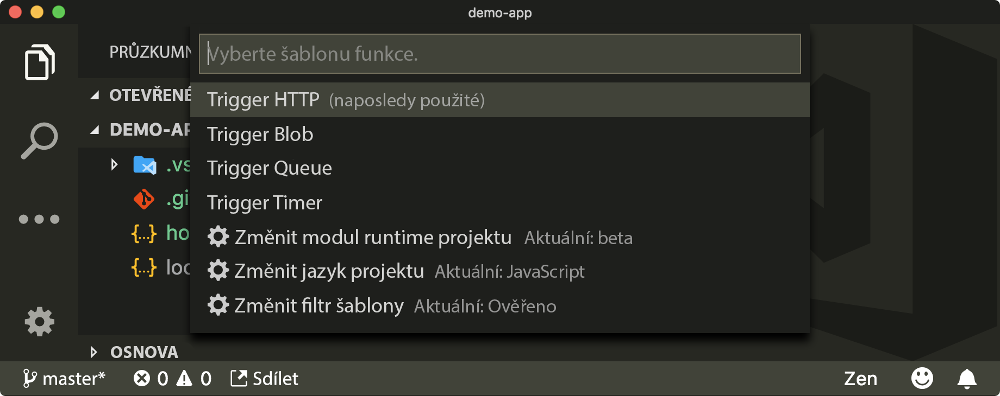
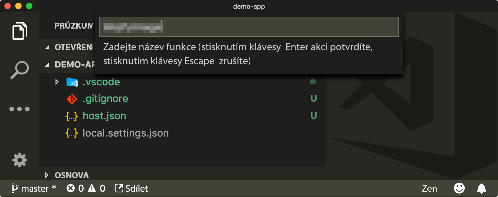
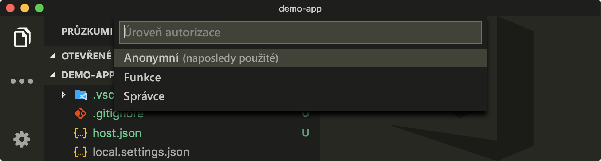

Vytvořili jste funkci Azure `MojifyImage`, která vrací obrázek převedený na emoji. Potřebujete druhý koncový bod, který bude Slack volat vždy, když někdo spustí příkaz `/mojify`. Tento druhý koncový bod musí vracet adresu URL funkci `MojifyImage`.

Při spuštění příkazu Slacku, jako je například `/mojify <some-image-url>`, se do nakonfigurovaného koncového bodu odešle požadavek POST a hodnota `<some-image-url>` se předá jako parametr `text` dotazu vložený do textu zprávy. Vytvoříte funkci `RespondToSlackCommand`, která bude koordinovat a reagovat na příkazy Slacku. Vytvoříte koncový bod HTTP používající formát, který Slack u požadavku očekává, a naučíte se používat tuto funkci tak, aby vracela obrázek.

## <a name="create-the-function-trigger-and-convert-to-typescript"></a>Vytvoření triggeru funkce a jeho převedení do jazyka TypeScript

Potřebujete vytvořit jinou funkci Azure aktivovanou protokolem HTTP. Tyto pokyny jsou v podstatě stejné jako předtím. Liší se v tom, že teď voláte funkci `RespondToSlackCommand` místo `MojifyImage`.

1. Klikněte na **View** (Zobrazit), pak na **Command Palette** (Paleta příkazů) a pak vyhledejte a vyberte **Azure Functions: Create Function...** (Funkce Azure: Vytvořit funkci).

    

2. Vyberte složku, ve které jste původně vytvořili projekt funkcí.

    

3. Vyberte možnost **HTTP Trigger** (Trigger HTTP).

    

4. Jako název funkce zadejte `RespondToSlackCommand`.

    

5. Jako úroveň ověřování zvolte **Anonymous** (Anonymní).

    > [!NOTE]
    > Když zvolíte **Anonymous** (Anonymní), bude funkce dostupná pro kohokoli a nebude zabezpečená. Pokud budete v budoucnosti vytvářet další funkce, není toto doporučené výchozí chování. Protože tady se jedná o cvičení s nízkým rizikem s využitím bezplatných výukových materiálů Azure, není to v této chvíli problém.

    

    Pokud byl tento postup úspěšný, měli byste teď mít v kořenovém adresáři složku **RespondToSlackCommand**.

    Teď můžete soubor převést z jazyka TypeScript do jazyka JavaScript.

6. Ve složce `RespondToSlackCommand` vytvořte soubor s názvem `index.ts`.

   Ujistěte se, že proces sestavování pro `TypeScript` stále běží a že se provádí automatická kompilace do souborů `index.js` a `index.js.map`.

7. Nahraďte kód v souboru `index.ts` následujícím kódem:

    ```typescript
    export function index(context, req) {
      context.log("RespondToSlackCommand HTTP trigger");
      context.res.body = "Hello!";
      context.done();
    }
    ```

## <a name="try-it-out"></a>Vyzkoušet

V prohlížeči přejděte na adresu (http://localhost:7071/api/RespondToSlackCommand) a ujistěte se, že vše funguje. Měl by se vypsat text `Hello!`.

## <a name="write-the-index-function"></a>Napsání funkce `index`

Tato funkce `index(context, req)` v jazyce TypeScript se dá napsat mnohem rychleji než předchozí funkce.

1. Nastavte objekt `context.res` v horní části okna funkce.

    ```typescript
    context.res = {
      headers: {
        "Content-Type": "application/json"
      },
      body: null
    };
    ```

    Tentokrát nemusíte nastavovat vlastnost `isRaw`, protože se použije výchozí hodnota `false`. Musíte však nastavit typ obsahu `application/json`.

1. Přidejte užitečnou knihovnu `querystring`.

    Protože Slack odesílá adresu URL obrázku, budete ji chtít zpracovávat jako řetězec dotazu s klíčem `text`. To informace vloží do textu požadavku, takže budete muset věnovat další úsilí tomu, abyste získali správné informace. Není to ale příliš obtížné.

    Usnadněte si to tím, že naimportujete balíček Node.js s řetězcem `querystring`. Vše je součástí souboru Node.js, takže není potřeba instalovat nic dalšího. Tento výraz pro import přidejte na začátek souboru.

    ```typescript
    import * as querystring from "querystring";
    ```

1. Ve funkci `index(context, req)` převeďte `req.body` na objekt, ze kterého budete extrahovat vlastnost `text`.

    ```typescript
    const { text } = querystring.parse(req.body);
    ```

    Pokud uživatel zadá příkaz správně, měl by text obsahovat adresu URL obrázku. Přidejte nějaké základní ověřování, abyste se ujistili, že to funguje.

    ```typescript
    let message = "Your mojified image my liege...";
    if (!text) {
      message = "You must provide an image to mojify";
    }
    ```

    Příkaz Slacku volá `https://somedomain.com/api/RespondToSlackCommand`. Potřebuje odpovědět odesláním adresy URL pro MojifyImage. Předpokládáme, že bude ve stejné doméně.

1. Extrahujte doménu z adresy URL z požadavku `MojifyImage`.

    ```typescript
    const mojifyUrl = req.originalUrl.substr(0, req.originalUrl.lastIndexOf("/")) + "/MojifyImage";
    ```

1. Nakonec nastavte text odpovědi na formát specifický pro Slack v dolní části funkce `index(context, req)`.

    > [!IMPORTANT]
    > Hodnotu `image_url` ve vlastnosti `attachments` je nutné nastavit tak, aby vracela `mojifyUrl` a předávala adresu URL, kterou uživatel zadal v příkazu jako parametr `imageUrl` dotazu.

    ```typescript
    context.res.body = {
      response_type: "in_channel",
      text: message,
      attachments: [
        {
          image_url: `${mojifyUrl}?imageUrl=${text}`
        }
      ]
    };

    context.done();
    ```

## <a name="try-it-out"></a>Vyzkoušet

1. Ujistěte se, že je spuštěná místní aplikace funkcí Azure, pomocí jedné z metod, které jste dříve používali: buď použijte příkaz `func host start`, nebo ji spusťte z nabídky ladění pomocí úlohy **Attach to JavaScript Function** (Připojit k funkci v JavaScriptu).

    Pokud se aplikace funkcí spustila správně, mělo by okno výstupu zobrazovat něco takového:

    ```
    Http Functions:
            MojifyImage: http://localhost:7071/api/MojifyImage
            RespondToSlackCommand: http://localhost:7071/api/RespondToSlackCommand
    ```

V prohlížeči přejděte na adresu http://localhost:7071/api/RespondToSlackCommand a ujistěte se, že vše funguje. Teď by se měl vypsat soubor json.

```json
{
  "response_type": "in_channel",
  "text": "You must provide an image to mojify",
  "attachments": [
    {
      "image_url": "http://localhost:7071/api/MojifyImage?imageUrl=undefined"
    }
  ]
}
```
