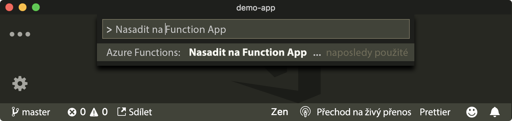
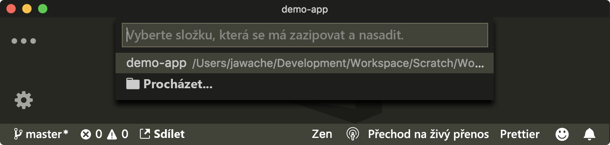
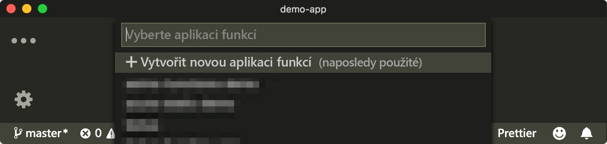
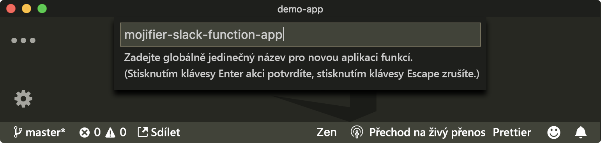
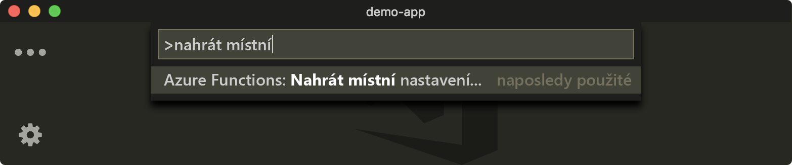
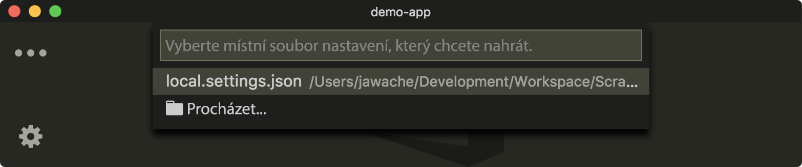

Místně jste vytvořili dvě funkce Azure. Teď tyto místní funkce zprovozníme v cloudu, abyste je mohli volat ze Slacku.

[!include[](../../../includes/azure-sandbox-activate.md)]

## <a name="create-an-azure-function-app-on-azure"></a>Vytvoření aplikace Azure Function App v Azure

Začneme vytvořením aplikace Azure Function App pomocí nástroje VS Code a rozšíření Azure Functions.

1. Klikněte na **View** (Zobrazit), pak na **Command Palette** (Paleta příkazů) a vyberte **Azure Function: Deploy to Function App** (Funkce Azure: Nasadit do aplikace funkcí).

   

2. Potvrďte, že chcete nahrát aktuální projekt.

   

3. Zvolte předplatné sandboxu **Concierge Subscription**.

4. Zvolte **+Create New Function App** (Vytvořit novou aplikaci funkcí).

   

5. Aplikaci pojmenujte. Vyberte globálně jedinečný název. My použijeme název **mojifier-slack-function-app**.

   

6. Vyberte skupinu prostředků. Sandbox Azure vytvořil _skupinu prostředků_, do které můžete umístit své prostředky. Název této skupiny prostředků je **<rgn>[název skupiny prostředků v sandboxu]</rgn>**.

7. Zvolte účet úložiště přidružený k sandboxu.

8. Jakmile se nahrávání dokončí, měla by se v okně s výstupem zobrazit adresa URL.

    ```output
    Deployment to "mojifier-slack-function-app" completed.
    HTTP Trigger Urls:
      MojifyImage: https://mojifier-slack-function-app.azurewebsites.net/api/MojifyImage
      RespondToSlackCommand: https://mojifier-slack-function-app.azurewebsites.net/api/ResponsToSlackCommand
    ```

## <a name="try-it-out"></a>Vyzkoušet

Funkce `RespondToSlackCommand` by měla fungovat, protože se nespoléhá na žádné jiné závislosti.

Přejděte na:

```bash
<deployed-app-name>.azurewebsites.net/api/RespondToSlackCommand
```

Měl by se vám vrátit soubor json.

```json
{
  "response_type": "in_channel",
  "text": "You must provide an image to mojify",
  "attachments": [
    {
      "image_url": "https://mojifier-slack.azurewebsites.net/api/MojifyImage?imageUrl=undefined"
    }
  ]
}
```

## <a name="upload-settings"></a>Nahrání nastavení

Vzpomeňte si, že jsme některá nastavení zadali do souboru `local.settings.json`. Tato nastavení obsahovala klíče a adresu URL pro služby Cognitive Services. Soubor `local.settings.json` je místní a při nasazování se nikdy nekopíruje do produkčního prostředí.

Většinou budete muset otevřít Azure Portal a nastavení ručně přidat v uživatelském rozhraní, anebo použít příkaz `func` v rozhraní příkazového řádku Azure. Protože však používáte nástroj VS Code, můžete místní nastavení nahrát pomocí rozšíření Azure Functions a palety příkazů.

1. Klikněte na **View** (Zobrazit), pak na **Command Palette** (Paleta příkazů) a vyberte **Azure Functions: Upload Local Settings** (Funkce Azure: Nahrát místní nastavení).

    

2. Zvolte `local.settings.json`.

    

3. Zvolte předplatné, které je přidružené k vaší funkci.

4. Vyberte aplikaci funkcí, do které chcete nastavení nahrát. V tomto příkladu je to aplikace s názvem **mojifier-slack-function-app**.

## <a name="try-it-out"></a>Vyzkoušení

Pokud vše funguje podle očekávání, měl by koncový bod MojifyImage fungovat. Navštívení

```bash
https:<deployed-app-name>.azurewebsites.net/api/MojifyImage?imageUrl=<image-url>
```

V okně by se měl zobrazit obrázek s přidanými obrázky emoji.
