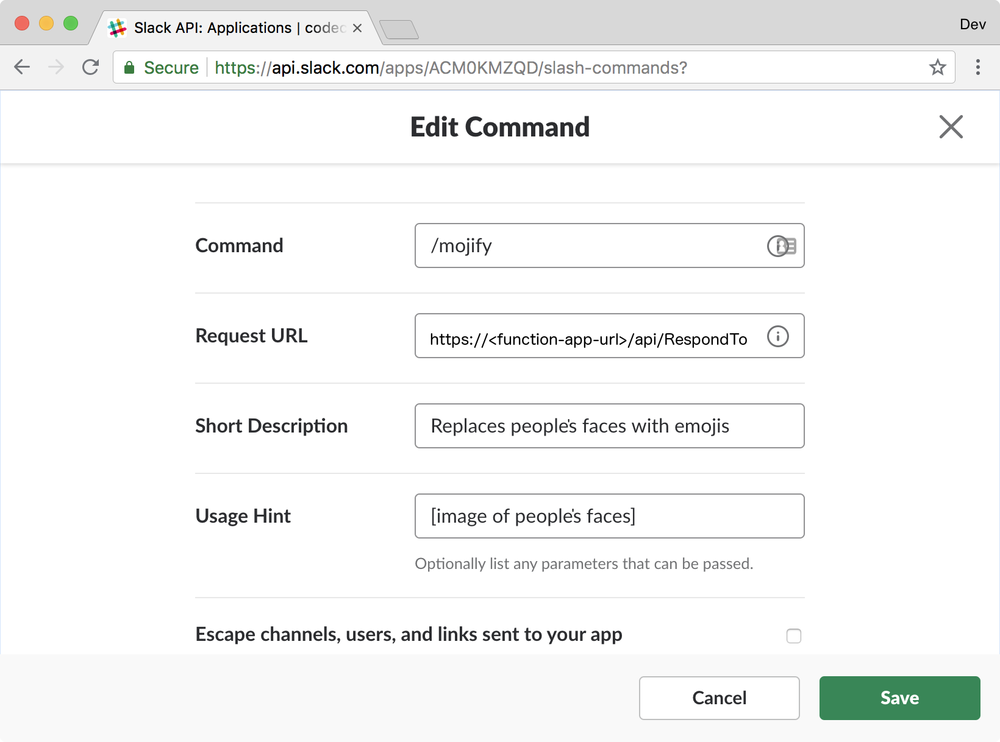

Vytvořili jste všechny požadované Azure Functions a nasadili je! Pojďme propojit Azure Functions se Slackem a vytvořit slackový příkaz lomítko, který zavolá funkci Azure Functions a zobrazí výsledný obrázek s emoji v okně Slacku. 

## Vytvoření slackové aplikace

Příkaz lomítko existuje jako součást aplikace Slack známé jako Slack bot. 

1. [Vytvořte slackovou aplikaci.](https://api.slack.com/apps/new?azure-portal=true)
2. Zvolte **název aplikace**, přidružte ho k **pracovnímu prostoru**, který jste vytvořili na začátku tohoto modulu, a pak vyberte **Create App** (Vytvořit aplikaci).

    

3. Přejděte do slackové aplikace a vytvořte příkaz lomítko. Vyberte položku nabídky `slash Commands` (Příkazy lomítko).

    

4. Vyberte **Create New Command** (Vytvořit nový příkaz).

    - Do pole **Command** (Příkaz) zadejte libovolný název pro váš příkaz lomítko.
    - Do pole **Request URL** (Adresa URL požadavku) zadejte veřejnou adresu URL aplikace funkcí Azure. Pro náš `mojifier-slack-function-app` použitý v předchozí části bude naše veřejná adresa URL aplikace funkcí `https://mojifier-slack-function-app.azurewebsites.net`. Připojte k adrese URL `/api/RespondToSlackCommand`.
    - Přidejte **Short Description** (Krátký popis) a **Usage Hint** (Nápovědu k použití).

    Vyberte **Save** (Uložit).

    

5. Pokud to bylo úspěšné, příkaz lomítko se zobrazí v seznamu **Slash Commands** (Příkazy lomítko).

    

6. Aby to fungovalo, bude nutné nainstalovat do pracovního prostoru slackovou aplikaci. V nabídce vyberte **Basic Information** (Základní informace).

7. Rozbalte **Install your app to your workspace** (Instalace aplikace do pracovního prostoru) a vyberte **Install app to workspace** (Nainstalovat aplikaci do pracovního prostoru).

   

8. Pokud se vám zobrazí výzva, abyste **autorizovali** aplikaci, autorizujte ji.

   

## Vyzkoušení

Vytvořili jste a propojili příkaz lomítko do nasazené služby Azure Functions. Teď ho můžete otestovat.

1. Otevřete svůj pracovní prostor Slacku.
2. Otevřete okno chatu a zadejte `/mojify`. Pokud pojmenujete aplikaci jinak, zadejte místo toho příslušný příkaz.
3. Pokud všechno funguje správně, měla by se zobrazit možnost `mojify`.

   

4. Zadejte `/mojify` a přidejte adresu URL obrázku.

   
