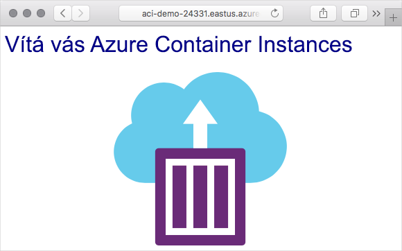

Tady vytvoříte v Azure kontejner a zpřístupníte ho na internetu pod plně kvalifikovaným názvem domény (FQDN).

[!include[](../../../includes/azure-sandbox-activate.md)]

## <a name="why-use-azure-container-instances"></a>Proč používat službu Azure Container Instances?

Služba Azure Container Instances je užitečná pro scénáře, které můžou fungovat v izolovaných kontejnerech, včetně jednoduchých aplikací, automatizace úkolů a úloh sestavení. Tady jsou některé z výhod:

- **Rychlé spuštění**: Kontejner spustíte za pár sekund.
- **Fakturace po sekundách**: Poplatky se vám účtují, jenom když kontejner běží.
- **Zabezpečení na úrovni hypervisoru**: Kompletní izolace aplikace, jako kdyby byla ve virtuálním počítači.
- **Vlastní velikosti**: Zadejte přesné hodnoty pro počet jader procesoru a paměti.
- **Trvalé úložiště**: Připojujte sdílené složky Azure Files přímo do kontejneru pro načtení a uložení stavu.
- **Linux a Windows**: Plánujte kontejnery Windows i Linuxu pomocí stejného rozhraní API.

Pro scénáře, kde potřebujete úplnou orchestraci kontejnerů, včetně zjišťování služeb napříč více kontejnery, automatického škálování a koordinovaných upgradů aplikací, doporučujeme službu Azure Kubernetes Service (AKS).

## <a name="create-a-container"></a>Vytvoření kontejneru

Kontejner vytvoříte příkazem `az container create`, do kterého zadáte název kontejneru, image Dockeru a skupinu prostředků Azure. Pokud chcete kontejner zpřístupnit na internetu, zadejte popisek názvu DNS. V tomto příkladu nasadíte kontejner, který hostuje malou webovou aplikaci. Můžete také vybrat umístění pro image – použijete oblast **USA – východ**, umístění ale můžete změnit na místo z následujícího seznamu, které je vám nejblíž.

<!-- TODO: fix region list so it's not hardcoded here --> Bezplatný sandbox vám umožňuje vytvářet prostředky v podmnožině globálních oblastí Azure. Při vytváření prostředků vyberte oblast z následujícího seznamu:

:::row:::
    :::column:::
        - Západní USA 2
        - Střed USA – jih
        - Střed USA
        - Východní USA
        - Západní Evropa
        - Jihovýchodní Asie
        - Střed Indie
    :::column-end:::
:::row-end:::

1. Abyste kontejner zpřístupnili na internetu, zadáte název DNS. Název DNS musí být jedinečný. Pro účely výuky spusťte z Cloud Shellu tento příkaz a vytvořte tak proměnnou prostředí Bash obsahující jedinečný název.

    ```bash
    DNS_NAME_LABEL=aci-demo-$RANDOM
    ```

1. Instanci kontejneru spustíte následujícím příkazem `az container create`.

    ```azurecli
    az container create \
      --resource-group <rgn>[sandbox resource group name]</rgn> \
      --name mycontainer \
      --image microsoft/aci-helloworld \
      --ports 80 \
      --dns-name-label $DNS_NAME_LABEL \
      --location eastus
    ```

    Proměnná `$DNS_NAME_LABEL` určuje název DNS. Název image **microsoft/aci-helloworld** odkazuje na image Dockeru hostovanou v Centru Dockeru se spouštěnou základní webovou aplikací Node.js.

1. Po dokončení příkazu `az container create` spusťte příkaz `az container show` ke kontrole stavu kontejneru.

    ```azurecli
    az container show \
      --resource-group <rgn>[sandbox resource group name]</rgn> \
      --name mycontainer \
      --query "{FQDN:ipAddress.fqdn,ProvisioningState:provisioningState}" \
      --out table
    ```

    Zobrazí se plně kvalifikovaný název domény (FQDN) kontejneru a stav jeho zřizování. Tady je příklad:

    ```output
    FQDN                                    ProvisioningState
    --------------------------------------  -------------------
    aci-demo.eastus.azurecontainer.io       Succeeded
    ````

    Pokud je kontejner ve stavu **Vytváření**, chvíli počkejte a spusťte příkaz znovu. Dělejte to, dokud se nezobrazí stav **Úspěch**.

1. V prohlížeči přejděte na plně kvalifikovaný název domény (FQDN) kontejneru, abyste viděli, že kontejner běží. Uvidíte toto:

    

## <a name="summary"></a>Shrnutí

Vytvořili jste tady instanci kontejneru Azure ke spuštění webového serveru a aplikace. Tuto aplikaci jste také otevřeli použitím plně kvalifikovaného názvu domény instance kontejneru.