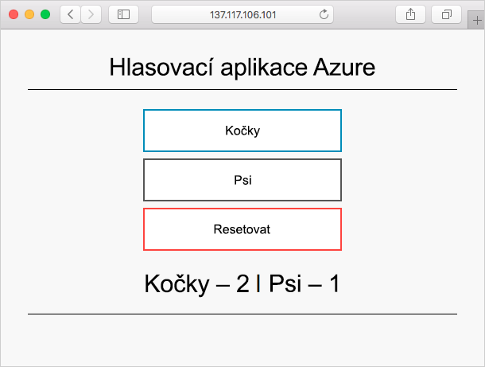

Proměnné prostředí umožňují dynamicky konfigurovat aplikaci nebo skript, které kontejner spouští. Při vytváření kontejneru můžete použít rozhraní příkazového řádku Azure, PowerShell nebo web Azure Portal k nastavení proměnných. Zabezpečené proměnné prostředí umožňují zabránit zobrazení citlivých informací ve výstupu kontejneru.

Tady vytvoříte instanci Azure Cosmos DB a použijete proměnné prostředí k předání informací o připojení do instance kontejneru Azure. Aplikace v kontejneru používá proměnné k zápisu dat do Cosmos DB a ke čtení dat z této databáze. Vytvoříte jak proměnnou prostředí, tak zabezpečenou proměnnou prostředí, abyste viděli, jaký je mezi nimi rozdíl.

## <a name="deploy-azure-cosmos-db"></a>Nasazení služby Azure Cosmos DB

1. Při nasazování služby Azure Cosmos DB zadáváte jedinečný název databáze. Pro účely výuky spusťte z Cloud Shellu tento příkaz a vytvořte tak proměnnou prostředí Bash obsahující jedinečný název.

    ```bash
    COSMOS_DB_NAME=aci-cosmos-db-$RANDOM
    ```

1. Spuštěním tohoto příkazu `az cosmosdb create` vytvořte instanci služby Azure Cosmos DB.

    ```azurecli
    COSMOS_DB_ENDPOINT=$(az cosmosdb create \
      --resource-group <rgn>[sandbox resource group name]</rgn> \
      --name $COSMOS_DB_NAME \
      --query documentEndpoint \
      --output tsv)
    ```

    Dokončení tohoto příkazu může trvat několik minut.

    `$COSMOS_DB_NAME` určuje jedinečný název databáze. Tento příkaz zobrazí adresu koncového bodu vaší databáze. Tady příkaz uloží tuto adresu do proměnné prostředí Bash `COSMOS_DB_ENDPOINT`.

1. Spuštěním příkazu `az cosmosdb list-keys` získejte klíč připojení Azure Cosmos DB a uložte ho do proměnné prostředí Bash s názvem `COSMOS_DB_MASTERKEY`.

    ```azurecli
    COSMOS_DB_MASTERKEY=$(az cosmosdb list-keys \
      --resource-group <rgn>[sandbox resource group name]</rgn> \
      --name $COSMOS_DB_NAME \
      --query primaryMasterKey \
      --output tsv)
    ```

## <a name="deploy-a-container-that-works-with-your-database"></a>Nasazení kontejneru pracujícího s databází

Zde vytvoříte instanci kontejneru Azure, která může číst z instance služby Azure Cosmos DB a zapisovat do ní záznamy.

Dvě proměnné prostředí, které jste vytvořili v poslední části, `COSMOS_DB_ENDPOINT` a `COSMOS_DB_MASTERKEY`, obsahují hodnoty potřebné pro připojení k instanci služby Azure Cosmos DB.

1. Spuštěním následujícího příkazu `az container create` vytvoříte kontejner.

    ```azurecli
    az container create \
      --resource-group <rgn>[sandbox resource group name]</rgn> \
      --name aci-demo \
      --image microsoft/azure-vote-front:cosmosdb \
      --ip-address Public \
      --location eastus \
      --environment-variables \
        COSMOS_DB_ENDPOINT=$COSMOS_DB_ENDPOINT \
        COSMOS_DB_MASTERKEY=$COSMOS_DB_MASTERKEY
    ```

    **microsoft/azure-vote-front:cosmosdb** odkazuje na image Dockeru, která spouští fiktivní hlasovací aplikaci.

    Poznamenejte si argument `--environment-variables`. Tento argument určuje proměnné prostředí, které se předávají kontejneru při jeho spuštění. Image kontejneru je nakonfigurovaná tak, aby tyto proměnné prostředí vyhledávala. Předejte název koncového bodu služby Azure Cosmos DB a klíč pro připojení.

1. Spuštěním příkazu `az container show` získáte veřejnou IP adresu kontejneru.

    ```azurecli
    az container show \
      --resource-group <rgn>[sandbox resource group name]</rgn> \
      --name aci-demo \
      --query ipAddress.ip \
      --output tsv
    ```

1. V prohlížeči přejděte na IP adresu kontejneru.

    > [!IMPORTANT]
    > Někdy to může trvat i minutu nebo dvě, než se kontejnery plně spustí a budou moct přijímat připojení. Pokud ve svém prohlížeči přejdete na adresu IP, ale nezaznamenáte žádnou odezvu, chvíli počkejte a pak aktualizujte stránku.

    Jakmile bude aplikace dostupná, zobrazí se toto.

    

    Zkuste dát hlas kočkám nebo psům. Každý hlas je uložený v instanci služby Azure Cosmos DB.

## <a name="use-secured-environment-variables-to-hide-connection-information"></a>Použití zabezpečených proměnných prostředí ke skrytí informací o připojení

V předchozí části jste k vytvoření kontejneru použili dvě proměnné prostředí. Ve výchozím nastavení jsou tyto proměnné prostředí přístupné prostřednictvím webu Azure Portal a v nástrojích příkazového řádku jako prostý text.

V této části se dozvíte, jak zabránit tomu, aby se citlivé informace, například klíče připojení, zobrazovaly jako prostý text.

1. Nejdřív se podívejme, jak vypadá aktuální chování v akci. Spuštěním následujícího příkazu `az container show` zobrazte proměnné prostředí vašeho kontejneru.

    ```azurecli
    az container show \
      --resource-group <rgn>[sandbox resource group name]</rgn> \
      --name aci-demo \
      --query containers[0].environmentVariables
    ```

    Uvidíte, že obě hodnoty se zobrazují ve formátu prostého textu. Tady je příklad.

    ```json
    [
      {
        "name": "COSMOS_DB_ENDPOINT",
        "secureValue": null,
        "value": "https://aci-cosmos.documents.azure.com:443/"
      },
      {
        "name": "COSMOS_DB_MASTERKEY",
        "secureValue": null,
        "value": "Xm5BwdLlCllBvrR26V00000000S2uOusuglhzwkE7dOPMBQ3oA30n3rKd8PKA13700000000095ynys863Ghgw=="
      }
    ]
    ```

    I když se tyto hodnoty vašim uživatelům v hlasovací aplikaci nezobrazují, je vhodným postupem zabezpečení zajistit, aby se citlivé údaje, jako jsou třeba klíče připojení, neukládaly jako prostý text.

    Zabezpečené proměnné prostředí brání jasnému textovému výstupu. Pokud chcete použít zabezpečené proměnné prostředí, použijte argument `--secure-environment-variables` místo argumentu `--environment-variables`.

1. Spuštěním následujícího příkazu vytvořte druhý kontejner s názvem **aci-demo-secure**, který využívá zabezpečené proměnné prostředí.

    ```azurecli
    az container create \
      --resource-group <rgn>[sandbox resource group name]</rgn> \
      --name aci-demo-secure \
      --image microsoft/azure-vote-front:cosmosdb \
      --ip-address Public \
      --location eastus \
      --secure-environment-variables \
        COSMOS_DB_ENDPOINT=$COSMOS_DB_ENDPOINT \
        COSMOS_DB_MASTERKEY=$COSMOS_DB_MASTERKEY
    ```

    Poznamenejte si použití argumentu `--secure-environment-variables`.

1. Spuštěním následujícího příkazu `az container show` zobrazte proměnné prostředí vašeho kontejneru.

    ```azurecli
    az container show \
      --resource-group <rgn>[sandbox resource group name]</rgn> \
      --name aci-demo-secure \
      --query containers[0].environmentVariables
    ```

    Tentokrát uvidíte, že se proměnné prostředí jako prostý text nezobrazují.

    ```json
    [
      {
        "name": "COSMOS_DB_ENDPOINT",
        "secureValue": null,
        "value": null
      },
      {
        "name": "COSMOS_DB_MASTERKEY",
        "secureValue": null,
        "value": null
      }
    ]
    ```

    Hodnoty proměnných prostředí se totiž nezobrazují vůbec. To je v pořádku, protože se tyto hodnoty vztahují k citlivým údajům. Vše, co potřebujete vědět, je, že proměnné prostředí existují.
