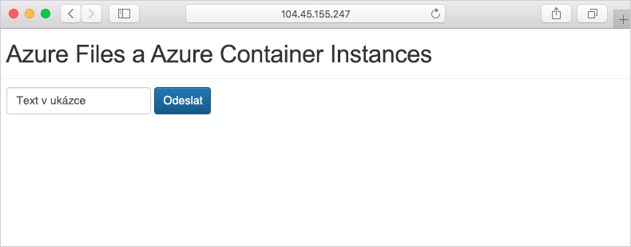

Ve výchozím nastavení je služba Azure Container Instances bezstavová. Pokud u kontejneru dojde k chybě nebo se kontejner zastaví, veškerý jeho stav se ztratí. Pokud chcete zachovat stav i po skončení doby života kontejneru, je nutné připojit svazek z externího úložiště.

Zde připojíte sdílenou složku Azure k instanci kontejneru Azure, aby do ní bylo možné ukládat data a později k nim přistupovat.

## <a name="create-an-azure-file-share"></a>Vytvoření sdílené složky Azure

Zde vytvoříte účet úložiště a sdílenou složku, kterou později zpřístupníte pro instanci kontejneru Azure.

1. Účet úložiště musí mít jedinečný název. Pro účely výuky spusťte následující příkaz, který uloží jedinečný název do proměnné prostředí Bash.

    ```bash
    ACI_PERS_STORAGE_ACCOUNT_NAME=mystorageaccount$RANDOM
    ```

1. Vytvořte účet úložiště spuštěním následujícího příkazu `az storage account create`.

    ```azurecli
    az storage account create \
      --resource-group <rgn>[sandbox resource group name]</rgn> \
      --name $ACI_PERS_STORAGE_ACCOUNT_NAME \
      --sku Standard_LRS \
      --location eastus
    ```

1. Spusťte následující příkaz, který umístí připojovací řetězec účtu úložiště do proměnné prostředí s názvem `AZURE_STORAGE_CONNECTION_STRING`.

    ```azurecli
    export AZURE_STORAGE_CONNECTION_STRING=$(az storage account show-connection-string \
      --resource-group <rgn>[sandbox resource group name]</rgn> \
      --name $ACI_PERS_STORAGE_ACCOUNT_NAME \
      --output tsv)
    ```

    `AZURE_STORAGE_CONNECTION_STRING` je speciální proměnná prostředí, kterou používá Azure CLI. Část `export` zpřístupňuje tuto proměnnou jiným příkazům CLI, které spustíte za chvíli.

1. Spuštěním tohoto příkazu vytvořte v účtu úložiště sdílenou složku s názvem **aci-share-demo**.

    ```azurecli
    az storage share create --name aci-share-demo
    ```

## <a name="get-storage-credentials"></a>Získání přihlašovacích údajů úložiště

K připojení sdílené složky Azure jako svazku ve službě Azure Container Instances potřebujete tyto tři hodnoty:

* Název účtu úložiště
* Název sdílené složky
* Přístupový klíč účtu úložiště

Název sdílené složky **aci-share-demo** už máte. Teď získáte zbývající dvě hodnoty.

1. Spuštěním následujícího příkazu získáte název účtu úložiště.

    ```azurecli
    STORAGE_ACCOUNT=$(az storage account list \
      --resource-group <rgn>[sandbox resource group name]</rgn> \
      --query "[?contains(name,'$ACI_PERS_STORAGE_ACCOUNT_NAME')].[name]" \
      --output tsv)
    ```

1. Volitelně můžete vytisknout název účtu úložiště do konzoly.

    ```bash
    echo $STORAGE_ACCOUNT
    ```

1. Spuštěním následujícího příkazu získáte klíč účtu úložiště.

    ```azurecli
    STORAGE_KEY=$(az storage account keys list \
      --resource-group <rgn>[sandbox resource group name]</rgn> \
      --account-name $STORAGE_ACCOUNT \
      --query "[0].value" \
      --output tsv)
    ```

1. Volitelně můžete vytisknout klíč úložiště do konzoly.

    ```bash
    echo $STORAGE_KEY
    ```

## <a name="deploy-a-container-and-mount-the-file-share"></a>Nasazení kontejneru a připojení sdílené složky

Pokud chcete připojit sdílenou složku Azure ke kontejneru jako svazek, zadejte při vytváření kontejneru přípojný bod sdílené složky a svazku.

1. Spuštěním příkazu `az container create` vytvořte kontejner, který ke sdílené složce připojí `/aci/logs/`.

    ```azurecli
    az container create \
      --resource-group <rgn>[sandbox resource group name]</rgn> \
      --name aci-demo-files \
      --image microsoft/aci-hellofiles \
      --location eastus \
      --ports 80 \
      --ip-address Public \
      --azure-file-volume-account-name $ACI_PERS_STORAGE_ACCOUNT_NAME \
      --azure-file-volume-account-key $STORAGE_KEY \
      --azure-file-volume-share-name aci-share-demo \
      --azure-file-volume-mount-path /aci/logs/
    ```

1. Spuštěním příkazu `az container show` získáte veřejnou IP adresu kontejneru.

    ```azurecli
    az container show \
      --resource-group <rgn>[sandbox resource group name]</rgn> \
      --name aci-demo-files \
      --query ipAddress.ip \
      --output tsv
    ```

1. V prohlížeči přejděte na IP adresu kontejneru. Uvidíte toto.

    

1. Zadejte do formuláře nějaký text a klikněte na **Odeslat**. Tato akce vytvoří soubor obsahující text, který jste zadali do sdílené složky Azure.

1. Spuštěním příkazu `az storage file list` zobrazte soubory, které daná sdílená složka obsahuje.

    ```azurecli
    az storage file list -s aci-share-demo -o table
    ```

1. Spuštěním příkazu `az storage file download` stáhněte soubor do relace služby Cloud Shell. Nahraďte **\<název_souboru\>** jedním ze souborů, které se zobrazily v předchozím kroku.

    ```azurecli
    az storage file download -s aci-share-demo -p <filename>
    ```

1. Spuštěním příkazu `cat` vytiskněte obsah souboru.

    ```azurecli
    cat <filename>
    ```

Mějte na paměti, že po ukončení kontejneru se daná data zachovají. Sdílenou složku můžete připojit k jiným instancím kontejneru a daná data jim tak zpřístupnit.