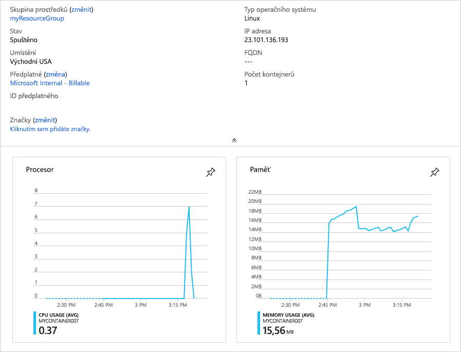

Abyste lépe pochopili základní způsoby řešení problémů s instancemi kontejnerů, provedete některé ze základních operací, jako je například:

* Vyžádání protokolů kontejneru
* Zobrazení událostí kontejneru
* Připojení k instanci kontejneru

## <a name="create-a-container"></a>Vytvoření kontejneru

Spuštěním následujícího příkazu `az container create` vytvořte základní kontejner.

```azurecli
az container create \
  --resource-group <rgn>[sandbox resource group name]</rgn> \
  --name mycontainer \
  --image microsoft/sample-aks-helloworld \
  --ports 80 \
  --ip-address Public \
  --location eastus
```

Image **microsoft/sample-aks-helloworld** spustí webový server, který zobrazuje základní webovou stránku.

## <a name="get-logs-from-your-container-instance"></a>Získání protokolů z instance kontejneru

Spusťte následující příkaz `az container logs` a zobrazte výstup ze spuštěné aplikace kontejneru.

```azurecli
az container logs \
  --resource-group <rgn>[sandbox resource group name]</rgn> \
  --name mycontainer
```

Uvidíte výstup podobný následujícímu.

```output
Checking for script in /app/prestart.sh
Running script /app/prestart.sh
Running inside /app/prestart.sh, you could add migrations to this file, e.g.:

#! /usr/bin/env bash

# Let the DB start
sleep 10;
# Run migrations
alembic upgrade head
```

## <a name="get-container-events"></a>Získání událostí kontejneru

Příkaz `az container attach` poskytuje diagnostické informace při spuštění kontejneru. Jakmile je kontejner spuštěný, zapisuje také standardní výstupní a standardní chybový datový proud do místního terminálu.

Spusťte `az container attach` a připojte se ke kontejneru.

```azurecli
az container attach \
  --resource-group <rgn>[sandbox resource group name]</rgn> \
  --name mycontainer
```

Uvidíte výstup podobný následujícímu.

```output
Container 'mycontainer' is in state 'Running'...
(count: 1) (last timestamp: 2018-09-21 23:48:14+00:00) pulling image "microsoft/sample-aks-helloworld"
(count: 1) (last timestamp: 2018-09-21 23:49:09+00:00) Successfully pulled image "microsoft/sample-aks-helloworld"
(count: 1) (last timestamp: 2018-09-21 23:49:12+00:00) Created container
(count: 1) (last timestamp: 2018-09-21 23:49:13+00:00) Started container

Start streaming logs:
Checking for script in /app/prestart.sh
Running script /app/prestart.sh
```

> [!TIP]
> Pokud se chcete odpojit od připojeného kontejneru, stiskněte klávesy <kbd>Ctrl+C</kbd>.

## <a name="execute-a-command-in-your-container"></a>Spuštění příkazu v kontejneru

Při diagnostice a odstraňování problémů může být nutné spouštět příkazy přímo ve spuštěném kontejneru.

1. Pokud chcete vidět, jak to vypadá v akci, spusťte provedením následujícího příkazu `az container exec` interaktivní relaci v kontejneru.

    ```azurecli
    az container exec \
      --resource-group <rgn>[sandbox resource group name]</rgn> \
      --name mycontainer \
      --exec-command /bin/sh
    ```

    V tuto chvíli pracujete uvnitř kontejneru.

1. Spusťte příkaz `ls`, aby se zobrazil obsah pracovního adresáře.

    ```output
    # ls
    __pycache__  main.py  prestart.sh  static  templates  uwsgi.ini
    ```

1. Pokud chcete, můžete systém prozkoumat podrobněji. Jakmile skončíte, spusťte příkaz `exit` k zastavení interaktivní relace.

## <a name="monitor-cpu-and-memory-usage-on-your-container"></a>Monitorování využití procesoru a paměti v kontejneru

Toto je postup monitorování využití procesoru a paměti v kontejneru.

1. Spuštěním následujícího příkazu `az container show` získejte ID instance kontejneru Azure a uložte toto ID do proměnné Bash.

    ```azurecli
    CONTAINER_ID=$(az container show \
      --resource-group <rgn>[sandbox resource group name]</rgn> \
      --name mycontainer \
      --query id \
      --output tsv)
    ```

1. Spuštěním příkazu `az monitor metrics list` získejte informace o využití procesoru.

    ```azurecli
    az monitor metrics list \
      --resource $CONTAINER_ID \
      --metric CPUUsage \
      --output table
    ```

    Poznamenejte si argument `--metric`. **CPUUsage** tady určuje, že se mají načíst informace o využití procesoru.

    Zobrazí se podobný výstup jako v následující ukázce.

    ```output
    Timestamp            Name              Average
    -------------------  ------------  -----------
    2018-08-20 21:39:00  CPU Usage
    2018-08-20 21:40:00  CPU Usage
    2018-08-20 21:41:00  CPU Usage
    2018-08-20 21:42:00  CPU Usage
    2018-08-20 21:43:00  CPU Usage      0.375
    2018-08-20 21:44:00  CPU Usage      0.875
    2018-08-20 21:45:00  CPU Usage      1
    2018-08-20 21:46:00  CPU Usage      3.625
    2018-08-20 21:47:00  CPU Usage      1.5
    2018-08-20 21:48:00  CPU Usage      2.75
    2018-08-20 21:49:00  CPU Usage      1.625
    2018-08-20 21:50:00  CPU Usage      0.625
    2018-08-20 21:51:00  CPU Usage      0.5
    2018-08-20 21:52:00  CPU Usage      0.5
    2018-08-20 21:53:00  CPU Usage      0.5
    ```

1. Spuštěním příkazu `az monitor metrics list` získejte informace o využití paměti.

    ```azurecli
    az monitor metrics list \
      --resource $CONTAINER_ID \
      --metric MemoryUsage \
      --output table
    ```

    Aby se načetly informace o využití paměti, zadáte pro argument `--metric` hodnotu **MemoryUsage**.

    Zobrazí se podobný výstup jako v následující ukázce.

    ```output
    Timestamp            Name              Average
    -------------------  ------------  -----------
    2018-08-20 21:43:00  Memory Usage
    2018-08-20 21:44:00  Memory Usage  0.0
    2018-08-20 21:45:00  Memory Usage  15917056.0
    2018-08-20 21:46:00  Memory Usage  16744448.0
    2018-08-20 21:47:00  Memory Usage  16842752.0
    2018-08-20 21:48:00  Memory Usage  17190912.0
    2018-08-20 21:49:00  Memory Usage  17506304.0
    2018-08-20 21:50:00  Memory Usage  17702912.0
    2018-08-20 21:51:00  Memory Usage  17965056.0
    2018-08-20 21:52:00  Memory Usage  18509824.0
    2018-08-20 21:53:00  Memory Usage  18649088.0
    2018-08-20 21:54:00  Memory Usage  18845696.0
    2018-08-20 21:55:00  Memory Usage  19181568.0
    ```

Informace o procesoru a paměti jsou dostupné také prostřednictvím webu Azure Portal. Grafické znázornění informací o využití procesoru a paměti získáte na webu Azure Portal na stránce s přehledem pro instanci kontejneru.



[!include[](../../../includes/azure-sandbox-cleanup.md)]
