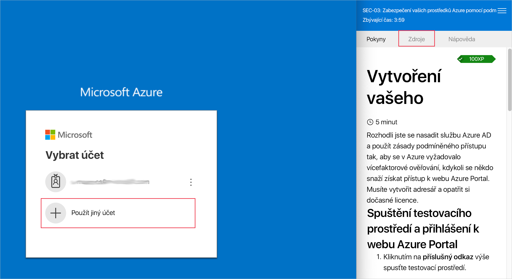
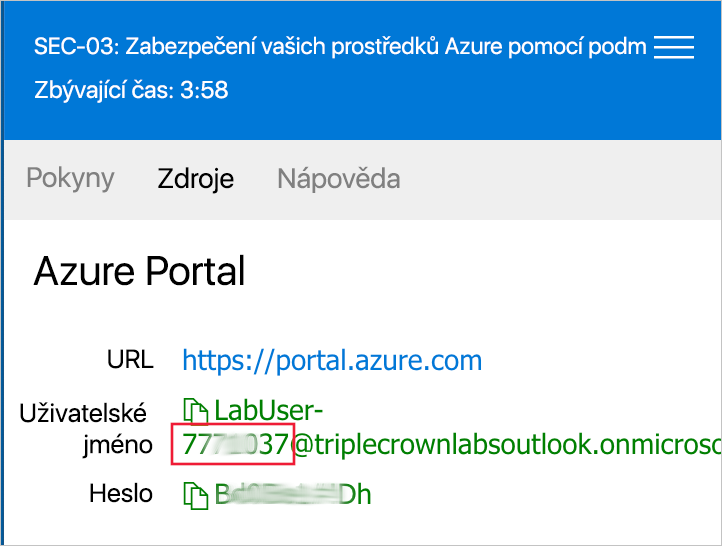
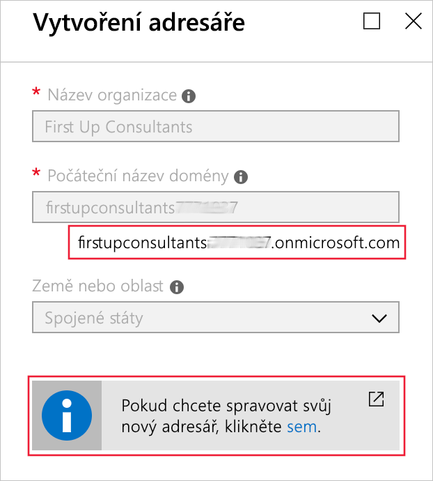
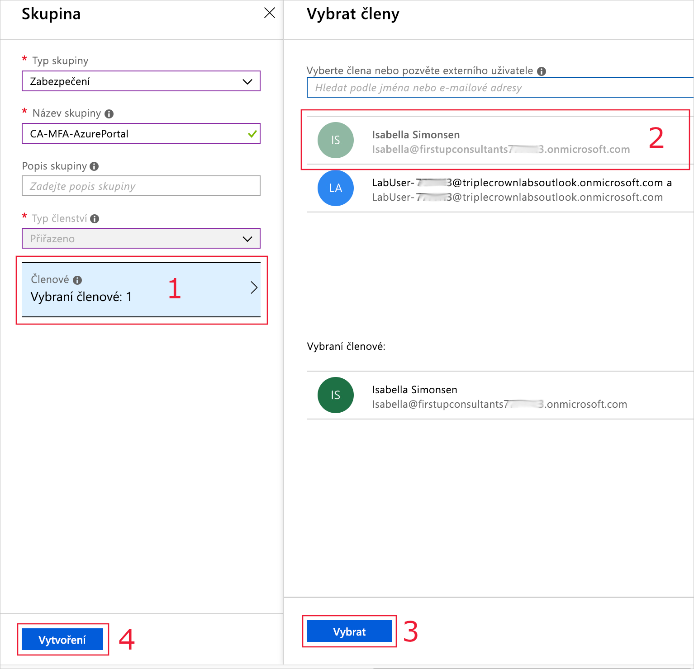

Rozhodli jste se nasadit službu Azure AD a použít zásady podmíněného přístupu tak, aby se v Azure vyžadovalo vícefaktorové ověřování, kdykoli se někdo snaží získat přístup k webu Azure Portal. Musíte vytvořit adresář a opatřit si dočasné licence.

## Spuštění testovacího prostředí a přihlášení k webu Azure Portal

1. Kliknutím na výše uvedený odkaz spusťte testovací prostředí.

> [!NOTE]
> Po spuštění testovacího prostředí budete potřebovat pro přihlášení uživatelské jméno a heslo, která se nacházejí na kartě **Prostředky** vedle pokynů.

Poznamenejte si číslo na konci uživatelského jména, jak je uvedeno níže. Budete ho potřebovat později v tomto cvičení.

Pokud kdykoliv během tohoto cvičení budete chtít začít znovu od začátku, můžete ukončit sandbox cvičení a pomocí výše uvedeného odkazu vytvořit nový.

## Vytvoření adresáře

Vytvoříte nový adresář Active Directory pro firmu First Up Consultants na portálu sandboxu, kde můžete testovat bez obav z ovlivnění produkčních uživatelů. Pokud si přejete dělat toto cvičení na svůj vlastní účet a předplatné Azure, přihlaste se teď na [web Azure Portal](https://portal.azure.com?azure-portal=true). Připomínáme, že to může mít dopad na váš existující účet a fakturaci předplatného. Tuto možnost zvolte, pouze pokud jste si jistí, jaké to bude mít důsledky. Doporučujeme použít prostředí sandboxu testovacího prostředí.

1. V levém navigačním podokně klikněte na **Vytvořit prostředek** > **Identita** > **Azure Active Directory**.

1. V okně **Vytvořit adresář** zadejte následující hodnoty pro **Název organizace** a **Počáteční název domény**:

   1. Název organizace: `First Up Consultants`
   2. Počáteční název domény: `firstupconsultants<XXXXXXX>` kde <XXXXXXX> je číslo, které jste si dříve poznamenali, které se objevuje za uživatelským jménem, jak je znázorněno na snímku obrazovky výše.

1. Počkejte, než se adresář vytvoří. Poznamenejte si úplný název domény, jak je znázorněno níže. Klikněte na odkaz pro přepnutí do nového adresáře.

## Opatření zkušebních licencí

Abyste mohli používat funkce jako podmíněný přístup nebo vícefaktorové ověřování (MFA – Multi-Factor Authentication), budete potřebovat aspoň zkušební licenci. Následující postup vás provede povolením zkušební licence:

1. V podokně **Přehled** služby Azure AD klikněte na odkaz **Zahájit bezplatnou zkušební verzi**.

1. Pod položkou **Azure AD Premium P2** klikněte na **Bezplatná zkušební verze** a pak klikněte na **Aktivovat**.

## Vytvoření testovacího uživatele

Budeme to muset otestovat s nějakým uživatelem. Isabella Simonsen (další členka vašeho týmu) se dobrovolně rozhodla vám pomoci. Bude potřebovat účet v tomto adresáři, takže si projdeme postup vytvoření jejího účtu.

1. Přejděte na **Azure Active Directory** > **Uživatelé**.

1. Klikněte na **Nový uživatel**.

1. Vytvořte uživatele **Isabella Simonsen** s tímto uživatelským jménem:

   `Isabella@firstupconsultants<XXXXXXX>.onmicrosoft.com`

   Za znakem @ nastavte stejnou doménu, jako je doména, kterou jste vytvořili a kterou jste si poznamenali v části *Vytvoření adresáře* výše.

1. Zaškrtněte u tohoto uživatele políčko **Zobrazit heslo**. Toto heslo si poznamenejte, abyste ho později při testování mohli použít.

1. Klikněte na **Vytvořit**.

## Vytvoření skupiny pilotního nasazení

Zásady, které vytvoříme, přiřadíme skupině uživatelů, napřed ale musíme pro tyto zásady vytvořit skupinu. Následující postup vám pomůže vytvořit skupinu zabezpečení pro pilotní nasazení.

1. Přejděte na **Azure Active Directory** > **Skupiny**.

1. Klikněte na **Nová skupina**.

1. Typ skupiny nastavte na **Zabezpečení**.

1. Dejte skupině název **CA-MFA-AzurePortal**.

1. Typ členství dejte na **Přiřazeno** a klikněte na odkaz Členové (označený jako 1 na obrázku níže).

1. Vyberte uživatele, kterého jsme vytvořili v předchozím kroku (na obrázku níže označený jako 2), a zvolte **Vybrat** (označené číslem 3).

1. Klikněte na **Vytvořit** (označené jako 4 na obrázku níže).

V této lekci jste zjistili, jak na webu Azure Portal vytvořit adresář pro zkušební licence, testovacího uživatele a skupinu pro pilotní nasazení.