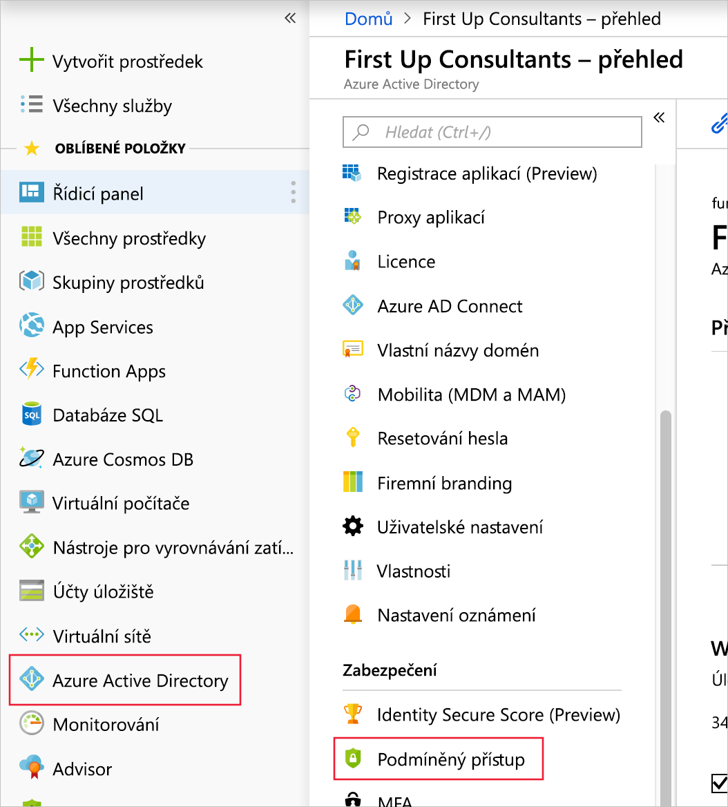

V předchozím cvičení jsme povolili zkušební licence a vytvořili adresář, uživatele a skupinu pro testování našeho řešení. V této lekci vytvoříme pravidlo podmíněného přístupu, které vyžaduje vícefaktorové ověřování (Azure Multi-Factor Authentication) pro Azure Portal.

## Povolení vícefaktorového ověřování na základě podmíněného přístupu

Podmíněný přístup umožňuje správcům nakonfigurovat, kdy chtějí nebo nechtějí, aby se něco stalo. K udělení nebo odepření přístupu k prostředkům mohou použít několik pravidel současně. Zde je pravidlo, které potřebujeme vytvořit:

**Při přístupu k webu Azure Portal – vyžadovat vícefaktorové ověřování**

Následující postup vás provede vytvořením pravidla podmíněného přístupu, které vyžaduje, aby uživatelé při přístupu k webu Azure Portal provedli vícefaktorové ověřování.

1. Přejděte na **Azure Active Directory** a pak ve výsledném okně vyhledejte a vyberte v podsekci **Zabezpečení** možnost **Podmíněný přístup**.

1. Klikněte na **Nové zásady**. Otevře se nové okno pro vytvoření nové zásady.

1. Pojmenujte zásady **Vyžadovat vícefaktorové ověřování pro Azure Portal**.

1. V oblasti **Přiřazení** vyberte **Uživatelé a skupiny**. Tím se otevře nové okno.

1. Klikněte na **Vyberte uživatele a skupiny** a pak níže klikněte na **Vybrat**. Tím se otevřete okno pro výběr.

1. Vyberte skupinu, kterou jste vytvořili v předchozí lekci (**CA-MFA-AzurePortal**), a potom dole klikněte na tlačítko **Vybrat**. Tím okno pro výběr zavřete.

1. Kliknutím na tlačítko **Hotovo** dokončete tento krok a zavřete okno. Znovu byste měli vidět okno pro vytvoření nové zásady, které jste otevřeli ve druhém kroku výše.

1. V oblasti **Přiřazení** vyberte **Cloudové aplikace**. Tím se otevře další okno.

1. Klikněte na **Vybrat aplikace** a pak níže klikněte na **Vybrat**. Tím se otevřete okno pro výběr.

1. Vyberte **Microsoft Azure Management** a pak dole vyberte tlačítko **Vybrat**. Tím okno pro výběr zavřete.

1. Kliknutím na tlačítko **Hotovo** dokončete tento krok a zavřete okno. Znovu byste měli vidět okno pro vytvoření nové zásady, které jste otevřeli ve druhém kroku výše.

1. Výběrem možnosti **Udělení** v části **Ovládací prvky přístupu** otevřete další okno.

1. Klikněte na **Udělit přístup** a pak na **Vyžadovat vícefaktorové ověřování**. Kliknutím na tlačítko **Vybrat** dokončete tento krok a zavřete okno. Znovu byste měli vidět okno pro vytvoření nové zásady, které jste otevřeli ve druhém kroku výše.

1. Nastavte **Povolit zásadu** na **Zapnuté**.

1. Klikněte na **Vytvořit**. Pokud tlačítko **Vytvořit** není dostupné, projděte si předchozí kroky a zkontrolujte, jestli jste je všechny správně dokončili.

V této lekci jste se naučili vytvořit pravidlo podmíněného přístupu pro dříve definovanou skupinu nebo uživatele. Toto pravidlo vyžaduje při přístupu k webu Azure Portal vícefaktorové ověřování.