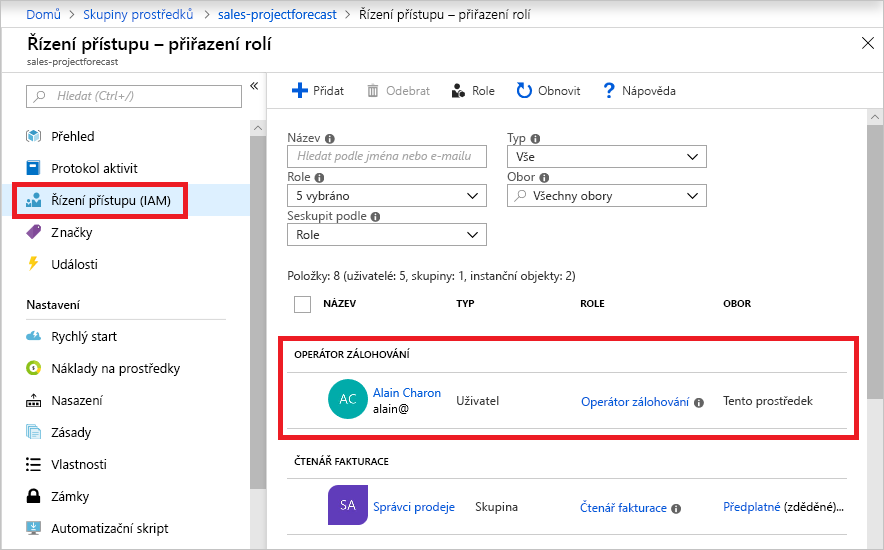
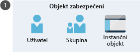
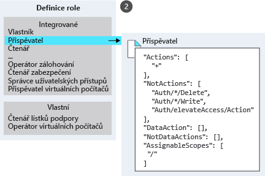
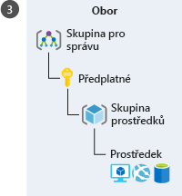

Předpokládejme, že potřebujete spravovat přístup k prostředkům v Azure pro vývojové, technické a marketingové týmy. Začali jste dostávat žádosti o přístup a je potřeba se rychle naučit, jak funguje řízení přístupu k prostředkům v Azure.

## Co je RBAC?

Řízení přístupu na základě role (RBAC) je systém autorizace založený na Azure Resource Manageru, který poskytuje přesnou správu přístupu k prostředkům v Azure. Azure nabízí velké množství prostředků – uveďme několik příkladů: virtuální počítače, weby, sítě a úložiště.

#### Co je řízení přístupu na základě role?

> [!VIDEO https://www.microsoft.com/videoplayer/embed/RE2yEvk]

## Co mi RBAC umožňuje?

RBAC umožňuje udělovat přístup k prostředkům Azure, které řídíte.

Zde je několik příkladů:

- Jednomu uživateli můžete povolit správu virtuálních počítačů v předplatném a jinému uživateli správu virtuálních sítí.
- Skupině správců databází můžete povolit správu databází SQL v předplatném.
- Uživateli můžete povolit správu všech prostředků ve skupině prostředků, například virtuálních počítačů, webů a podsítí.
- Aplikaci můžete povolit přístup ke všem prostředkům ve skupině prostředků.

## RBAC na portálu Azure Portal

V několika oblastech na portálu Azure Portal najdete okno s názvem **Řízení přístupu (IAM)**, označované také jako správa identit a přístupu. V tomto okně můžete zjistit, kdo má přístup k této oblasti a příslušné roli. Pomocí stejného okna můžete přístup udělovat nebo odebírat.

Tady je příklad okna Řízení přístupu (IAM) pro skupinu prostředků. V tomto příkladu byla jednomu uživateli přiřazena role operátora zálohování pro tuto skupinu prostředků.

## Jak RBAC funguje?

Pomocí RBAC řídíte přístup k prostředkům tím, že vytváříte přiřazení rolí, které řídí způsob vynucování oprávnění. Při vytváření přiřazení role potřebujete tři prvky: objekt zabezpečení, definici role a obor. Tyto prvky si můžete představit jako odpovědi na otázky „kdo“, „co“ a „kde“.

### 1. Objekt zabezpečení (kdo)

*Objekt zabezpečení* je jen „vznešené“ označení pro uživatele, skupinu nebo aplikaci, kterým chcete udělit přístup.

### 2. Definice role (co je možné dělat)

*Definice role* je kolekce oprávnění. Někdy se jí jednoduše říká role. Definice role obsahuje seznam oprávnění, která je možné uplatňovat, například čtení, zápis a odstranění. Role můžou být souhrnné, například Vlastník, nebo konkrétní, například Přispěvatel virtuálních počítačů.

Azure obsahuje několik předdefinovaných rolí, které můžete využít. V následujícím seznamu najdete čtyři základní předdefinované role:

- Vlastník – má úplný přístup ke všem prostředkům, včetně práva delegovat přístup na ostatní.
- Přispěvatel – může vytvářet a spravovat všechny typy prostředků Azure, ale nemůže udělovat přístup ostatním.
- Čtenář – může zobrazit existující prostředky Azure.
- Správce uživatelských přístupů – může spravovat uživatelský přístup k prostředkům Azure.

Pokud předdefinované role nesplňují konkrétní požadavky vaší organizace, můžete si vytvořit vlastní role.

### 3. Obor (kde)

*Obor* vymezuje prostor, pro který přístup platí. To je užitečné v případě, kdy někomu chcete udělit roli Přispěvatel webů, ale jen pro jednu skupinu prostředků.

V Azure můžete zadat obor na více úrovních: na úrovni skupiny pro správu, předplatného, skupiny prostředků nebo prostředku. Obory jsou strukturovány ve vztahu nadřazený-podřízený obor. Když udělíte přístup na úrovni nadřízeného oboru, podřízené obory zdědí příslušná oprávnění. Pokud například přiřadíte určité skupině roli Přispěvatel v oboru předplatného, zdědí tuto roli všechny skupiny prostředků a prostředky v daném předplatném.

### Přiřazení role

Po stanovení odpovědi na otázky „kdo“, „co“ a „kde“ můžete tyto prvky zkombinovat, abyste udělili příslušný přístup. *Přiřazení role* je proces svázání role s objektem zabezpečení v určitém oboru za účelem udělení přístupu. Přístup se uděluje vytvořením přiřazení role. Přístup se odvolává odebráním přiřazení role.

V tomto příkladu byla marketingové skupině přiřazena role Přispěvatel v oboru skupiny prostředků Prodej.

## RBAC stojí na modelu, kdy je možné přístup povolit

RBAC stojí na modelu, kdy je možné přístup povolit. To znamená, že když vám někdo přiřadí roli, RBAC vám umožní provádět určité akce jako čtení, zápis nebo odstranění. Takže pokud vám jedno přiřazení role udělí oprávnění ke čtení určité skupiny prostředků a jiné přiřazení role vám udělí oprávnění k zápisu do téže skupiny prostředků, budete u ní mít oprávnění k zápisu.

RBAC obsahuje něco, co se nazývá oprávnění `NotActions`. `NotActions` nepředstavuje pravidlo pro odepření – jednoduše jde o pohodlný způsob, jak vytvořit sadu povolených oprávnění, když je třeba vyloučit konkrétní oprávnění.

V této lekci jste se naučili základy fungování RBAC. Teď když jste si prošli základní informace o RBAC, můžete se pustit do nastavování této funkce. Nejjednodušší způsob, jak začít, je použít Azure Portal. Ve zbytku tohoto modulu budete provádět praktická cvičení související s RBAC.