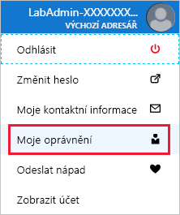

> [!NOTE]
> Po spuštění testovacího prostředí budete potřebovat uživatelské jméno a heslo, která se nacházejí na kartě **Prostředky** vedle pokynů.

Ve společnosti First Up Consultants vám byl udělen přístup ke skupině prostředků pro marketingový tým. Chcete se seznámit s portálem Azure Portal a podívat se, jaké role jsou aktuálně přiřazené.

## Výpis rolí přiřazených vám

Následujícím postupem si zobrazíte role, které jsou aktuálně přiřazené vám.

1. V pravém horním rohu webu Azure Portal klikněte na svoje uživatelské jméno a otevřete nabídku.

1. Zkontrolujte, že jste přihlášeni jako **LabAdmin-_XXXXXXX_**. Pokud ne, odhlaste se a přihlaste se pomocí uživatelského jména a hesla na kartě **Prostředky**.

1. Kliknutím na tlačítko se třemi tečkami (**...**) si zobrazte další odkazy.

    

1. Kliknutím na **Moje oprávnění** otevřete podokno Moje oprávnění.

    

    V podokně Moje oprávnění se zobrazují role, které vám byly přiřazeny, a obor. Váš výpis bude vypadat jinak.

## Výpis přiřazení rolí pro skupinu prostředků

Následujícím postupem si zobrazíte role, které jsou přiřazené v oboru skupiny prostředků.

1. V navigačním seznamu klikněte na **Skupiny prostředků**.

   

1. Vyhledejte skupinu prostředků s názvem **FirstUpConsultantsRG1-_XXXXXXX_** a klikněte na ni.

1. Klikněte na **Řízení přístupu (IAM)**.

   

1. Klikněte na kartu **Přiřazení rolí**.

    Můžete vidět, kdo má přístup k této skupině prostředků. Všimněte si, že některé role mají obor nastavený na **Tento prostředek**, zatímco jiné mají nastavení **(zděděno)** z nadřazeného oboru.

   

## Výpis rolí

Jak jste se dozvěděli v předchozí jednotce, role je kolekce oprávnění. Azure má více než 70 předdefinovaných rolí, které můžete použít ve svých přiřazeních rolí. Výpis rolí zobrazíte následujícím postupem.

- V horní části podokna klikněte na kartu **Role** – tím si zobrazíte seznam všech předdefinovaných a vlastních rolí.

   Vidíte i počet uživatelů a skupin přiřazených k jednotlivým rolím.

   

V této lekci jste se dozvěděli, jak si přes Azure Portal zobrazit výpis rolí, které máte přiřazené. Také jste zjistili, jak si zobrazit výpis přiřazení rolí pro skupinu prostředků.