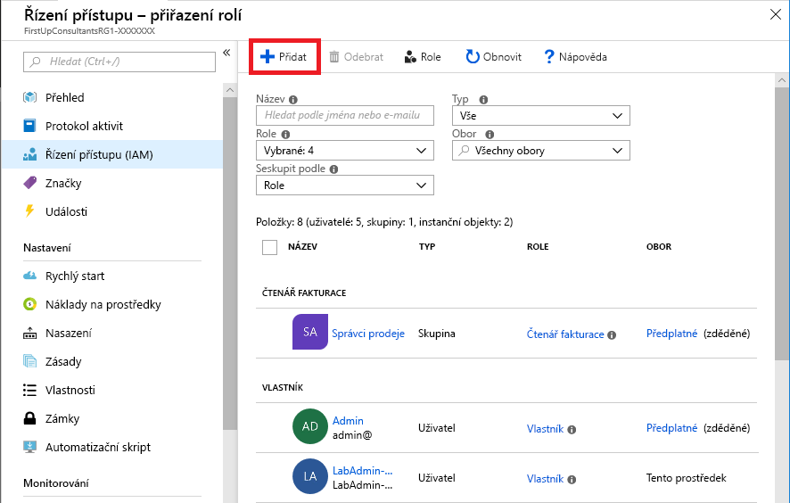
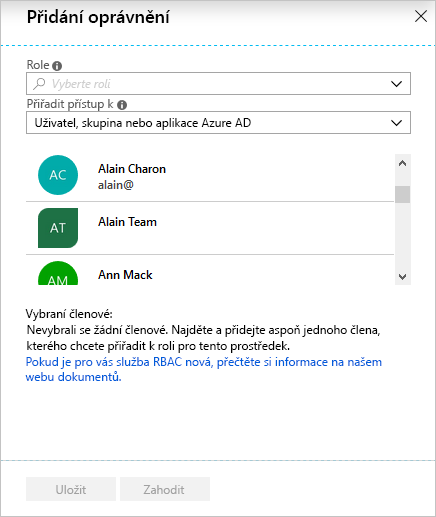
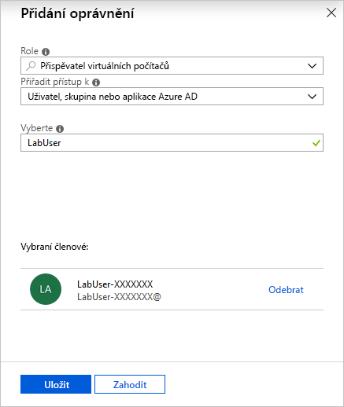
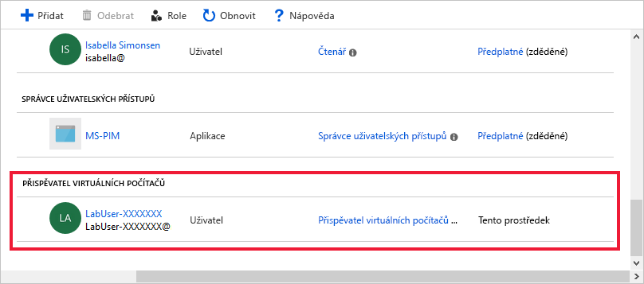
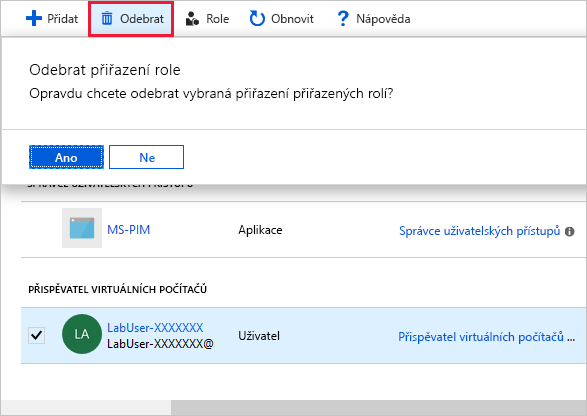

Spolupracovník Alain ve společnosti First Up Consultants potřebuje mít možnost vytvářet a spravovat virtuální počítače pro projekt, na kterém pracuje. Váš nadřízený vás požádal, abyste tuto žádost vyřídili. S použitím osvědčeného postupu pro udělování minimálních oprávnění uživatelům pro vykonávání jejich práce se rozhodnete přiřadit Alainovi roli Přispěvatel virtuálních počítačů pro skupinu prostředků.

## Udělení přístupu

Následujícím postupem přiřadíte uživateli roli Přispěvatel virtuálních počítačů v oboru skupiny prostředků.

1. V navigačním seznamu klikněte na **Skupiny prostředků**.

1. Vyhledejte skupinu prostředků s názvem **FirstUpConsultantsRG1-_XXXXXXX_** a klikněte na ni.

1. Klikněte na **Řízení přístupu (IAM)**.

1. Kliknutím na kartu **Přiřazení rolí** zobrazte aktuální seznam přiřazení rolí.

   

1. V horní části stránky klikněte na **Přidat přiřazení role**.

   

    Otevře se podokno **Přidat přiřazení role**.

   

1. V rozevíracím seznamu **Role** vyberte **Přispěvatel virtuálních počítačů**.

1. V seznamu **Vybrat** vyberte **LabUser-_XXXXXXX_**.

    Uživatelské jméno můžete najít na kartě **Prostředky** vedle pokynů.

   

1. Kliknutím na **Uložit** vytvořte přiřazení role.

   Za pár okamžiků se uživateli **LabUser-_XXXXXXX_** přiřadí role Přispěvatel virtuálních počítačů v oboru skupiny prostředků **FirstUpConsultantsRG1-_XXXXXXX_**. Uživatel teď může vytvořit a spravovat virtuální počítače pouze v rámci této skupiny prostředků.

   

## Odebrání přístupu

V RBAC se přístup odebírá odebráním přiřazení role.

1. V seznamu přiřazení rolí vyberte uživatele **LabUser-_XXXXXXX_** s rolí Přispěvatel virtuálních počítačů.

1. Klikněte na **Odebrat**.

   

1. Ve zprávě **Odebrat přiřazení role**, která se zobrazí, klikněte na **Ano**.

V této lekci jste zjistili, jak uživateli udělit přístup k vytváření a správě virtuálních počítačů ve skupině prostředků pomocí webu Azure Portal.