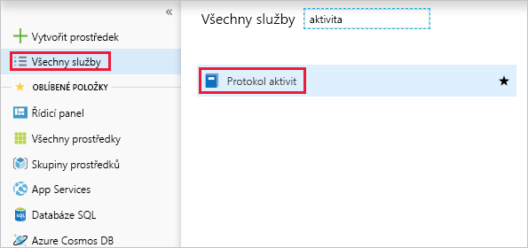
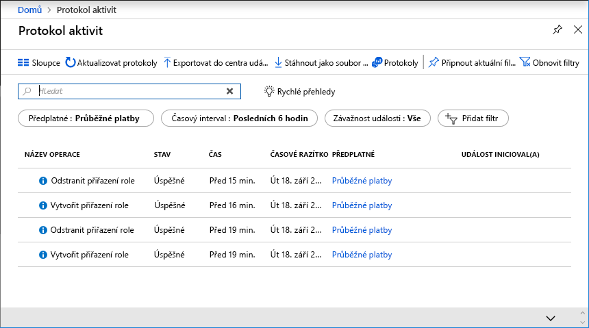
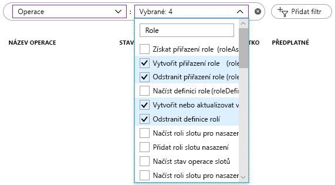

Společnost First Up Consultants provádí čtvrtletní revize řízení přístupu na základě role (RBAC) pro účely auditování a odstraňování potíží. Víte, že se změny zaznamenávají do [protokolu aktivit v Azure](/azure/monitoring-and-diagnostics/monitoring-overview-activity-logs). Vedoucí vás vyzval, abyste vygenerovali sestavu změn přiřazení rolí a vlastních rolí za poslední měsíc.

## Zobrazení protokolů aktivit

Nejjednodušší způsob, jak začít, je zobrazit si protokoly aktivit přes Azure Portal.

1. Klikněte na **Všechny služby** a pak vyhledejte **Protokol aktivit**.

    

1. Kliknutím na **Protokol aktivit** otevřete protokol aktivit.

    

1. Nastavte filtr **Časový rozsah** na **Minulý měsíc**.

1. Přidejte filtr **Operace** zadejte **roli** – tím seznam vyfiltrujete.

1. Vyberte následující operace RBAC:

    - Vytvoření přiřazení role (roleAssignments)
    - Odstranění přiřazení role (roleAssignments)
    - Vytvoření nebo aktualizace definice vlastní role (roleDefinitions)
    - Odstranění definice vlastní role (roleDefinitions)

    

    Za okamžik se zobrazí všechny operace s přiřazeními a definicemi rolí za poslední měsíc. K dispozici je také odkaz pro stažení protokolu aktivit do souboru CSV.

1. Kliknutím na některou z operací zobrazíte podrobnosti záznamu aktivit.

    

V této lekci jste zjistili, jak pomocí protokolu aktivit Azure vytvořit seznam změn v RBAC na portálu a vygenerovat jednoduchou sestavu.