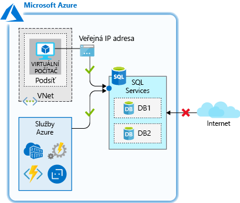
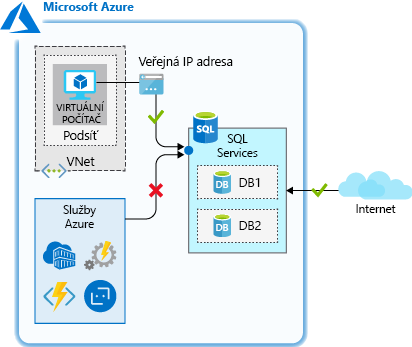
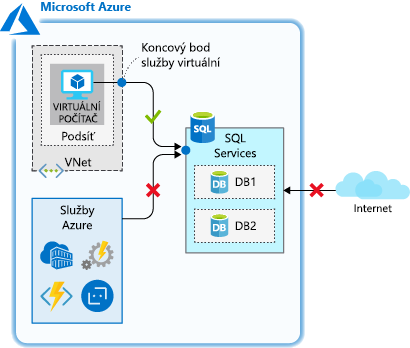
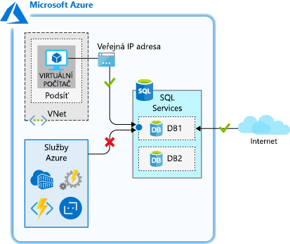
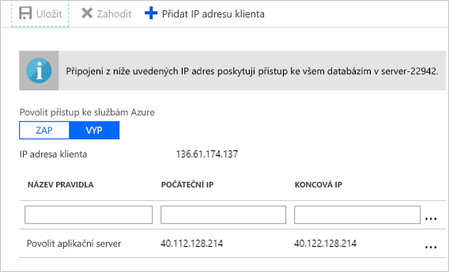

Uživatelé se budou k našemu aplikačnímu serveru připojovat, aby zadávali objednávky, aktualizovali svůj účet a prováděli podobné aktivity, což následně těmito změnami aktualizuje databázi. V databázi máme uložená naše osobní data, a proto je důležité zajistit, aby k ní byl povolen přístup jenom z důvěryhodných a nezbytných prostředků. Podívejme se na několik způsobů, jak lze řídit přístup k databázi SQL v síti.

## <a name="firewall-rules"></a>Pravidla brány firewall

Azure SQL Database má integrovanou bránu firewall, která slouží k povolení nebo zamítnutí síťového přístupu k databázovému serveru i k jednotlivým databázím. Pravidla brány firewall se konfigurují na úrovni serveru nebo na úrovni databáze a konkrétně určují, které síťové prostředky mají povoleno vytvořit připojení k dané databázi. V závislosti na příslušné úrovni můžete použít následující pravidla:

- **Pravidla brány firewall na úrovni serveru**
  - Pravidlo Povolit přístup ke službám Azure
  - Pravidla IP adres
  - Pravidla virtuálních sítí
- **Pravidla brány firewall na úrovni databáze**
  - Pravidla IP adres

Podívejme se podrobněji, jak tato pravidla fungují.

### <a name="server-level-firewall-rules"></a>Pravidla brány firewall na úrovni serveru

Tato pravidla umožňují klientům přístup k celému serveru Azure SQL, jinými slovy ke všem databázím na stejném logickém serveru. Existují tři typy pravidel, které lze použít na úrovni serveru.

Pravidlo **Povolit přístup ke službám Azure** umožňuje službám v Azure připojovat se k Azure SQL Database. Toto nastavení umožňuje komunikaci ze všech veřejných IP adres Azure. Zahrnuje to všechny služby Azure s architekturou PaaS (platforma jako služba), například Azure App Service a Azure Container Service, a také virtuální počítače Azure, které mají odchozí internetový přístup. Toto pravidlo je možné nakonfigurovat na portálu v podokně brány firewall pomocí možnosti **ZAPNUTO/VYPNUTO** nebo pomocí pravidla IP adres, které má jako počáteční a koncovou IP adresu 0.0.0.0.



Toto pravidlo se používá, když máte aplikace běžící v Azure jako služby PaaS, například Azure Logic Apps nebo Azure Functions, které potřebují přístup k Azure SQL Database. Řada těchto služeb nemá statickou IP adresu, takže toto pravidlo je nutné k tomu, aby se zajistilo, že se budou moct připojit k databázi.

> [!IMPORTANT]
> Touto možností se brána firewall nakonfiguruje tak, aby povolovala všechna připojení z Azure, včetně připojení z předplatných ostatních zákazníků. Když vyberete tuto možnost, ujistěte se, že vaše přihlašovací a uživatelská oprávnění omezují přístup jenom na autorizované uživatele.

**Pravidla IP adres** jsou pravidla založená na konkrétních rozsazích veřejných IP adres. K databázi se budou moct připojovat IP adresy z povoleného rozsahu veřejných IP adres.



Tato pravidla lze používat, když máte statickou veřejnou IP adresu, která potřebuje přístup k databázi.

**Pravidla virtuálních sítí** umožňují explicitně povolit připojení z uvedených podsítí v jedné nebo více virtuálních sítích Azure. Pravidla virtuálních sítí můžou poskytovat lepší možnosti řízení přístupu k databázím a v závislosti na vašem scénáři můžou být upřednostňovanou volbou. Adresní prostory virtuální sítě Azure jsou privátní, což umožňuje účinně eliminovat přístup pro veřejné IP adresy a zabezpečit připojení pro ty adresy, které máte pod kontrolou.



Pravidla virtuálních sítí se používají, když máte virtuální počítače Azure, které potřebují přístup k databázi.

Všechny uvedené typy pravidel na úrovni serveru lze vytvářet a spravovat prostřednictvím portálu, PowerShellu, CLI a Transact-SQL (T-SQL).

### <a name="database-level-firewall-rules"></a>Pravidla brány firewall na úrovni databáze

Tato pravidla povolují přístup k jednotlivým databázím na logickém serveru a jsou uložena v samotné databázi. Pravidla na úrovni databáze lze nakonfigurovat jenom jako **pravidla IP adres**. Fungují stejně jako při použití na úrovni serveru, ale jsou omezená jenom na danou databázi.



Výhodou pravidel na úrovni databáze je jejich přenositelnost. Při replikaci databáze na jiný server se budou pravidla na úrovni databáze replikovat, protože jsou uložená v samotné databázi.

Nevýhodou pravidel na úrovni databáze je, že lze používat jenom pravidla IP adres. To může omezovat vaši flexibilitu a zvyšovat nároky na správu.

Pravidla brány firewall na úrovni databáze lze vytvářet a spravovat jenom prostřednictvím T-SQL.

## <a name="restricting-network-access-in-practice"></a>Omezení síťového přístupu v praxi

Podívejme se, jak to funguje v praxi a jak můžete síťový přístup zabezpečit, aby bylo povoleno jenom to, co je nezbytné. Připomínáme, že jsme vytvořili logický server Azure SQL Database, databázi a linuxový virtuální počítač _appServer_, který funguje jako aplikační server. K tomuto scénáři často dochází, když se databáze migruje do Azure SQL Database a prostředky ve virtuální sítě k ní potřebují mít přístup. Funkci brány firewall služby Azure SQL Database je možné použít v řadě scénářů, ale toto je příklad, který má praktickou použitelnost a ukazuje, jak jednotlivá pravidla fungují.

Projděme si jednotlivá nastavení brány firewall a podívejme se, jak fungují. V těchto cvičeních použijeme Cloud Shell i portál.

Databáze, kterou jsme teď vytvořili, nepovoluje přístup ze žádného připojení. Toto chování je určeno na základě příkazů, které jsme spustili pro vytvoření logického serveru a databáze. Ověřme toto chování.

1. V Cloud Shellu se připojte přes SSH k linuxovému virtuálnímu počítači, pokud ještě nejste připojeni.

    ```bash
    ssh <X.X.X.X>
    ```

1. Vzpomeňte si na příkaz `sqlcmd`, který jsme načetli dříve. Spusťte ho a pokuste se tak připojit k databázi. Nezapomeňte `<username>` a `<password>` nahradit přihlašovacími údaji `ADMINUSER`, které jste zadali v předchozí lekci.

    ```bash
    sqlcmd -S tcp:server<12345>.database.windows.net,1433 -d marketplaceDb -U <username> -P <password> -N -l 30
    ```

    Při pokusu o připojení by se měla zobrazit chybová zpráva. Ta je očekávaná, protože jsme žádný přístup k databázi nepovolili.

    ```output
    Sqlcmd: Error: Microsoft ODBC Driver 17 for SQL Server : Cannot open server 'securedb' requested by the login. Client with IP address '40.112.128.214' is not allowed to access the server.  To enable access, use the Windows Azure Management Portal or run sp_set_firewall_rule on the master database to create a firewall rule for this IP address or address range.  It may take up to five minutes for this change to take effect..
    ```

Udělíme tedy přístup, abychom se mohli připojit.

### <a name="use-the-server-level-allow-access-to-azure-services-rule"></a>Použití pravidla Povolit přístup ke službám Azure na úrovni serveru

Náš virtuální počítač má odchozí internetový přístup, takže k povolení přístupu z tohoto virtuálního počítače můžeme použít pravidlo **Povolit přístup ke službám Azure**.

1. Pomocí stejného účtu, kterým jste aktivovali sandbox, se přihlaste k webu [Azure Portal](https://portal.azure.com/learn.docs.microsoft.com?azure-portal=true).

1. Prostřednictvím pole **Hledat prostředky, služby a dokumenty** v horní části obrazovky vyhledejte váš databázový server `server<12345>`. Vyberte tento SQL server.

1. Na panelu SQL serveru v části **Zabezpečení** v levé nabídce vyberte **Brány firewall a virtuální sítě**.

1. Nastavte možnost **Povolit přístup ke službám Azure** na **ZAPNUTO** a klikněte na **Uložit**.

1. V relaci SSH se znovu zkusíme připojit k dané databázi.

    ```bash
    sqlcmd -S tcp:server<12345>.database.windows.net,1433 -d marketplaceDb -U <username> -P <password> -N -l 30
    ```

    Teď byste se měli připojit. Po úspěšném připojení by se měl zobrazit příkazový řádek sqlcmd.

    ```sql
    1>
    ```

Otevřeli jsme připojení, ale toto nastavení aktuálně umožňuje přístup z _jakéhokoli_ prostředku Azure, včetně prostředků mimo naše předplatné. Změníme tedy toto nastavení tak, aby byl síťový přístup omezen jenom na prostředky, které máme pod kontrolou.

### <a name="use-a-database-level-ip-address-rule"></a>Použití pravidla IP adres na úrovni databáze

Připomínáme, že pravidla IP adres na úrovni databáze povolují přístup jenom k jednotlivým databázím na logickém serveru. Takové pravidlo tady použijeme k povolení přístupu ke statické IP adrese našeho virtuálního počítače _appServer_.

K vytvoření pravidla IP adres na úrovni databáze bude nutné spustit pár příkazů T-SQL. Pravidlo databáze vytvoříte pomocí následující konvence, ve které předáte název pravidla, počáteční IP adresu a koncovou IP adresu. Určením stejné počáteční a koncové IP adresy omezujeme přístup na jedinou IP adresu, ale kdybychom měli větší blok adres, které vyžadují přístup, mohli bychom tento rozsah rozšířit.

```sql
EXECUTE sp_set_database_firewall_rule N'My Firewall Rule', '40.112.128.214', '40.112.128.214'
```

1. Na příkazovém řádku sqlcmd spusťte následující příkaz, přičemž v obou umístěních uvedených níže nahraďte veřejnou IP adresu vašeho virtuálního počítače _appServer_.

    ```sql
    EXECUTE sp_set_database_firewall_rule N'Allow appServer database level rule', '<From IP Address>', '<To IP Address>';
    GO
    ```

    Po dokončení tohoto příkazu ukončete nástroj sqlcmd zadáním příkazu `exit`. Zůstaňte připojeni přes SSH.

1. Na portálu na panelu **Brány firewall a virtuální sítě** pro váš SQL server nastavte možnost **Povolit přístup ke službám Azure** na **VYPNUTO** a klikněte na **Uložit**. Touto akcí se zakáže přístup ze všech služeb Azure, ale my se budeme moct nadále připojit, protože pro náš server máme pravidlo IP adres na úrovni databáze.

1. V Cloud Shellu se zkuste na virtuálním počítači, ke kterému jste připojeni přes SSH, znovu připojit k databázi.

    ```bash
    sqlcmd -S tcp:server<12345>.database.windows.net,1433 -d marketplaceDb -U <username> -P <password> -N -l 30
    ```

    Teď byste se měli připojit. Po úspěšném připojení by se měl zobrazit příkazový řádek sqlcmd.

    ```sql
    1>
    ```

Použití pravidla na úrovni databáze umožňuje omezit přístup jenom pro určitou databázi. To může být užitečné při konfiguraci síťového přístupu pro jednotlivou databázi. Pokud sdílí stejnou úroveň síťového přístupu více databází, můžete správu zjednodušit pomocí pravidla na úrovni serveru, které použije stejný přístup pro všechny databáze na serveru.

#### <a name="use-a-server-level-ip-address-rule"></a>Použití pravidla IP adres na úrovni serveru

Pravidla na úrovni databáze jsou užitečnou možností, ale co kdybychom měli na stejném serveru více databází, ke kterým se náš virtuální počítač _appServer_ potřebuje připojovat? Mohli bychom pro každou databázi přidat pravidlo na úrovni databáze, ale když přidáme více databází, bude to vyžadovat více úsilí. Nároky na správu by snížilo povolování přístupu pomocí pravidla na úrovni serveru, které by se používalo pro všechny databáze na serveru.

Teď použijeme pravidlo IP adres na úrovni serveru, které bude omezovat systémy, které se můžou připojit.

1. Na příkazovém řádku sqlcmd spusťte následující příkaz, který odstraní pravidlo IP adres na úrovni databáze.

    ```sql
    EXECUTE sp_delete_database_firewall_rule N'Allow appServer database level rule';
    GO
    ```

    Po dokončení tohoto příkazu ukončete nástroj sqlcmd zadáním příkazu `exit`. Zůstaňte připojeni přes SSH.

1. Na portálu na panelu **Brány firewall a virtuální sítě** pro váš SQL server přidejte nové pravidlo, jehož **NÁZEV PRAVIDLA** bude **Povolit appServer** a **POČÁTEČNÍ IP ADRESA** a **KONCOVÁ IP ADRESA** budou nastaveny na veřejnou IP adresu virtuálního počítače _appServer_.

    Klikněte na **Uložit**.

    

1. V Cloud Shellu se zkuste na virtuálním počítači _appServer_ znovu připojit k databázi.

    ```bash
    sqlcmd -S tcp:server<12345>.database.windows.net,1433 -d marketplaceDb -U <username> -P <password> -N -l 30
    ```

    Teď byste se měli připojit, protože pravidlo na úrovni serveru povoluje přístup na základě veřejné IP adresy virtuálního počítače _appServer_. Po úspěšném připojení by se měl zobrazit příkazový řádek sqlcmd.

    ```sql
    1>
    ```

    Ukončete nástroj sqlcmd zadáním příkazu `exit`. Zůstaňte připojeni přes SSH.

Omezili jsme tedy připojení jenom na IP adresu, kterou jsme určili v tomto pravidlu. Funguje to skvěle, ale kdybychom přidali více systémů, které se potřebují připojit, nadále by to představovalo určité nároky na správu. Vyžaduje se také statická IP adresa nebo IP adresa z definovaného rozsahu IP adres. Pokud by IP adresa byla dynamická a měnila by se, museli bychom k zajištění připojení toto pravidlo aktualizovat. Virtuální počítač _appServer_ je teď nakonfigurovaný s dynamickou IP adresou, takže tato IP adresa se pravděpodobně v určitém okamžiku změní. Až se to stane, náš přístup se přeruší. Podívejme se teď, jak v naší konfiguraci můžou být užitečná pravidla virtuálních sítí.

#### <a name="use-a-server-level-virtual-network-rule"></a>Použití pravidla virtuálních sítí na úrovni serveru

Náš virtuální počítač běží v Azure, takže v tomto případě můžeme omezit přístup a usnadnit budoucím službám získání přístupu k databázi pomocí pravidla virtuálních sítí na úrovni serveru.

1. Na portálu na panelu **Brány firewall a virtuální sítě** v části **Virtuální sítě** klikněte na možnost **+ Přidat existující virtuální síť**.

1. Zobrazí se dialogové okno pravidla pro vytvoření nebo aktualizaci virtuální sítě. Nastavte následující hodnoty:

    | _Nastavení_                        | _Hodnota_                                  |
    | -------------------------------- | ---------------------------------------- |
    | **Název**                         | Ponechejte výchozí hodnotu.                  |
    | **Předplatné**                 | Předplatné Concierge                   |
    | **Virtuální síť**              | appServerVNET                            |
    | **Název podsítě / předpona adresy** | appServerSubnet / 10.0.0.0/24            |

    Povolte koncový bod služby v podsíti kliknutím na **Povolit**. Po povolení koncového bodu vytvořte pravidlo kliknutím na **OK**.

1. Teď odebereme pravidlo IP adres. Klikněte na **...** vedle pravidla **Povolit appServer** a pak klikněte na **Odstranit** a na **Uložit**.

1. V Cloud Shellu se zkuste na virtuálním počítači _appServer_ znovu připojit k databázi.

    ```bash
    sqlcmd -S tcp:server<12345>.database.windows.net,1433 -d marketplaceDb -U <username> -P <password> -N -l 30
    ```

    Teď byste se měli připojit. Po úspěšném připojení by se měl zobrazit příkazový řádek sqlcmd.

    ```sql
    1>
    ```

Uvedený postup odstraňuje veškerý veřejný přístup k danému SQL serveru a povoluje jenom přístup z konkrétní podsítě ve virtuální síti Azure, kterou jsme definovali. Pokud bychom přidali do této podsítě další aplikační servery, nebyla by nutná žádná další konfigurace, protože každý server v této podsíti se k SQL serveru bude moct připojit. Tímto postupem se omezuje přístup služeb, které nemáme pod kontrolou, a zjednodušuje se správa v případě, že potřebujeme přidat další servery. Jedná se o účinný způsob zabezpečení síťového přístupu k Azure SQL Database.