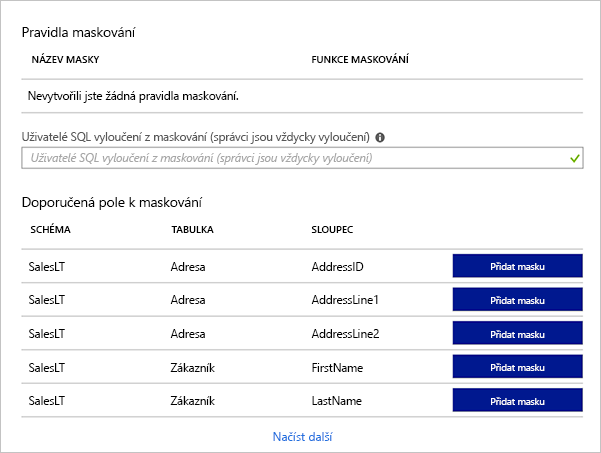
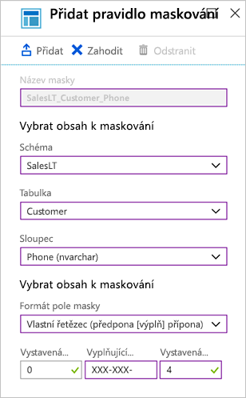

Databáze _marketplaceDb_ uchovává informace, které jsou citlivé, například fyzické adresy, e-mailové adresy a telefonní čísla. Pokud dojde k jejich zveřejnění, mohli by je útočníci se zlými úmysly použít k poškození naší firmy nebo našich zákazníků. Podívejme se, jak lze zabezpečení databáze zvýšit pomocí šifrování a maskování dat.

## <a name="tls-network-encryption"></a>Šifrování sítě TLS

Azure SQL Database vynucuje šifrování TLS (Transport Layer Security) po celou dobu pro všechna připojení, což zajišťuje, že všechna data jsou „během přenosu“ mezi databází a klientem zašifrovaná. Pomocí šifrování TLS můžete zajistit, že nikdo, komu se podařilo zachytit přenos dat mezi aplikačním serverem a databází, nebude moct tato data přečíst. Šifrování TLS je standard zabezpečení provozu přes internet a v tomto případě zajišťuje, že síťový provoz do vaší databáze Azure SQL a z této databáze bude ve výchozím nastavení zabezpečený.

## <a name="transparent-data-encryption"></a>Transparentní šifrování dat

Azure SQL Database chrání vaše neaktivní uložená data pomocí transparentního šifrování dat. Transparentní šifrování dat provádí šifrování a dešifrování neaktivní uložené databáze, souvisejících záloh a souborů transakčních protokolů v reálném čase a nevyžaduje žádné změny v aplikaci. Transparentní šifrování dat pomocí šifrovacího klíče databáze provádí v reálném čase šifrování a dešifrování vstupně-výstupních operací s daty na úrovni stránky. Každá stránka se při načtení do paměti dešifruje a pak se před zápisem na disk zašifruje.

Ve výchozím nastavení je transparentní šifrování dat povolené pro všechny nově nasazené databáze Azure SQL. Je důležité zkontrolovat, že nedošlo k vypnutí šifrování dat. Starší databáze Azure SQL Serveru nemusí mít transparentní šifrování dat povolené.

Podívejme se na portál, kde se transparentní šifrování dat pro naši databázi _marketplaceDb_ konfiguruje.

1. Pomocí stejného účtu, kterým jste aktivovali sandbox, se přihlaste k webu [Azure Portal](https://portal.azure.com/learn.docs.microsoft.com?azure-portal=true).

1. Na panelu hledání v horní části portálu vyhledejte **marketplaceDb** a pak tuto databázi na portálu vyberte.

1. V nabídce vlevo v části **Zabezpečení** vyberte možnost **Transparentní šifrování dat**.

1. Ověřte, že možnost **Šifrování dat** je nastavena na **Zapnuto**. Stav šifrování by měl být **Šifrováno**.

Nové databáze se ve výchozím nastavení šifrují, takže hned po vytvoření databáze si můžeme být jisti, že naše data jsou na disku zašifrovaná.

> [!NOTE]
> Součástí Azure je integrovaná služba s názvem Azure Security Center, která poskytuje přehled o zabezpečení prostředí včetně databází Azure SQL. Azure Security Center označí příznakem všechny databáze, u kterých není transparentní šifrování dat povolené, takže máte možnost tuto skutečnost nahlásit a provést akci potřebnou pro zabezpečení vašich dat.

## <a name="dynamic-data-masking"></a>Dynamické maskování dat

Možná jste si při spuštění našeho dotazu v předchozí lekci všimli, že některé informace v databázi jsou citlivé. Jsou tam telefonní čísla, e-mailové adresy a další informace, které třeba nechceme celé zobrazovat všem uživatelům, kteří k těmto datům mají přístup.

Nechceme třeba našim uživatelům zobrazovat celé telefonní číslo nebo e-mailovou adresu, ale přesto bychom rádi pracovníkům služeb pro zákazníky část těchto dat zpřístupnili, aby mohli zákazníka identifikovat. Pomocí funkce dynamického maskování dat Azure SQL Database můžeme omezit data, která se uživateli zobrazují. Dynamické maskování dat je funkce zabezpečení založená na zásadách, která skrývá citlivá data v sadě výsledků dotazu nad určenými poli databáze, zatímco data v databázi se nemění.

Pravidla maskování dat se skládají ze sloupce, na který se má maska použít, a způsobu, jak se tato data mají maskovat. Můžete vytvořit vlastní formát maskování nebo použít některou ze standardních masek, jako jsou například:

- Výchozí hodnota, která místo daného datového typu zobrazuje výchozí hodnotu
- Hodnota platební karty, která zobrazuje pouze poslední čtyři číslice čísla, všechny ostatní nahradí malými písmeny x.
- E-mail, který skryje název domény a vše kromě prvního znaku názvu e-mailového účtu.
- Číslo, které specifikuje náhodné číslo v rozsahu hodnot. Například u měsíce a roku doby platnosti platební karty byste mohli vybrat náhodné měsíce od 1 do 12 a nastavit rozsah let od 2018 do 3000.
- Vlastní řetězec, který umožňuje nastavit počet znaků vystavených na začátku dat, počet znaků vystavených na konci dat a znaky, které se opakují pro zbývající data.

Správci databáze uvidí při dotazování sloupců stále původní hodnoty, jiní uživatelé ale uvidí hodnoty maskované. Ostatním uživatelům můžete povolit zobrazení nemaskovaných verzí tak, že je přidáte k uživatelům SQL vyloučeným ze seznamu maskování.

Podívejme se, jak by to fungovalo v naší databázi _marketplaceDb_.

1. Na portálu na panelu databáze _marketplaceDb_ v části **Zabezpečení** v levé nabídce vyberte **Dynamické maskování dat**.

    Na obrazovce s pravidly maskování se zobrazí seznam existujících dynamických masek dat a doporučení pro sloupce, na které byste potenciálně měli dynamickou masku dat použít.

    

1. Přidejme masku pro telefonní číslo, která zobrazí jenom poslední čtyři číslice. Kliknutím na tlačítko **+ Přidat masku** v horní části otevřete dialogové okno **Přidat pravidlo maskování**.

1. Vyberte následující hodnoty.

    | _Nastavení_                | _Hodnota_                                 |
    | ------------------------ | --------------------------------------- |
    | **Schéma**               | SalesLT                                 |
    | **Tabulka**                | Customer (Zákazník)                                |
    | **Sloupec**               | Phone (Telefon) (nvarchar)                        |
    | **Formát pole masky** | Vlastní řetězec (předpona [výplň] přípona) |
    | **Vystavená předpona**       | 0                                       |
    | **Vyplňující řetězec**       | XXX-XXX-                                |
    | **Vystavená přípona**       | 4                                       |

    Kliknutím na **Přidat** přidejte pravidlo maskování.

    

1. Přidejme ještě další pravidlo pro e-mailovou adresu. Kliknutím na tlačítko **+ Přidat masku** v horní části otevřete znovu dialogové okno **Přidat pravidlo maskování**.

    | _Nastavení_                | _Hodnota_                                 |
    | ------------------------ | --------------------------------------- |
    | **Schéma**               | SalesLT                                 |
    | **Tabulka**                | Customer (Zákazník)                                |
    | **Sloupec**               | EmailAddress (nvarchar)                 |
    | **Formát pole masky** | E-mail (aXXX@XXX.com)                    |

    Kliknutím na **Přidat** přidejte pravidlo maskování.

1. Každá nová maska se přidá do seznamu pravidel maskování. Aby se masky použily, klikněte na tlačítko **Uložit**.

Podívejme se, jak se tím náš dotaz změní.

1. Přihlaste se teď znovu k databázi, ale jako uživatel _ApplicationUser_.

    ```bash
    sqlcmd -S tcp:server<12345>.database.windows.net,1433 -d marketplaceDb -U ApplicationUser -P <password> -N -l 30
    ```

1. Spusťte následující dotaz.

    ```sql
    SELECT FirstName, LastName, EmailAddress, Phone FROM SalesLT.Customer;
    GO
    ```

    Podívejte se na maskování výstupu.

    ```output
    FirstName     LastName      EmailAddress         Phone
    ------------- ------------- -------------------- ------------
    Orlando       Gee           oXXX@XXXX.com        XXX-XXX-0173
    Keith         Harris        kXXX@XXXX.com        XXX-XXX-0127
    Donna         Carreras      dXXX@XXXX.com        XXX-XXX-0130
    Janet         Gates         jXXX@XXXX.com        XXX-XXX-0173
    ...
    ```

Vytvořená pravidla maskování provádějí maskování našich dat ve formátu, který jsme zadali. Naši pracovníci služeb pro zákazníky tak můžou ověřit zákazníka pomocí posledních čtyř číslic telefonního čísla, ale celé číslo a e-mailová adresa zákazníka se jim nezobrazují.