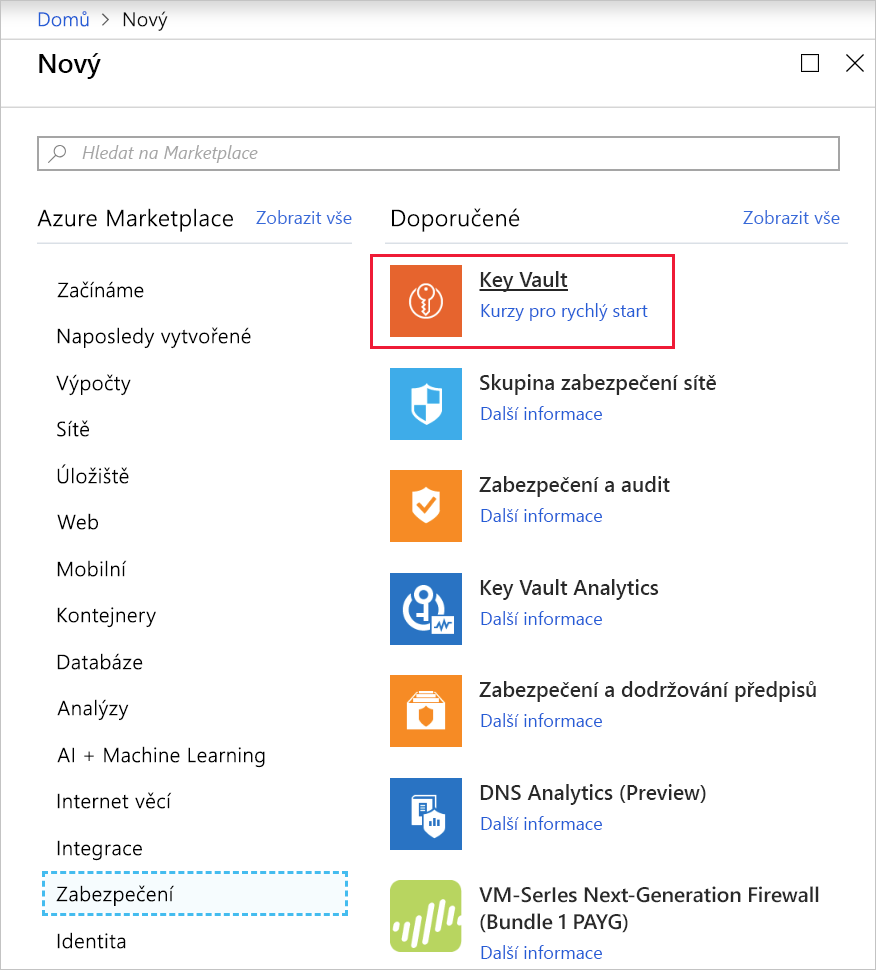
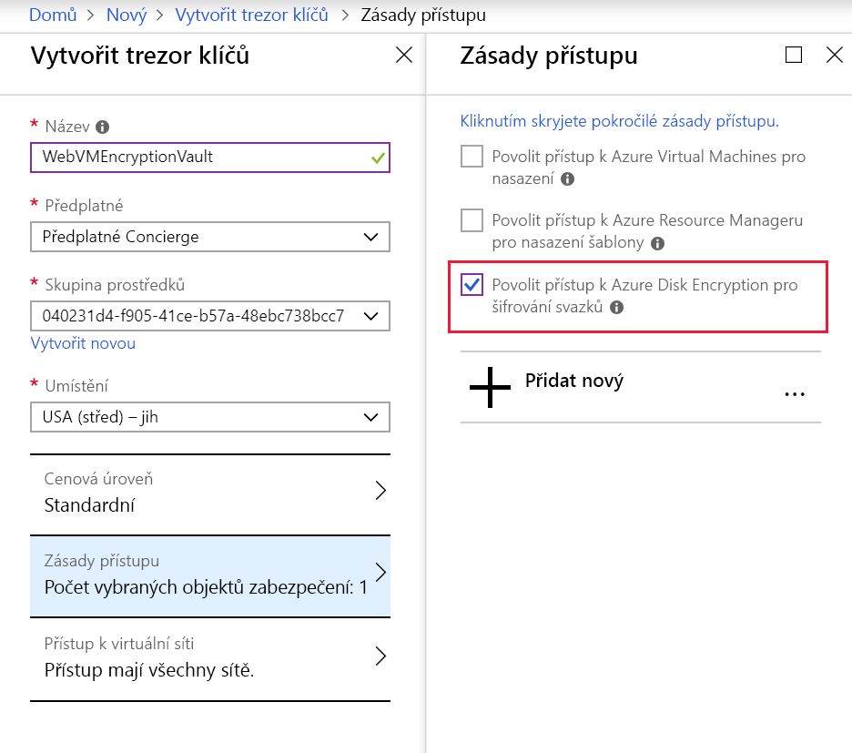

Předpokládejme, že se vaše společnost rozhodla implementovat ve všech virtuálních počítačích Azure Disk Encryption (ADE). Je nutné zvážit, jak zavést šifrování pro existující svazky virtuálních počítačů. Tady najdete požadavky na ADE a kroky potřebné při šifrování disků na stávajících virtuálních počítačích s Linuxem a Windows.

## <a name="azure-disk-encryption-prerequisites"></a>Požadavky na službu Azure Disk Encryption

Před zašifrováním disků virtuálního počítače je potřeba provést tyto kroky:

1. Vytvořte trezor klíčů.
1. Nastavte zásady přístupu k trezoru klíčů pro podporu šifrování disků.
1. Použijte trezor klíčů k ukládání šifrovacích klíčů pro ADE.

### <a name="azure-key-vault"></a>Azure Key Vault

Šifrovací klíče, které používá ADE, je možné ukládat ve službě Azure Key Vault. Azure Key Vault je nástroj pro zabezpečené ukládání tajných kódů a přístup k nim. Tajný kód je cokoli, k čemu chcete pečlivě kontrolovat přístup, třeba klíče rozhraní API, hesla nebo certifikáty. Tak získáte vysoce dostupné a škálovatelné zabezpečené úložiště, jak je definováno v modulech hardwarového zabezpečení (HSM) standardu FIPS 140-2 Level 2. Pomocí služby Key Vault zajistíte plnou kontrolu nad klíči k šifrování dat a můžete spravovat a auditovat využití klíčů. 

> [!NOTE]
> Azure Disk Encryption vyžaduje, aby trezor klíčů a virtuální počítače byly ve stejné oblasti Azure. Tím se zajistí, že šifrované tajné kódy nepřekročí hranice oblastí.

Trezor klíčů můžete nakonfigurovat a spravovat pomocí těchto nástrojů:

#### <a name="powershell"></a>PowerShell

```powershell
New-AzKeyVault -Location <location> `
    -ResourceGroupName <resource-group> `
    -VaultName "myKeyVault" `
    -EnabledForDiskEncryption
```

### <a name="azure-cli"></a>Azure CLI

```azurecli
az keyvault create \
    --name "myKeyVault" \
    --resource-group <resource-group> \
    --location <location> \
    --enabled-for-disk-encryption True
```

### <a name="azure-portal"></a>Azure Portal

Azure Key Vault je prostředek, který lze vytvořit na portálu Azure pomocí normálního procesu vytváření prostředků.

1. Na bočním panelu vlevo klikněte na možnost **Vytvořit prostředek**.

1. Vyhledejte „Trezor klíčů“. V okně podrobností klikněte na možnost **Vytvořit**.

    

1. Zadejte podrobnosti pro nový trezor klíčů:
    - Zadejte **název** trezoru klíčů.
    - Vyberte předplatné, do kterého ho chcete umístit (výchozí nastavení je vaše aktuální předplatné).
    - Jako vlastníka trezoru klíčů vyberte existující **skupinu prostředků** nebo vytvořte novou.
    - Vyberte **umístění** pro trezor klíčů. Je nutné vybrat umístění, ve kterém se nachází virtuální počítač.
    - Jako cenovou úroveň můžete zvolit Standard nebo Premium. Hlavní rozdíl je, že úroveň Premium umožňuje použití klíčů s hardwarovým šifrováním.

1. Zásady přístupu je nutné změnit tak, aby podporovaly šifrování disků. Ve výchozím nastavení se tímto krokem přidá _váš_ účet do zásad.
    - Vyberte **Zásady přístupu**.
    - Klikněte na **Pokročilé zásady přístupu**.
    - Zaškrtněte políčko **Povolit přístup k Azure Disk Encryption pro šifrování svazků**.
    - Pokud chcete, můžete svůj účet odebrat – není nutný v případě, že chcete trezor klíčů použít jen pro šifrování disků.
    - Kliknutím na tlačítko **OK** uložte změny.

    

1. Kliknutím na možnost **Vytvořit** vytvořte nový trezor klíčů.

## <a name="enabling-access-policies-in-the-key-vault"></a>Povolení zásad přístupu v trezoru klíčů
Azure potřebuje přístup k šifrovacím klíčům nebo tajným kódům ve vašem trezoru klíčů, aby byly pro virtuální počítač dostupné při spouštění a dešifrování svazků. Probrali jsme to u portálu, když jsme výše změnili **Pokročilé zásady přístupu**.

Existují tři zásady, které můžete povolit.
1. **Šifrování disků:** Je nutné pro Azure Disk Encryption.
1. **Nasazení:** (Nepovinné) Umožňuje poskytovateli prostředků Microsoft.Compute načtení tajných kódů z tohoto trezoru klíčů, když se na tento trezor odkazuje při vytváření prostředků, například při vytváření virtuálního počítače.
1. **Nasazení šablon:** (Nepovinné) Umožňuje nástroji Azure Resource Manager získání tajných kódů z tohoto trezoru klíčů, když se na tento trezor odkazuje při nasazování šablon.

Tady je postup pro povolení zásady šifrování disků. Další dvě jsou podobné, ale používají jiné příznaky.

```powershell
Set-AzKeyVaultAccessPolicy -VaultName <keyvault-name> -ResourceGroupName <resource-group> -EnabledForDiskEncryption
```

```azurecli
az keyvault update --name <keyvault-name> --resource-group <resource-group> --enabled-for-disk-encryption "true"
```

## <a name="encrypting-an-existing-vm-disk"></a>Šifrování existujícího disku virtuálního počítače

Po nastavení služby Key Vault můžete k šifrování virtuálního počítače použít Azure CLI nebo Azure PowerShell. Při prvním šifrování virtuálního počítače se systémem Windows můžete zvolit, zda chcete šifrovat všechny disky nebo pouze disk s operačním systémem. V některých distribucích Linuxu je možné šifrovat pouze datové disky. Aby bylo možné disky se systémem Windows šifrovat, musí být naformátovány jako svazky systému souborů NTFS.

> [!WARNING]
> Než zapnete šifrování, musíte pořídit snímek nebo zálohu spravovaných disků. Níže uvedený příznak `SkipVmBackup` informuje nástroj, že zálohování spravovaných disků je dokončeno. Bez zálohy nebude možné virtuální počítač obnovit v případě, že se šifrování z nějakého důvodu nezdaří.

V případě PowerShellu použijte pro povolení šifrování rutinu `Set-AzVmDiskEncryptionExtension`.

```powershell

Set-AzVmDiskEncryptionExtension `
    -ResourceGroupName <resource-group> `
    -VMName <vm-name> `
    -VolumeType [All | OS | Data]
    -DiskEncryptionKeyVaultId <keyVault.ResourceId> `
    -DiskEncryptionKeyVaultUrl <keyVault.VaultUri> `
     -SkipVmBackup
```

Pro Azure CLI použijte pro povolení šifrování příkaz `az vm encryption enable`.

```azurecli
az vm encryption enable \
    --resource-group <resource-group> \
    --name <vm-name> \
    --disk-encryption-keyvault <keyvault-name> \
    --volume-type [all | os | data] \
    --skipvmbackup
```

## <a name="viewing-the-status-of-the-disk"></a>Zobrazení stavu disku

Můžete zkontrolovat, jestli jsou konkrétní disky šifrované nebo ne.

```powershell
Get-AzVmDiskEncryptionStatus  -ResourceGroupName <resource-group> -VMName <vm-name>
```

```azurecli
az vm encryption show --resource-group <resource-group> --name <vm-name>
```

Oba tyto příkazy vrací stav jednotlivých disků připojených k zadanému virtuálnímu počítači.

## <a name="decrypting-drives"></a>Dešifrování jednotek

Šifrování lze prostřednictvím PowerShellu zvrátit pomocí `Disable-AzVMDiskEncryption`.

```powershell
Disable-AzVMDiskEncryption -ResourceGroupName <resource-group> -VMName <vm-name>
```

Pro Azure CLI použijte příkaz `vm encryption disable`.

```azurecli
az vm encryption disable --resource-group <resource-group> --name <vm-name>
```

Tyto příkazy zakazují šifrování pro svazky daného typu pro všechny zadané virtuální počítače. Stejně jako u šifrovací verze můžete rozhodnout, které disky se mají dešifrovat, a to pomocí parametru `-VolumeType` `[All | OS | Data]`. Pokud ho nezadáte, použije se výchozí hodnota `All`.

> [!WARNING]
> Zakázání šifrování datových disků u virtuálních počítačů Windows, když byly zašifrovány disky s operačním systémem a datové disky, nefungujte podle očekávání. Místo toho je nutné zakázat šifrování na všech discích.

Vyzkoušejme tyto příkazy na novém virtuálním počítači.