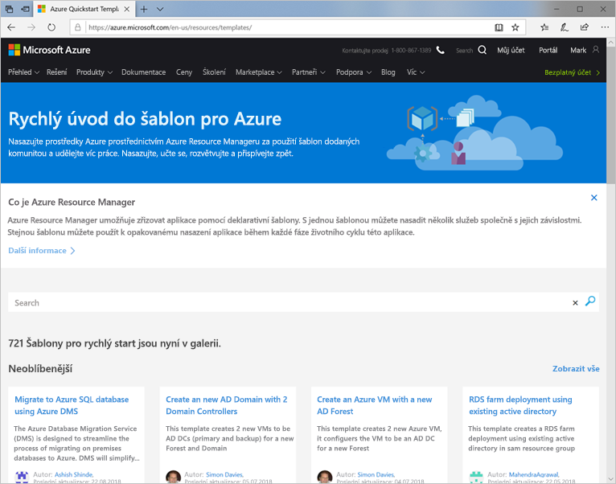
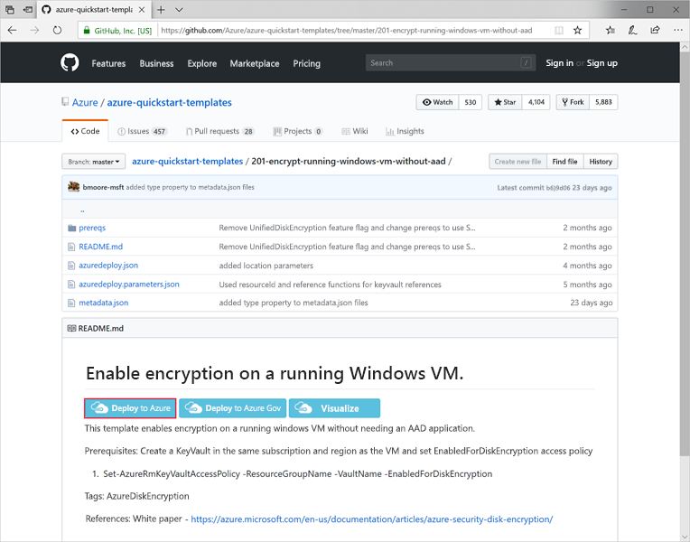
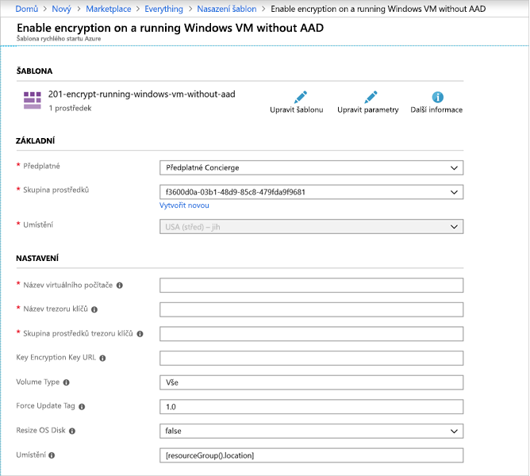

Předpokládejme, že vaše společnost v rámci přechodu na cloud nasazuje několik serverů. Disky virtuálních počítačů musí být při nasazování šifrované, takže se nemůže nikdy stát, že by byly ohrožené. Chcete tento proces automatizovat a musíte upravit šablony Azure Resource Manageru, aby bylo možné automaticky povolit šifrování.

V tomto článku se podíváme, jak pomocí šablony Azure Resource Manageru automaticky povolit šifrování pro nové virtuální počítače s Windows.

## <a name="what-are-azure-resource-manager-templates"></a>Co jsou šablony Azure Resource Manageru?

Šablony Resource Manageru jsou soubory JSON sloužící k definování sady prostředků, které se mají nasadit do Azure. Můžete je napsat úplně od začátku a pro některé prostředky Azure, včetně virtuálních počítačů, je můžete vygenerovat pomocí webu Azure Portal. Budete muset doplnit požadované informace pro ruční nasazení virtuálního počítače, ale místo toho, abyste pak virtuální počítač nasadili do Azure, uložíte šablonu. Šablonu pak můžete _opakovaně používat_ k vytváření této konkrétní konfigurace virtuálního počítače.

K dispozici jsou [ukázkové šablony ve složce docs](https://azure.microsoft.com/resources/templates) k automatizaci nejrůznějších typů úloh správy. Ve skutečnosti jsme mohli k šifrování virtuálního počítače, které jsme právě provedli ručně, použít jednu z těchto šablon.



## <a name="using-github-templates"></a>Použití šablon GitHubu

Samotný zdroj šablony je uložený v GitHubu. Procházením můžete vyhledat šablonu v GitHubu a ze stránky ji nasadit přímo do Azure.



Když je šablona nasazená, zobrazí se v Azure seznam požadovaných vstupní polí.



Potom můžete šablonu spustit a vytvářet, upravovat nebo odebírat prostředky.

### <a name="running-templates-in-the-azure-portal"></a>Spouštění šablon na portálu Azure Portal

Pokud už víte, kterou šablonu chcete použít, nebo pokud máte uložené šablony v účtu Azure, můžete použít **Vytvořit prostředek** > **Nasazení šablony** a vyhledat a spustit definované šablony na portálu. V šablonách můžete vyhledávat pomocí názvů, šablonu můžete upravit a změnit její parametry nebo chování nebo můžete šablonu spustit přímo z uživatelského rozhraní.

### <a name="running-templates-from-the-command-line"></a>Spouštění šablon z příkazového řádku

Když máte adresu URL šablony, můžete ji spustit v prostředí Azure PowerShell. Pomocí následujícího příkazu PowerShellu můžete například spustit šablonu pro šifrování disku:

```powershell
New-AzResourceGroupDeployment `
    -Name encrypt-disk `
    -ResourceGroupName <resource-group-name> `
    -TemplateUri https://raw.githubusercontent.com/azure/azure-quickstart-templates/master/201-encrypt-running-windows-vm-without-aad/azuredeploy.json
```

Pokud dáváte přednost rozhraní příkazového řádku Azure, můžete ji spustit pomocí příkazu `group deployment create`.

```azurecli
azure config mode arm
azure group deployment create <my-resource-group> <my-deployment-name> \ 
    --template-uri https://raw.githubusercontent.com/azure/azure-quickstart-templates/master/201-encrypt-running-windows-vm-without-aad/azuredeploy.json
```

