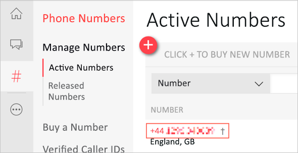

> [!TIP]
> Uživatelské jméno a heslo, které potřebujete pro přihlášení k virtuálnímu počítači, se nacházejí na kartě **Prostředky**.

> [!NOTE]
> Pokud používáte Mac, po spuštění virtuálního počítače může být nutné použít buď na ikonu blesku na panelu nástrojů, nebo volbu **Ctrl + Alt + Delete** na kartě **Prostředky** vedle pokynů k odemčení virtuálního počítače.

V tomto modulu vytvoříte multiplatformní aplikaci Xamarin.Forms s bezserverovým back-endem. Tato aplikace získá ze zařízení uživatele jeho polohu a odešle ji se seznamem telefonních čísel do funkce Azure. Tato funkce potom použije vazbu ke službě třetí strany (Twilio) a vaši polohu odešle jako zprávu SMS na všechna zadaná telefonní čísla.

Tento proces zahrnuje následující kroky:

1. Aplikace zaznamená vaši polohu pomocí Xamarin.Essentials jako abstrakci prostřednictvím rozhraní API pro zjišťování polohy konkrétních zařízení.

1. Poloha a telefonní čísla se zabalí do datové části JSON a odešlou se funkci Azure.

1. Funkce Azure dekóduje datovou část JSON a vytvoří SMS zprávy.

1. Zprávy SMS se pošlou přes [Twilio](https://www.twilio.com/?azure-portal=true).

Následující obrázek znázorňuje přehled tohoto procesu.

## Vytvoření účtu Twilio

K odesílání zpráv SMS z funkce Azure budete potřebovat účet Twilio. Pro začátek vám bohatě stačí bezplatný účet.

1. Přejděte na [twilio.com](https://www.twilio.com?azure-portal=true).

1. Klikněte na červené tlačítko **Zaregistrovat se** v pravém horním rohu.

1. Zadejte požadované informace a klikněte na **Začínáme**.

1. Budete muset ověřit vaše telefonní číslo. Bezplatné účty Twilio umožňují odesílat zprávy jenom na ověřená telefonní čísla, aby se nedala využívat pro nevyžádanou poštu. Twilio vám pošle ověřovací kód, který musíte zadat, abyste ověřili svůj telefon.

1. Vyberte kartu **Produkty**, klikněte na **Programovatelné SMS** a pak klikněte na **Pokračovat**.

1. Zadejte název svého prvního projektu, například „Jsem tady“, a pak klikněte na **Pokračovat**.

1. Přeskočte krok pozvání týmového kolegy.

1. V řídicím panelu zasílání zpráv Twilio rozbalte panel **Informace o projektu**.

1. Poznamenejte si hodnoty **ACCOUNT SID** a **AUTH TOKEN**, protože je budete později potřebovat.

    Při vytváření účtu Twilio dostanete přiřazené telefonní číslo, ze kterého můžete odesílat zprávy. Toto telefonní číslo najdete na řídicím panelu **Phone Numbers** (Telefonní čísla) platformy Twilio.

1. Na webu Twilio vyberte tři tečky na konci nabídky vlevo. Potom vyberte *SUPER NETWORK -> Phone Numbers* (SUPER SÍŤ -> Telefonní čísla). Tento řídicí panel můžete připnout k nabídce vlevo pomocí ikony špendlíku. Vaše číslo Twilio se nachází v části *Manage Numbers->Active Numbers* (Správa čísel -> Aktivní čísla).

    

    > [!TIP]
    > Pokud ještě nemáte aktivní číslo, vyberte možnost **Začínáme** na stránce Aktivní čísla a zahajte proces vytvoření čísla.

1. Poznamenejte si své aktivní telefonní číslo. Použije se později v tomto modulu.

> [!NOTE]
> Při registraci se vám přidělí telefonní číslo Twilio, které se použije k odeslání SMS zpráv. V některých zemích možná tato čísla nebudou moct zprávy SMS odesílat. Dokumentace Twilio uvádí, [které země mají omezení](https://support.twilio.com/hc/articles/223183068-Twilio-international-phone-number-availability-and-their-capabilities?azure-portal=true), a ukazuje, jak posílat zprávy SMS pomocí [mezinárodního čísla nebo alfanumerického ID odesílatele](https://support.twilio.com/hc/articles/226690868-Using-Twilio-when-SMS-numbers-are-unavailable-in-your-country?azure-portal=true).

## Spuštění sady Visual Studio

Pro tento modul vyvinete mobilní aplikaci a aplikaci Azure Functions pomocí sady Visual Studio 2017, která je dostupná prostřednictvím virtuálního počítače. Přestože aplikace Xamarin.Forms je možné sestavovat pro spouštění v systémech iOS, Android a Univerzální platforma Windows (UPW), v tomto modulu se budeme soustředit jenom na UPW, aby práce probíhala ve virtuálním počítači v testovacím prostředí.

Spusťte Visual Studio 2017 z nabídky Start virtuálního počítače nebo ze zástupce na ploše.

## Shrnutí

V této lekci jste vytvořili účet Twilio pro odesílání zpráv SMS a spustili Visual Studio. Dál se naučíte, jak vytvořit aplikaci Xamarin.Forms a přidat balíček NuGet Xamarin.Essentials.

> [!IMPORTANT]
> Uložte si hodnoty **ACCOUNT SID**, **AUTH TOKEN** a **aktivní telefonní číslo** platformy Twilio, které jste získali v této lekci, protože je budete potřebovat později.
