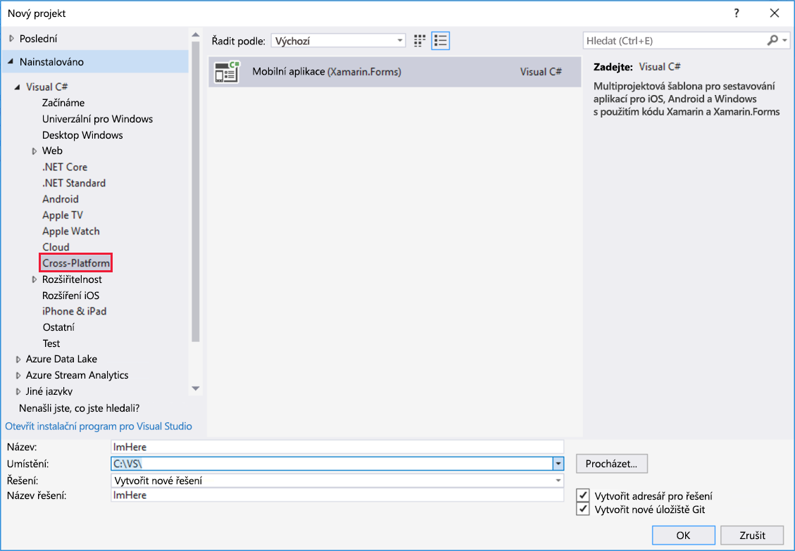
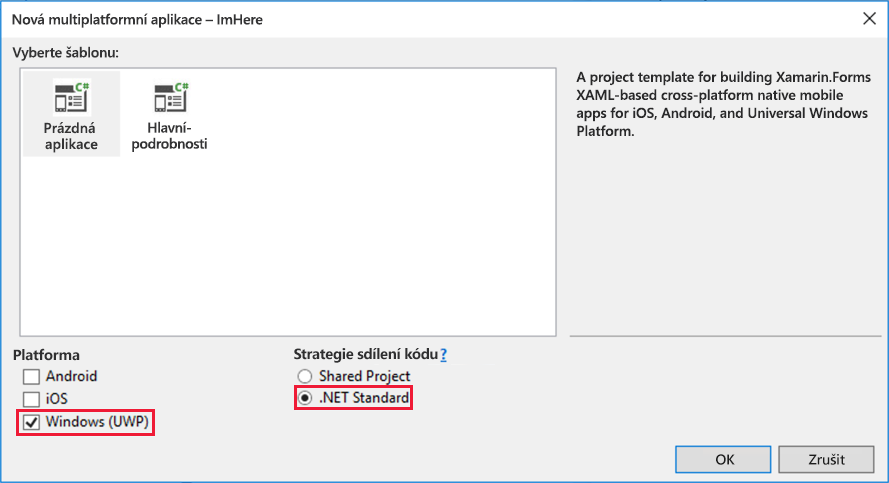
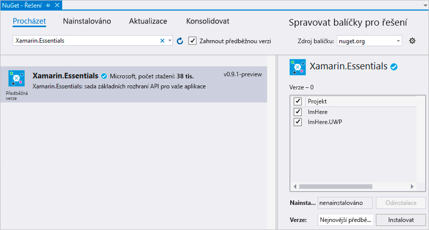
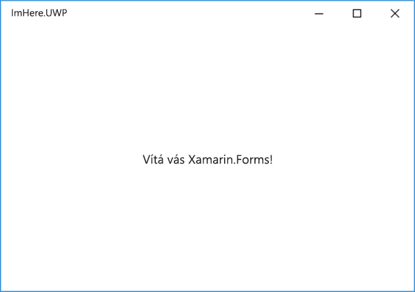

Aplikace, kterou vytváříte, je multiplatformní mobilní aplikace, která komunikuje s funkci Azure pro sdílení polohy. V této lekci vytvoříte prázdnou mobilní aplikaci pomocí sady Visual Studio a nainstalujete balíček NuGet, který nabízí rozhraní API pro získání polohy uživatele.

## Vytvoření projektu Xamarin.Forms

1. V sadě Visual Studio vyberte *Soubor->Nový->Projekt...*.

1. Ve stromu na levé straně vyberte *Visual C# -> Multiplatformní* a potom na prostředním panelu vyberte *Mobilní aplikace (Xamarin.Forms)*.

1. Pojmenujte své řešení „ImHere“.

1. Vyberte pro řešení vhodné umístění.

1. Klikněte na **OK**.

    

1. V dialogovém okně **Nová multiplatformní aplikace** vyberte šablonu *Prázdná aplikace*.

1. Pro tento modul budete sestavovat aplikaci UPW, proto zrušte zaškrtnutí políčka pro iOS a Android a nechte zaškrtnuté jen UPW.

1. Jako *strategii sdílení kódu* vyberte **.NET Standard**.

1. Klikněte na **OK**.

    

Visual Studio pro vás vytvoří dva projekty – aplikaci UPW s názvem `ImHere.UWP` a knihovnu .NET Standard `ImHere`. Aplikace Xamarin.Forms se skládají ze dvou částí – jeden nebo několika projektů aplikací pro konkrétní platformu a jedné (nebo několika) knihoven .NET Standard. Projekty aplikací pro konkrétní platformu obsahují kód potřebný ke spuštění aplikace na dané platformě. Tyto projekty pak spustí aplikaci Xamarin.Forms, která je definována prostřednictvím multiplatformní knihovny .NET Standard. Aplikaci vyvíjíte jako multiplatformní kód a za běhu se veškeré uživatelské rozhraní, které vytvoříte, překládá do příslušných komponent pro danou platformu.

## Přidání balíčku Xamarin.Essentials

Platformy UPW, Android a iOS poskytují mnoho obdobných funkcí, které využívají operační systém a hardware. Bez ohledu na tyto podobnosti jsou rozhraní API velmi odlišná. Použití těchto rozhraní API z multiplatformního kódu vyžaduje v projektech vašich aplikací psaní kódu specifického pro platformu, který zpřístupníte knihovně .NET Standard. [Xamarin.Essentials](https://docs.microsoft.com/xamarin/essentials/?azure-portal=true) je balíček NuGet, který poskytuje multiplatformní abstrakci pro několik těchto rozhraní API, abyste nemuseli psát kód specifický pro danou platformu. To zahrnuje rozhraní API pro polohové služby, které použijete ve své aplikaci pro zjišťování polohy uživatele.

1. V Průzkumníku řešení v sadě Visual Studio klikněte pravým tlačítkem na řešení `ImHere` (na řešení na nejvyšší úrovni, ne na projekt `ImHere` .NET Standard) a vyberte *Spravovat balíčky NuGet pro řešení*.

1. Vyberte kartu **Procházet** a vyhledejte „Xamarin.Essentials“. Tento balíček je aktuálně k dispozici jako předběžná verze balíčku NuGet, proto zaškrtněte políčko *zahrnout předběžné verze*.

    > [!TIP]
    > Pokud balíček NuGet Xamarin.Essentials nevidíte, zkontrolujte, že je zaškrtnuté políčko *Zahrnout předběžné verze*. 

1. Vyberte **Xamarin.Essentials** balíček NuGet.

1. Zaškrtněte všechny projekty v seznamu na pravé straně.

1. Kliknutím na tlačítko **Instalovat** nainstalujte balíček NuGet. Před pokračováním bude nutné přijmout licenční podmínky.

    

## Sestavení a spuštění aplikace

1. V Průzkumníku řešení klikněte pravým tlačítkem na projekt `ImHere.UWP` a vyberte možnost *Nastavit jako spouštěný projekt*.

1. Nastavte konfiguraci sestavení na **ladění**, platformu na **x86** a zařízení pro spuštění na **místní počítač**.

    

1. Začněte ladit aplikaci.

    

## Shrnutí

V této lekci jste vytvořili novou mobilní multiplatformní mobilní aplikaci Xamarin.Forms a přidali balíček NuGet Xamarin.Essentials. V dalším kroku se dozvíte, jak vytvořit uživatelské rozhraní a logiku mobilní aplikace.