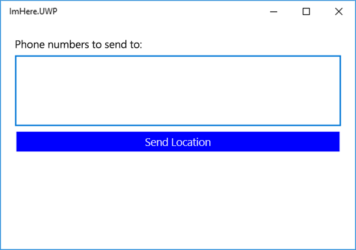

V tuto chvíli máme jednoduchou mobilní aplikaci „Hello World“. V této lekci přidáte uživatelské rozhraní a základě logiku aplikace.

Uživatelské rozhraní aplikace bude mít tyto součásti:

- Ovládací prvek pro zadávání textu, který umožní zadávání telefonních čísel.
- Tlačítko pro odeslání vaší polohy na tato čísla pomocí funkce Azure.
- Popisek, který zobrazí uživateli zprávu o aktuálním stavu, třeba o probíhajícím odesílání polohy a úspěšném odeslání polohy.

Nástroj Xamarin.Forms podporuje model návrhu s názvem Model-View-ViewModel (MVVM). Další informace o modelu MVVM najdete v [dokumentaci k modelu Xamarin MVVM](https://docs.microsoft.com/xamarin/xamarin-forms/enterprise-application-patterns/mvvm?azure-portal=true). Hlavní je ale to, že každá stránka (zobrazení) má určitý model ViewModel, který zveřejňuje vlastnosti a chování.

Vlastnosti modelu ViewModel jsou „svázané“ s komponentami uživatelského rozhraní pomocí názvu a tato vazba synchronizuje data mezi zobrazením a modelem ViewModel. Například vlastnost `string` modelu ViewModel s názvem `Name` může být svázaná s vlastností `Text` ovládacího prvku pro zadávání textu v uživatelském rozhraní. Ovládací prvek pro zadávání textu zobrazuje hodnotu vlastnosti `Name`, a když potom uživatel změní text v uživatelském rozhraní, vlastnost `Name` se aktualizuje. Pokud se změní hodnota vlastnosti `Name` v modelu ViewModel, vytvoří se událost, která vyzve uživatelské rozhraní k aktualizaci.

Chování modelu ViewModel se zveřejňuje jako vlastnosti příkazu. Příkaz je objekt, který obsahuje akci prováděnou při vyvolání tohoto příkazu. Příkazy jsou pomocí názvu svázané s ovládacími prvky, jako jsou tlačítka, a klepnutím na tlačítko se vyvolá daný příkaz.

## <a name="create-a-base-viewmodel"></a>Vytvoření základního modelu ViewModel

Všechny modely ViewModel implementují rozhraní `INotifyPropertyChanged`. Toto rozhraní má jednu událost `PropertyChanged`, která upozorňuje uživatelské rozhraní na případné aktualizace. Argumenty této události obsahují název vlastnosti, která se změnila. Je běžné vytvářet základní třídu ViewModel, která implementuje toto rozhraní a poskytuje některé pomocné metody.

1. Kliknutím pravým tlačítkem na projekt a výběrem *Přidat -> Třída…* vytvořte novou třídu v projektu `ImHere` .NET Standard s názvem `BaseViewModel`. Novou třídu pojmenujte „BaseViewModel“ a klikněte na **Přidat**.

1. Nastavte tuto třídu jako `public` a odvozenou z `INotifyPropertyChanged`. Bude potřeba přidat direktivu Using pro `System.ComponentModel`.

1. Implementujte rozhraní `INotifyPropertyChanged` přidáním události `PropertyChanged`:

    ```cs
    public event PropertyChangedEventHandler PropertyChanged;
    ```

1. Vlastnosti modelu ViewModel obvykle mají veřejnou vlastnost s privátním pomocným polem. V metodě Setter vlastnosti se pomocné pole porovnává s novou hodnotu. Pokud se nová hodnota liší od pomocného pole, pomocné pole se aktualizuje a vytvoří se událost `PropertyChanged`. Tato logika se dá snadno převést do metody, proto přidejte metodu `Set`. Bude potřeba přidat direktivu Using pro obor názvů `System.Runtime.CompilerServices`.

    ```cs
    protected void Set<T>(ref T field, T value, [CallerMemberName] string propertyName = null)
    {
        if (Equals(field, value)) return;
        field = value;
        PropertyChanged?.Invoke(this, new PropertyChangedEventArgs(propertyName));
    }
    ```

    Tato metoda přebírá odkaz na pomocné pole, novou hodnotu a název vlastnosti. Pokud se pole nezměnilo, metoda se vrátí. V opačném případě se pole aktualizuje a vytvoří se událost `PropertyChanged`. Parametr `propertyName` metody `Set` je výchozí parametr označený atributem `CallerMemberName`. Při volání této metody z metody Setter vlastnosti se tento parametr většinou ponechává jako výchozí hodnota. Kompilátor potom automaticky nastaví hodnotu parametru na název volající vlastnosti.

Níže vidíte celý kód pro tuto třídu.

```cs
using System.ComponentModel;
using System.Runtime.CompilerServices;

namespace ImHere
{
    public class BaseViewModel : INotifyPropertyChanged
    {
        public event PropertyChangedEventHandler PropertyChanged;

        protected void Set<T>(ref T field, T value, [CallerMemberName] string propertyName = null)
        {
            if (Equals(field, value)) return;
            field = value;
            PropertyChanged?.Invoke(this, new PropertyChangedEventArgs(propertyName));
        }
    }
}
```

## <a name="create-a-viewmodel-for-the-page"></a>Vytvoření modelu ViewModel stránky

`MainPage` bude obsahovat ovládací prvek pro zadávání textu určený pro telefonní čísla a popisek pro zobrazení zprávy. Tyto ovládací prvky budou svázané s vlastnostmi modelu ViewModel.

1. Vytvořte v projektu .NET Standard `ImHere` třídu s názvem `MainViewModel`.

1. Nastavte tuto třídu jako veřejnou a odvozenou z `BaseViewModel`.

1. Přidejte dvě vlastnosti `string`, `PhoneNumbers` a `Message`, z nichž každá má pomocné pole. V metodě Setter vlastnosti použijte metodu základní třídy `Set` k aktualizaci hodnoty a vytvoření události `PropertyChanged`.

   ```cs
    string message = "";
    public string Message
    {
        get => message;
        set => Set(ref message, value);
    }

    string phoneNumbers = "";
    public string PhoneNumbers
    {
        get => phoneNumbers;
        set => Set(ref phoneNumbers, value);
    }
   ```

1. Přidejte vlastnost příkazu jenom pro čtení s názvem `SendLocationCommand`. Tento příkaz bude mít typ `ICommand` z oboru názvů `System.Windows.Input`.

    ```cs
    public ICommand SendLocationCommand { get; }
    ```

1. Přidejte do třídy konstruktor a v něm inicializujte `SendLocationCommand` jako novou položku Xamarin.Forms `Command`. Bude potřeba přidat direktivu using pro obor názvů `Xamarin.Forms`. Konstruktor pro tento příkaz používá ke spuštění při vyvolání příkazu `Action`, takže vytvořte metodu `async` s názvem `SendLocation` a předejte funkci lambda, která provede akci `await` tohoto volání do konstruktoru. Tělo metody `SendLocation` implementujeme v pozdějších lekcích tohoto modulu. Bude potřeba přidat direktivu Using pro obor názvů `System.Threading.Tasks`, aby mohlo dojít k vrácení `Task`.

    ```cs
    public MainViewModel()
    {
        SendLocationCommand = new Command(async () => await SendLocation());
    }

    async Task SendLocation()
    {
    }
    ```

Níže vidíte kód pro tuto třídu.

```cs
using System.Threading.Tasks;
using System.Windows.Input;
using Xamarin.Forms;

namespace ImHere
{
    public class MainViewModel : BaseViewModel
    {
        string message = "";
        public string Message
        {
            get => message;
            set => Set(ref message, value);
        }

        string phoneNumbers = "";
        public string PhoneNumbers
        {
            get => phoneNumbers;
            set => Set(ref phoneNumbers, value);
        }

        public MainViewModel()
        {
            SendLocationCommand = new Command(async () => await SendLocation());
        }

        public ICommand SendLocationCommand { get; }

        async Task SendLocation()
        {
        }
    }
}
```

## <a name="create-the-user-interface"></a>Vytvoření uživatelského rozhraní

Uživatelská rozhraní Xamarin.Forms se dají sestavovat pomocí XAML.

1. Otevřete soubor `MainPage.xaml` z projektu `ImHere`. Stránka se otevře v editoru XAML.

    > [!NOTE]
    >  Projekt `ImHere.UWP` obsahuje také soubor s názvem `MainPage.xaml`. Ujistěte se, že upravujete soubor v knihovně .NET Standard.

1. Než vytvoříte vazby ovládacích prvků na vlastnosti v modelu ViewModel, je potřeba nastavit jako kontext vazby stránky instanci modelu ViewModel. Do položky `ContentPage` nejvyšší úrovně přidejte následující kód XAML.

    ```xml
    <ContentPage.BindingContext>
        <local:MainViewModel/>
    </ContentPage.BindingContext>
    ```

1. Přepište soubor `StackLayout` následujícím kódem:

     ```xml
    <StackLayout Padding="20">
        <Label Text="Phone numbers to send to:" HorizontalOptions="Start"/>
        <Editor Text="{Binding PhoneNumbers}" HeightRequest="100"/>
    </StackLayout>
    ```
    - Ovládací prvek `Editor` se použije k přidání telefonní čísla a `Label` výše popisuje účel tohoto pole pro uživatele. 
    - `StackLayout` uspořádávají podřízené ovládací prvky buď vodorovně, nebo svisle v pořadí jejich přidání, takže pokud přidáte nejdřív `Label`, bude se nacházet výš než `Editor`.
    - Ovládací prvky `Editor` jsou víceřádkové prvky pro zadávání, které umožňují uživateli zadat více telefonních čísel na samostatné řádky.

   

    Vlastnost `Text` v `Editor` je svázaná s vlastností `PhoneNumbers` v `MainViewModel`. Syntaxe vazby určuje, že se má hodnota vlastnosti nastavit na `"{Binding <property name>}"`. Složené závorky sdělují kompilátoru XAML, že je tato hodnota zvláštní a je potřeba s ní zacházet jinak než s jednoduchou hodnotou `string`.

1. Přidejte `Button` pod ovládací prvek `Editor`. Použijeme toto tlačítko k odeslání umístění uživatele.

    ```xml
    <Button Text="Send Location" BackgroundColor="Blue" TextColor="White"
            Command="{Binding SendLocationCommand}" />
    ```

    Vlastnost `Command` je v modelu ViewModel svázaná s příkazem `SendLocationCommand`. Při klepnutí na toto tlačítko se příkaz provede.

1. Přidejte `Label` pod ovládací prvek `Button`. V tomto popisku zobrazíme stavové zprávy.

    ```xml
    <Label Text="{Binding Message}"
           HorizontalOptions="Center" VerticalOptions="CenterAndExpand" />
    ```

    Níže vidíte celý kód této stránky.
    
    ```xml
    <?xml version="1.0" encoding="utf-8"?>
    <ContentPage xmlns="http://xamarin.com/schemas/2014/forms"
                 xmlns:x="http://schemas.microsoft.com/winfx/2009/xaml"
                 xmlns:local="clr-namespace:ImHere"
                 x:Class="ImHere.MainPage">
        <ContentPage.BindingContext>
            <local:MainViewModel/>
        </ContentPage.BindingContext>
        <StackLayout Padding="20">
            <Label Text="Phone numbers to send to:" HorizontalOptions="Start"/>
            <Editor Text="{Binding PhoneNumbers}" HeightRequest="100"/>
            <Button Text="Send Location" BackgroundColor="Blue" TextColor="White"
                    Command="{Binding SendLocationCommand}" />
            <Label Text="{Binding Message}"
                   HorizontalOptions="Center" VerticalOptions="CenterAndExpand" />
        </StackLayout>
    </ContentPage>
    ```

1. Spusťte aplikaci, abyste si mohli prohlédnout nové uživatelské rozhraní. Pokud chcete v tuto chvíli ověřit vazby, můžete to provést přidáním zarážek k vlastnostem nebo metodě `SendLocation`.

    > [!NOTE]
    > Při kompilaci aplikace se zobrazí upozornění, že `SendLocation` postrádá modifikátory `await`. Upozornění můžete ignorovat, protože tento problém se vyřeší, až se kód do této metody přidá v další lekci.
    
    
    

## <a name="summary"></a>Shrnutí

V této lekci jste se dozvěděli, jak vytvořit uživatelské rozhraní aplikace pomocí kódu XAML a jak nastavit logiku aplikace pomocí modelu ViewModel. Také jste zjistili, jak svázat model ViewModel s uživatelským rozhraním. V další lekci přidáte do modelu ViewModel vyhledávání polohy.