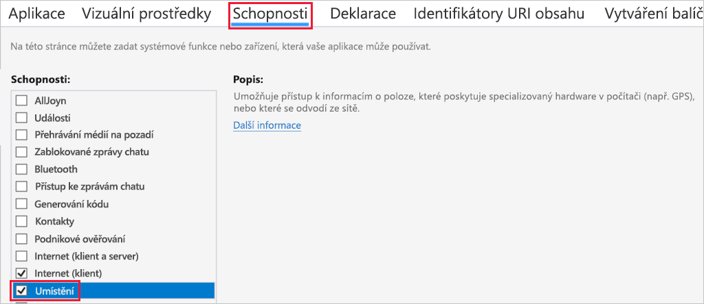
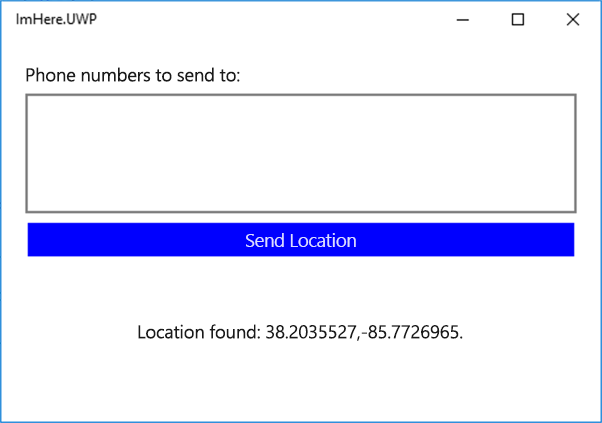

Aplikace obsahuje uživatelské rozhraní a model ViewModel. V této lekci pomocí Xamarin.Essentials přidáte do modelu ViewModel vyhledávání polohy.

## <a name="enable-location-permissions"></a>Povolení oprávnění k poloze

Všechny mobilní platformy zajišťují zabezpečení informací o uživateli a určitého hardwaru, například fotoaparátu, fotogalerie nebo polohy uživatele. Aplikace získá přístup k poloze uživatele, teprve když jí k tomu uživatel udělí oprávnění. Uživatel může tato oprávnění implicitně udělit při instalaci nebo se může rozhodnout oprávnění udělit za běhu. Když v obchodě zobrazíte aplikaci pro UPW, v jejím záznamu se zobrazí oprávnění, která aplikace potřebuje. Instalací takové aplikace implicitně udělíte oprávnění. Tato oprávnění se konfigurují v souboru manifestu aplikace.

1. V projektu aplikace `ImHere.UWP` otevřete soubor `Package.appxmanifest`.

1. Přejděte na kartu **Možnosti** a zaškrtněte možnost *Poloha*.

    

## <a name="query-for-the-users-location"></a>Dotaz na polohu uživatele

Polohu uživatele je možné získat dvěma způsoby – jako poslední známou polohu nebo aktuální polohu. Získání aktuální polohy může nějakou dobu trvat, protože zařízení možná bude muset navázat připojení GPS a počkat na načtení přesné polohy. Nejrychlejším způsobem je získat poslední známou polohu zjištěnou zařízením. Poslední známá poloha je potenciálně méně přesná, ale její zjištění je mnohem rychlejší. Poloha přichází jako souřadnice zeměpisné šířky a délky v [desetinných stupních](https://en.wikipedia.org/wiki/Decimal_degrees?azure-portal=true) a nadmořská výška zařízení v metrech nad mořem.

1. Otevřete třídu `MainViewModel` v projektu .NET Standard `ImHere`.

1. V metodě `SendLocation` zavolejte statickou metodu `GetLastKnownLocationAsync` třídy `Geolocation` v oboru názvů `Xamarin.Essentials`. Bude potřeba přidat direktivu using pro obor názvů `Xamarin.Essentials`.

    ```csharp
    Location location = await Geolocation.GetLastKnownLocationAsync();
    ```

1. Pokud se zjistí poloha uživatele, aktualizuje se vlastnost `Message`.

    ```csharp
    if (location != null)
    {
        Message = $"Location found: {location.Latitude}, {location.Longitude}.";
    }
    ```

    Níže vidíte celý kód této metody.
    
    ```csharp
    async Task SendLocation()
    {
        Location location = await Geolocation.GetLastKnownLocationAsync();
    
        if (location != null)
        {
            Message = $"Location found: {location.Latitude}, {location.Longitude}.";
        }
    }
    ```

1. Spusťte aplikaci a kliknutím na tlačítko **Send Location** (Odeslat polohu) zobrazte polohu v uživatelském rozhraní.

        

> [!NOTE]
> Tato aplikace používá poslední známou polohu. V aplikaci určené do produkčního prostředí byste měli chtít získat aktuální přesnou polohu v určitém časovém limitu, a pokud se do té doby žádná nezjistí, použít místo toho poslední známou polohu. Další informace o tom, jak to provést, najdete v [dokumentaci k zeměpisné poloze v Xamarin.Essentials](https://docs.microsoft.com/xamarin/essentials/geolocation?tabs=uwp#using-geolocation?azure-portal=true).
> 
> Tato aplikace neobsahuje zpracování chyb. V aplikaci určené do produkčního prostředí byste měli zpracovávat všechny výjimky, ke kterým dojde, například když není k dispozici poloha.

## <a name="summary"></a>Shrnutí

V této lekci jste zjistili, jak pomocí Xamarin.Essentials získat polohu uživatele. V další lekci vytvoříte funkci Azure, která bude fungovat jako back-end mobilní aplikace.