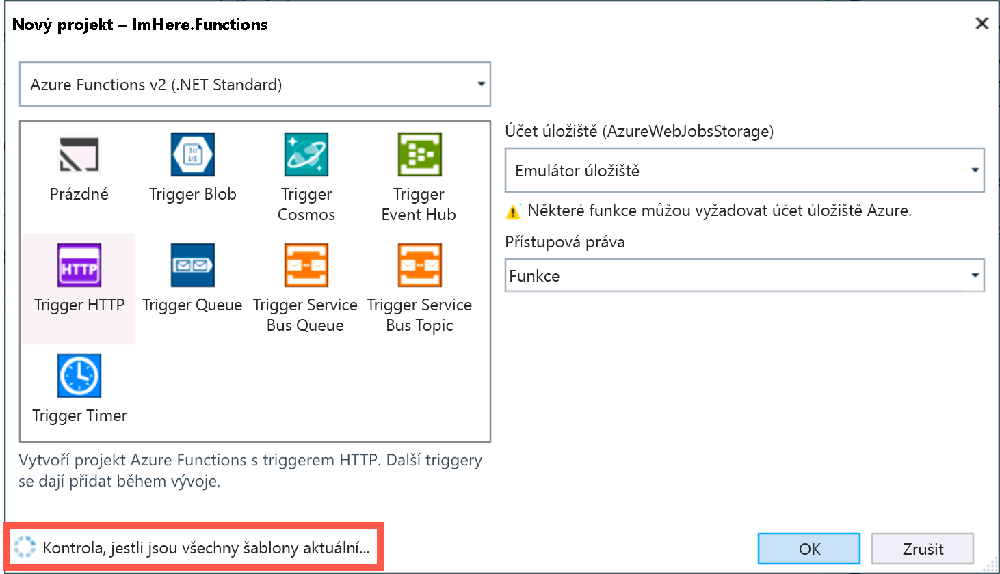

V tuto chvíli už aplikace načítá polohu uživatele a je připravená k odeslání do funkce Azure. V této lekci tuto funkci Azure sestavíte.

## <a name="create-an-azure-functions-project"></a>Vytvoření projektu služby Azure Functions

1. Přidejte do řešení `ImHere` nový projekt kliknutím pravým tlačítkem na řešení a výběrem možností *Přidat -> Nový projekt…*.

1. Ve stromu na levé straně vyberte *Visual C# -> Cloud* a potom na prostředním panelu vyberte *Azure Functions*.

1. Pojmenujte projekt „ImHere.Functions“ a klikněte na **OK**.

    

1. Zobrazí se dialogové okno konfigurace **Nový projekt** a během načítání aktualizovaných šablon se může v levém dolním rohu zobrazovat rotující indikátor průběhu. Pokud ho uvidíte, počkejte, dokud se nedokončí načítání, a pak, pokud budou k dispozici aktualizované šablony, klikněte na zobrazené tlačítko **Aktualizovat**, abyste měli jistotu, že máte stažené nejnovější šablony funkcí.

    

1. V konfiguračním dialogu **Nový projekt** nechte nastavenou verzi služby Functions na *Azure Functions v2 (.NET Standard)* (**NIKOLI NA** _v1 (.NET Framework)_). Vyberte *Trigger HTTP*, ponechte účet úložiště nastavený na *Emulátor úložiště* a nastavte přístupová práva na *Anonymní*. Pak klikněte na **OK**.

    

    Vytvoří se nový projekt s výchozí funkcí s názvem `Function1`.

> [!NOTE]
> Tato funkce se vytvořila s anonymním přístupem. Po publikování do Azure bude moct tuto funkci volat každý, kdo zná adresu URL. V praxi by bylo potřeba funkci chránit nějakou formou ověřování, třeba [ověřováním služby Azure App Service](https://docs.microsoft.com/azure/app-service/app-service-authentication-overview?azure-portal=true) nebo [Azure Active Directory B2C](https://docs.microsoft.com/azure/active-directory-b2c?azure-portal=true).

## <a name="create-the-function"></a>Vytvoření funkce

Projekt Azure Functions se vytvoří s jednou funkcí triggeru HTTP s názvem `Function1`. Triggery HTTP vám umožňují volat funkce pomocí požadavků HTTP. Samotná funkce je implementovaná jako statická metoda `Run` třídy `Function1`.

1. Přejmenujte soubor v Průzkumníku řešení z „Function1.cs“ na „SendLocation.cs“. Po zobrazení výzvy k přejmenování všech odkazů na element kódu `Function1` klikněte na **Ano**.

1. Přejmenujte funkci v atributu na „SendLocation“.

    ```cs
    [FunctionName("SendLocation")]
    ```

1. Odstraňte obsah funkce s výjimkou prvního řádku, který zapíše do protokolovacího nástroje informační zprávu.

    ```cs
    public static async Task<IActionResult> Run([HttpTrigger(AuthorizationLevel.Anonymous,
                                                             "get", "post",
                                                             Route = null)]HttpRequestMessage req,
                                                ILogger log)
    {
        log.LogInformation("C# HTTP trigger function processed a request.");
    }
    ```

## <a name="create-a-class-to-share-data-between-the-mobile-app-and-function"></a>Vytvoření třídy pro sdílení dat mezi mobilní aplikací a funkcí

Data odesílaná do funkce Azure se odešlou ve formátu JSON. Mobilní aplikace serializuje data do formátu JSON a funkce je deserializuje z formátu JSON. V zájmu zajištění konzistence těchto dat mezi mobilní aplikací a funkci vytvořte nový projekt obsahující třídu, která bude obsahovat data polohy a telefonních čísel. Aplikace a funkce potom budou odkazovat na tento projekt.

1. V rámci řešení `ImHere` vytvořte nový projekt kliknutím pravým tlačítkem na řešení a výběrem možností *Přidat -> Nový projekt…*.

1. Ve stromu na levé straně vyberte *Visual C# -> .NET Standard* a potom na prostředním panelu vyberte *Knihovna tříd (.NET Standard)*.

1. Pojmenujte projekt „ImHere.Data“ a klikněte na **OK**.

    

1. Odstraňte automaticky vygenerovaný soubor „Class1.cs“.

1. Kliknutím pravým tlačítkem na projekt a výběrem *Přidat -> Třída…* vytvořte novou třídu v projektu `ImHere.Data` .NET Standard s názvem `PostData`. Pojmenujte novou třídu „PostData“ a klikněte na **OK**. Označte tuto novou třídu jako `public`.

1. Přidejte `double` vlastnosti pro zeměpisnou šířku a zeměpisnou délku a také vlastnost `string[]` pro telefonní čísla, na která se budou odesílat zprávy.

    ```cs
    public class PostData
    {
        public double Latitude { get; set; }
        public double Longitude { get; set; }
        public string[] ToNumbers { get; set; }
    }
    ```

1. Kliknutím pravým tlačítkem na projekt a výběrem možností *Přidat -> Odkaz…* přidejte odkaz na tento projekt do projektu `ImHere.Functions` i `ImHere`. Ve stromu na levé straně vyberte *Projekty* a zaškrtněte políčko vedle položky *ImHere.Data*.

    

## <a name="read-the-data-sent-to-the-function"></a>Čtení dat odeslaných do funkce

Parametr `req` ve funkci Azure obsahuje odeslaný požadavek HTTP a data v tomto požadavku budou serializovaný objekt JSON `PostData`.

1. Otevřete třídu `SendLocation` v projektu `ImHere.Functions`.

1. Načtěte obsah požadavku HTTP do řetězce, pak ho deserializujte do objektu `PostData` a přidejte direktivu using pro obor názvů `ImHere.Data`.

    ```cs
    string requestBody = await new StreamReader(req.Body).ReadToEndAsync();
    PostData data = JsonConvert.DeserializeObject<PostData>(requestBody);
    ```

1. Na základě zeměpisné délky a šířky z vlastnosti `PostData` vytvořte adresu URL služby Mapy Google.

   ```cs
   string url = $"https://www.google.com/maps/search/?api=1&query={data.Latitude},{data.Longitude}";
   ```

1. Zaznamenejte adresu URL do protokolu.

    ```cs
    log.LogInformation($"URL created - {url}");
    ```

1. Vrátí se stavový kód 200, který značí, že s funkce dokončila bez chyb.

    ```cs
    return new OkResult();
    ```

Celou funkci vidíte níže.

```cs
[FunctionName("SendLocation")]
public static async Task<IActionResult> Run([HttpTrigger(AuthorizationLevel.Anonymous,
                                                                "get", "post",
                                                         Route = null)]HttpRequest req,
                                                    ILogger log)
{
    log.LogInformation("C# HTTP trigger function processed a request.");
    string requestBody = await new StreamReader(req.Body).ReadToEndAsync();
    PostData data = JsonConvert.DeserializeObject<PostData>(requestBody);
    string url = $"https://www.google.com/maps/search/?api=1&query={data.Latitude},{data.Longitude}";
    log.LogInformation($"URL created - {url}");
    return new OkResult();
}
```

## <a name="run-the-azure-function-locally"></a>Místní spuštění funkce Azure

Funkce se dají spouštět v místním prostředí pomocí místního účtu úložiště a místního modulu runtime Azure Functions. Tento místní modul runtime umožňuje otestovat funkci před jejím nasazením do Azure.

1. V Průzkumníku řešení klikněte pravým tlačítkem na projekt `ImHere.Functions` a klikněte na *Nastavit jako spouštěný projekt*.

1. V nabídce *Ladit* vyberte *Spustit bez ladění*. Místní modul runtime Azure Functions se spustí v okně konzole a spustí vaši funkci s nasloucháním na dostupném portu `localhost`. Pokud se zobrazí dialogové okno s žádostí o přístup přes bránu firewall, povolte přístup k privátním sítím (výchozí možnost).

    

1. Poznamenejte si port, na kterém funkce naslouchá. V další lekci ho budete potřebovat při testování mobilní aplikace. Na předchozím obrázku funkce naslouchá na portu **7071**.

    ```sh
    Listening on http://localhost:7071/
    ```

1. Nechte funkci spuštěnou, abyste mohli v další lekci otestovat mobilní aplikaci.

## <a name="summary"></a>Shrnutí

V této části jste se dozvěděli, jak v sadě Visual Studio vytvořit projekt Azure Functions, přidali jste sdílený projekt s datovým objektem ke sdílení mezi mobilní aplikací a funkcí a zjistili jste, jak vytvořit základní implementaci funkce pro deserializaci předávaných dat. Také jste se naučili spustit funkci Azure v místním prostředí. V další lekci provedete volání funkce Azure z mobilní aplikace.