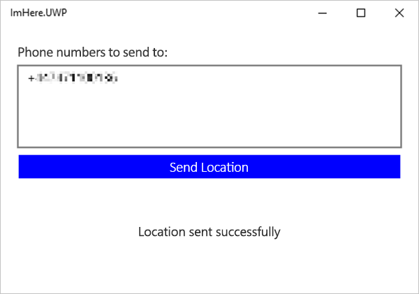
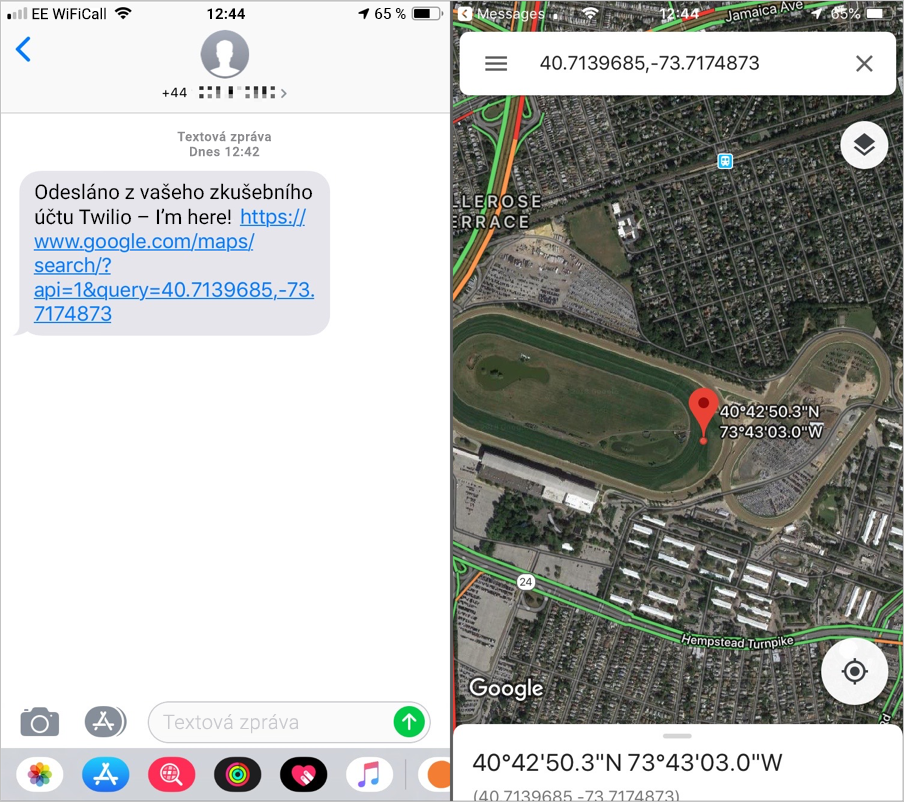

V tuto chvíli je mobilní aplikace dokončená a může odesílat polohu uživatele a seznam telefonních čísel do funkce Azure, která dokáže data deserializovat. V této lekci svážete tuto funkci Azure s platformou Twilio, která umožní odesílání zpráv SMS.

Služba Azure Functions se dá propojit s jinými službami, a to jak se službami Azure, tak se službami třetích stran. Tato propojení označovaná jako vazby existují ve dvou podobách – vstupní a výstupní vazby. Vstupní vazby poskytují vaší funkci data a výstupní vazby zase přebírají data z vaší funkce odesílají je do jiné služby. Informace o vazbách najdete v [dokumentech o vazbách služby Azure Functions](https://docs.microsoft.com/azure/azure-functions/functions-triggers-bindings?azure-portal=true).

Vazby služby Azure Functions vytvořené v sadě Visual Studio se ve funkci definují pomocí parametrů opatřených atributy.

## <a name="bind-the-azure-function-to-twilio"></a>Vytvoření vazby mezi funkcí Azure a platformou Twilio

Odesílání zpráv SMS přes platformu Twilio vyžaduje výstupní vazbu, která má nakonfigurované ID předplatného (SID) vašeho účtu a ověřovací token.

1. Pokud máte ještě po předchozí lekci spuštěný místní modul runtime služby Azure Functions, zastavte ho.

2. Přidejte do projektu `ImHere.Functions` balíček NuGet „Microsoft.Azure.WebJobs.Extensions.Twilio“. Tento balíček NuGet obsahuje příslušné třídy pro vazbu.

3. Do statické metody `Run` ve statické třídě `SendLocation` s názvem `messages` přidejte nový parametr. Bude se jednat o parametr typu `ICollector<CreateMessageOptions>`. Bude potřeba přidat direktivu `using` pro obor názvů `Twilio.Rest.Api.V2010.Account`.

    ```cs
    [FunctionName("SendLocation")]
    public static async Task<IActionResult> Run([HttpTrigger(AuthorizationLevel.Anonymous,"get", "post", Route = null)]HttpRequestMessage req,
                                                ICollector<CreateMessageOptions> messages,
                                                ILogger log)
    ```

4. Opatřete nový parametr `messages` atributem `TwilioSms`: 

      ```cs
    [TwilioSms(AccountSidSetting = "TwilioAccountSid",AuthTokenSetting = "TwilioAuthToken", From = "+1xxxxxxxxx")]ICollector<CreateMessageOptions> messages,
    ```
    Tento atribut má tři parametry, které je potřeba nastavit:

    * **AccountSidSetting** – nastavte na `"TwilioAccountSid"`.
  
        Toto je identifikátor SID účtu Twilio, který jste si poznamenali dříve v modulu. Tento parametr nenastavuje identifikátor SID přímo, ale představuje název hodnoty v nastavení aplikace funkcí, který se použije k načtení vlastního identifikátoru SID.

    * **AuthTokenSetting** – nastavte na `"TwilioAuthToken"`.

       Toto je ověřovací token účtu Twilio, který jste si poznamenali dříve v modulu. Tento parametr nenastavuje ověřovací token přímo, ale představuje název hodnoty v nastavení aplikace funkcí, který se použije k načtení vlastního ověřovacího tokenu.

    * **Z** – nastavte na aktivní telefonní číslo Twilio, které jste si poznamenali dříve v modulu.

        Telefonní číslo Twilio, ze kterého budou přicházet zprávy SMS v mezinárodním formátu (+\<směrové číslo země\>\<telefonní číslo\>, například „+1555123456“).

    > [!IMPORTANT]
    > Ujistěte se, že telefonní číslo neobsahuje žádné mezery.

5. Nastavení aplikace funkcí se dá nakonfigurovat lokálně v souboru `local.settings.json`. Přidejte do tohoto souboru JSON identifikátor SID a ověřovací token svého účtu Twilio za použití názvů nastavení předaných atributu `TwilioSMS`.

    ```json
    {
        "IsEncrypted": false,
        "Values": {
            "AzureWebJobsStorage": "UseDevelopmentStorage=true",
            "FUNCTIONS_WORKER_RUNTIME": "dotnet",
            "TwilioAccountSid": "<Your SID>",
            "TwilioAuthToken": "<Your Auth Token>"
        }
    }
    ```

    Položky \<Your SID\> (Váš identifikátor SID) a \<Your Auth Token\> (Váš ověřovací token) nahraďte hodnotami z řídicího panelu Twilio.

    > [!NOTE]
    > Toto místní nastavení bude sloužit jenom ke spouštění v místním prostředí. V produkční aplikaci se v těchto hodnotách použijí přihlašovací údaje k vašemu místnímu účtu pro vývoj nebo testování. Hodnoty pro produkční prostředí budete moct nakonfigurovat po nasazení této funkce Azure do Azure.

    > [!NOTE]
    > Když tento kód vrátíte se změnami do správy zdrojového kódu, vrátí se s ním i tyto hodnoty nastavení pro místní aplikaci, takže si dejte pozor, abyste v těchto souborech nevraceli žádné skutečné hodnoty, pokud máte kód typu open source nebo pokud se jedná o jakoukoli formu veřejného kódu.

## <a name="create-the-sms-messages"></a>Vytvoření zpráv SMS

Parametr `ICollector<CreateMessageOptions>` je kolekce instancí `CreateMessageOptions` a slouží ke shromažďování zpráv SMS, které chcete odeslat. Až se funkce dokončí, veškeré instance `CreateMessageOptions` přidané do této kolekce se předají do Twilia a použijí se k vytvoření zpráv, které se odešlou příslušným příjemcům.

1. Ve funkci `SendLocation` přidejte kód pro cyklické procházení telefonních čísel v `PostData` a pro každé vytvořte zprávu SMS. Bude potřeba přidat direktivu using pro `Twilio.Types`.

    ```cs
    foreach (string toNo in data.ToNumbers)
    {
        PhoneNumber number = new PhoneNumber(toNo);
        CreateMessageOptions message = new CreateMessageOptions(number)
        {
            Body = $"I'm here! {url}"
        };
    }
    ```

    Zpráva musí mít telefonní číslo, na které se má odeslat, a text obsahující adresu URL služby Mapy Google vytvořenou z polohy uživatele.

1. Zaneste každou zprávu do protokolu a potom ji přidejte do kolekce `messages`.

    ```cs
    foreach (string toNo in data.ToNumbers)
    {
        ...
        log.LogInformation($"Creating SMS message to {message.To}, message is '{message.Body}'.");
        messages.Add(message);
    }
    ```

Níže je znázorněna celá metoda `SendLocation`. Aktivní telefonní číslo nahradí zástupný symbol v parametru `From`.

```cs
[FunctionName("SendLocation")]
public static async Task<IActionResult> Run([HttpTrigger(AuthorizationLevel.Anonymous,
                                                         "get", "post",
                                                         Route = null)]HttpRequest req,
                                            [TwilioSms(AccountSidSetting = "TwilioAccountSid",
                                                       AuthTokenSetting = "TwilioAuthToken",
                                                       From = "+1xxxxxxxxx")] ICollector<CreateMessageOptions> messages,
                                            ILogger log)
{
    log.LogInformation("C# HTTP trigger function processed a request.");

    string requestBody = await new StreamReader(req.Body).ReadToEndAsync();
    PostData data = JsonConvert.DeserializeObject<PostData>(requestBody);
    string url = $"https://www.google.com/maps/search/?api=1&query={data.Latitude},{data.Longitude}";
    log.LogInformation($"URL created - {url}");

    foreach (string toNo in data.ToNumbers)
    {
        PhoneNumber number = new PhoneNumber(toNo);
        CreateMessageOptions message = new CreateMessageOptions(number)
        {
            Body = $"I'm here! {url}"
        };
        log.LogInformation($"Creating SMS message to {message.To}, message is '{message.Body}'.");
        messages.Add(message);
    }

    return new OkResult();
}
```

## <a name="test-it-out"></a>Testování

1. Nastavte aplikaci `ImHere.Functions` jako spouštěný projekt a spusťte ji bez ladění.

1. Nastavte aplikaci `ImHere.UWP` jako spouštěný projekt a spusťte ji.

1. Zadejte vlastní telefonní číslo v mezinárodním formátu (+\<směrové číslo země\>\<telefonní číslo\>) do aplikace Xamarin.Forms. Zkušební účty Twilio můžou odesílat zprávy jenom na ověřená telefonní čísla, takže prozatím budete moct odesílat zprávy jenom sobě, pokud neprovedete upgrade na placený účet nebo neověříte další čísla.

1. Klikněte na tlačítko **Send Location** (Odeslat umístění). Pokud se zpráva SMS úspěšně odeslala, v aplikaci Xamarin.Forms se zobrazí zpráva „Location sent successfully“ (Poloha byla úspěšně odeslána).

    

1. V protokolech konzoly pro funkci Azure uvidíte, že se zpráva vytvořila a odeslala. Pokud dojde k nějaké chybě (třeba pokud je číslo v nesprávném formátu), zobrazí se tady.

    

1. Podívejte se, jestli vám na telefon přišla zpráva. Pomocí odkazu ve zprávě zobrazte svoji polohu.

    

    > [!TIP]
    > Umístění, které uvidíte, je umístění, ve kterém je aplikace spuštěná, takže bude v blízkosti datového centra, ze kterého běží virtuální počítač. Pokud byla tato aplikace spuštěna na místním zařízení, mělo by se zobrazit vaše umístění.

## <a name="summary"></a>Shrnutí

V této lekci jste se dozvěděli, jak vytvořit vazbu funkce Azure s platformou Twilio a odeslat zprávu SMS s polohou uživatele do funkce spuštěné v místním prostředí. V další lekci publikujete funkci do Azure.
