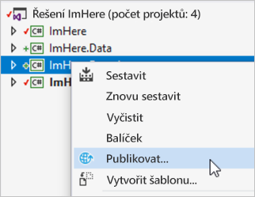
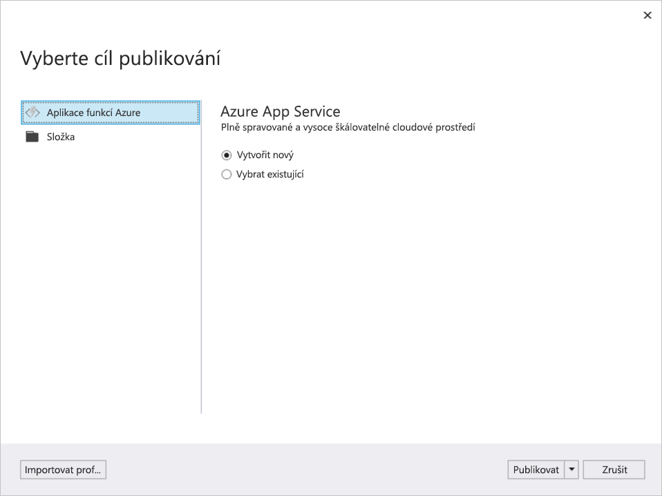
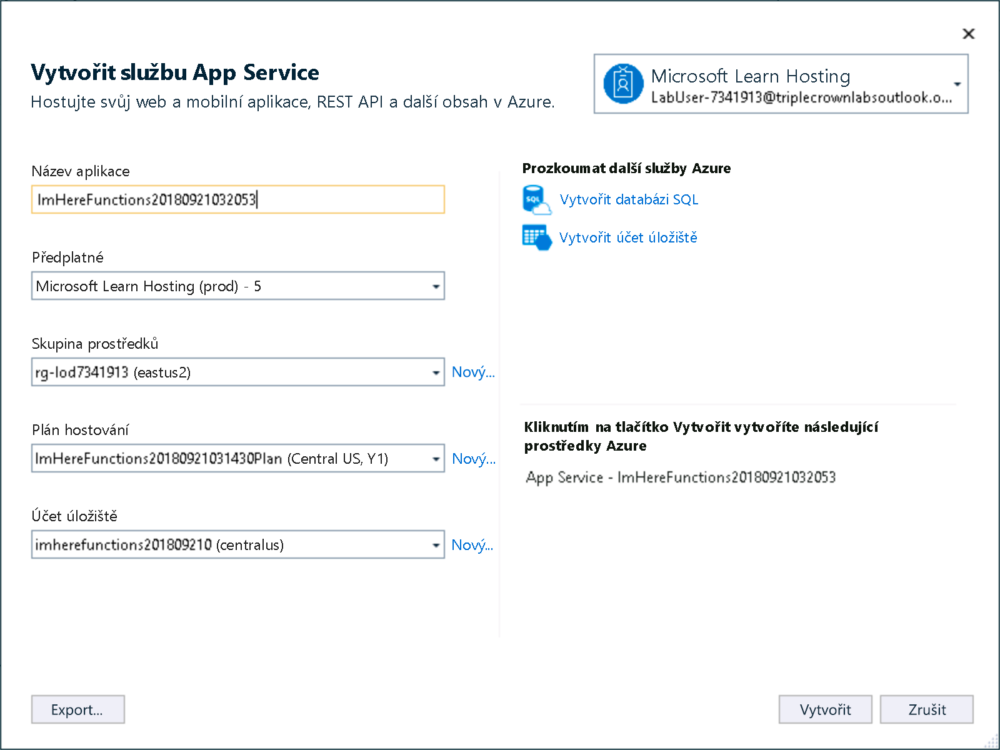
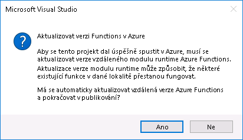
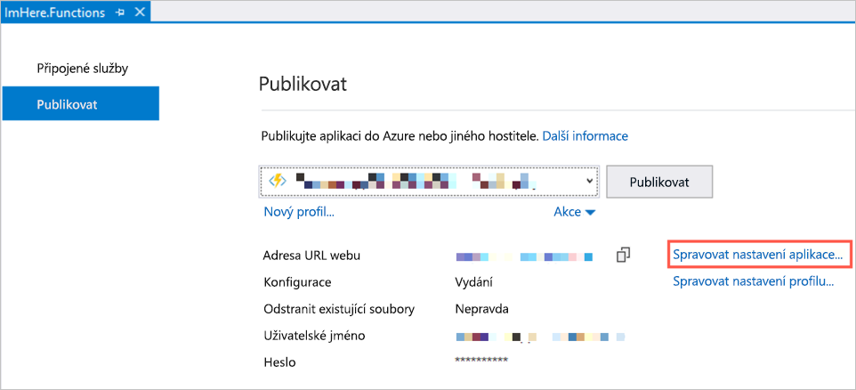
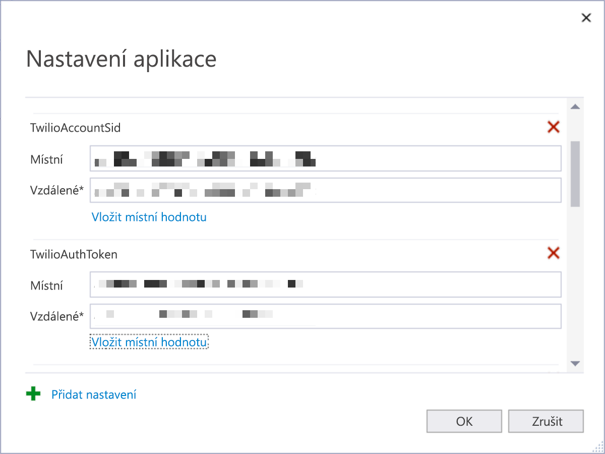
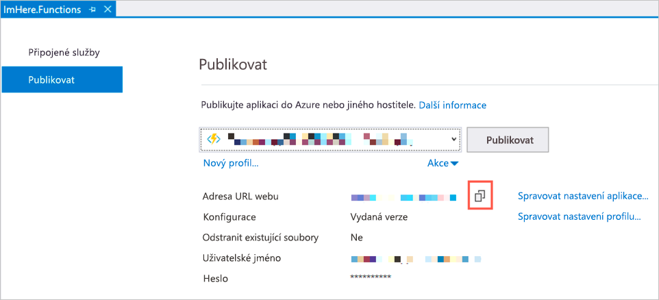

Aplikace a funkce Azure Functions jsou teď dokončené a běží v místním prostředí. V této lekci publikujete funkci do Azure, aby se mohla spustit v cloudu.

> [!Note]
> Budete publikovat funkci ze sady Visual Studio. Je to výborný způsob, jak začít s testováním konceptu, prototypy a učením, tuto metodu byste ale **neměli** používat pro aplikace určené do produkčního prostředí. Místo toho je vhodné použít nějakou formu nasazení s průběžnou integrací. O tom si můžete přečíst podrobnější informace v [dokumentaci k nasazení služby Azure Functions](https://docs.microsoft.com/azure/azure-functions/functions-continuous-deployment?azure-portal=true).

## Publikování aplikace do Azure

Funkce Azure se dají publikovat do Azure ze sady Visual Studio.

1. Pokud máte ještě po předchozí lekci spuštěný místní modul runtime služby Azure Functions, zastavte ho.

1. V Průzkumníku řešení klikněte pravým tlačítkem na aplikaci `ImHere.Functions` a vyberte možnost *Publikovat*.

    

1. V dialogovém okně **Vyberte cíl publikování** vyberte *Aplikace Azure Function* a u položky **Aplikační služba Azure** vyberte *Vytvořit novou*. Klikněte na **Publikovat**.

    

1. Přihlaste se k Azure pomocí uživatelského jména a hesla na kartě **Prostředky** v okně s těmito pokyny. Pokud vytváříte tuto aplikaci místně, tzn. nepoužíváte virtuální počítač, přihlaste se pomocí svého účtu Azure. V případě potřeby si vytvořte nový pomocí odkazů v dialogovém okně.

1. Všechny hodnoty nechejte na výchozím nastavení, protože tím se vytvoří veškerá nezbytná infrastruktura ke spouštění vaší aplikace Functions.

1. Kliknutím na **Vytvořit** zřiďte všechny prostředky v Azure a publikujte svou aplikaci Azure Functions.

    

1. Můžete být vyzváni, abyste si aktualizovali verzi Functions v Azure. Pokud se zobrazí toto dialogové okno, vyberte **Ano**, aby bylo zajištěno, že se vaše aplikace funkcí publikuje pomocí nejnovější verze modulu runtime Azure Functions.
    

Zřizování bude trvat několik minut. Zřídí se následující prostředky:

- Účet úložiště k ukládání souborů potřebných pro aplikaci Azure Functions
- Plán služby App Service pro správu výpočetních prostředků nezbytných pro aplikaci Azure Functions
- Služba App Service, na které poběží funkce Azure

Teď se funkce publikuje a bude dostupná pro volání na adrese **https://\<název_vaší_aplikace\>.azurewebsites.net/api/SendLocation**.

## Konfigurace aplikace

Když funkce Azure běžela v místním prostředí, používala přihlašovací údaje platformy Twilio uložené v souboru `local.settings.json`. Jak napovídá jeho název, tento soubor je určený pro místní nastavení, ne pro nastavení v Azure. Než bude možné volat funkci Azure v rámci Azure, je potřeba nakonfigurovat nastavení `TwilioAccountSid` a `TwilioAuthToken`.

1. Na kartě Publikovat klikněte na tlačítko **Spravovat nastavení aplikace**.

    

1. V dialogu **Nastavení aplikace** se zobrazí nastavení aplikace pomocí jak pro místní, tak pro vzdálenou hodnotu – místní hodnota pochází z vašeho souboru `local.settings.json` a vzdálená hodnota je hodnota, kterou bude vaše funkce používat, když bude hostována v Azure. Zkopírujte *místní* hodnotu do pole pro *vzdálenou hodnotu* pro hodnoty **TwilioAccountSid** a **TwilioAuthToken**.

    

1. Klikněte na **OK**. Tím se hodnoty publikují do aplikace Azure Functions.

## Nasměrování mobilní aplikace do Azure

1. Na kartě Publikovat pomocí tlačítka pro **kopírování do schránky** zkopírujte hodnotu v poli **Adresa URL webu**.

    

1. Otevřete soubor `MainViewModel` z projektu `ImHere`.

1. Aktualizujte hodnotu v poli `baseUrl` na adresu URL webu zkopírovanou z karty Publikovat.

## Testování

1. Nastavte aplikaci `ImHere.UWP` jako spouštěnou aplikaci a spusťte ji.

1. Zadejte telefonní číslo a klikněte na tlačítko **Send Location** (Odeslat polohu).

1. Polohu byste měli dostat ve zprávě SMS.

1. Pokud se vám vrátí chybová zpráva s informací o tom, že *služba je nedostupná*, zkontrolujte, jakou verzi balíčku NuGet Microsoft.Azure.WebJobs.Extensions.Twilio vaše aplikace Functions používá. Měla by to být verze 3.0.0-rc1, NIKOLI verze 3.0.0.
1. Pokud se vám vrátí chybová zpráva s informací o tom, že *služba je nedostupná*, zkontrolujte, jakou verzi balíčku NuGet Microsoft.Azure.WebJobs.Extensions.Twilio vaše aplikace Functions používá. Měla by to být verze 3.0.0-rc1, **NIKOLI** verze 3.0.0.

## Shrnutí

V této lekci jste se dozvěděli, jak publikovat projekt Azure Functions do Azure ze sady Visual Studio a jak nakonfigurovat nastavení aplikace.