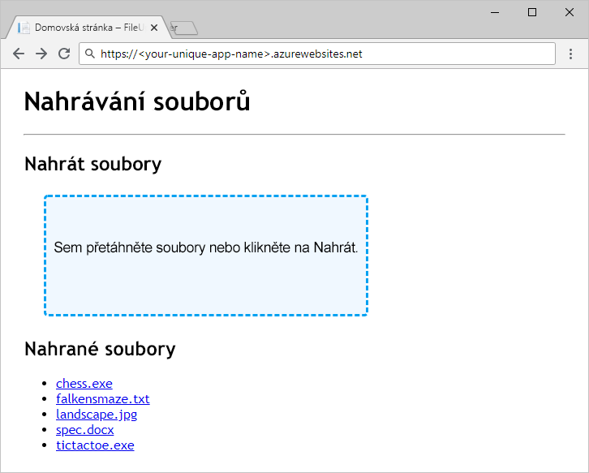

Jakmile získáme představu o tom, jak budeme ukládat data do účtů úložiště, kontejnerů a objektů blob, můžeme začít uvažovat o prostředcích Azure, které je třeba pro aplikaci vytvořit.

### <a name="storage-accounts"></a>Účty úložiště

Vytvoření účtu úložiště je aktivita správy a administrace, která se provádí před nasazením a spuštěním aplikace. Účty se obvykle vytváří pomocí skriptu pro nasazení nebo pro konfiguraci prostředí, pomocí šablony Azure Resource Manageru nebo ručně správcem. Aplikace jiné než nástroje pro správu by obecně neměly mít oprávnění k vytváření účtů úložiště.

### <a name="containers"></a>Kontejnery

Na rozdíl od vytvoření účtu úložiště je vytvoření kontejneru jednoduchá operace, kterou má smysl provádět z aplikace. Není neobvyklé, že součástí práce aplikace je vytváření a rušení kontejnerů.

U aplikací, které závisí na předem známé sadě kontejnerů s pevně zadanými nebo předem nakonfigurovanými názvy je typickou praxí vytvořit potřebné kontejnery po spuštění aplikace nebo při jejich prvním použití, pokud ještě neexistují. Když přesunete vytváření kontejnerů z fáze nasazení aplikace přímo do její činnosti, znamená to, že aplikace nemusí znát názvy kontejnerů vytvořených během nasazení, a naopak při nasazení není třeba znát názvy kontejnerů, které aplikace potřebuje.

## <a name="exercise"></a>Cvičení

Rozpracovanou aplikaci v ASP.NET Core dokončíme přidáním kódu pro použití úložiště Azure Blob Storage. Toto cvičení se zaměřuje více na rozhraní API úložiště objektů blob než na vytvoření a organizaci schématu názvů. Tady je ale stručný přehled aplikace a způsobu, jakým ukládá data.



Naše aplikace funguje jako sdílená složka, která přijímá nahrávané soubory a zpřístupňuje je ke stažení. Nepoužívá pro uspořádání objektů blob databázi &mdash; místo toho čistí názvy nahraných souborů a používá je přímo jako názvy objektů blob. Všechny nahrané soubory se ukládají do jednoho kontejneru.

Kód, se kterým začneme, se dá zkompilovat a spustit, ale části pro ukládání a načítání dat jsou prázdné. Jakmile kód dokončíme, nasadíme aplikaci do Azure App Service a otestujeme ji.

[!include[](../../../includes/azure-sandbox-activate.md)]

Pojďme pro naši aplikaci vytvořit infrastrukturu úložiště.

### <a name="storage-account"></a>Účet úložiště

Vytvoříme účet uložiště pomocí Azure Cloud Shell a příkazového řádku Azure CLI. Pro účet úložiště bude třeba zadat jedinečný název – poznamenejte si ho pro další postup. V následujícím příkladu používáme oblast USA – východ (East US), ale můžete ji změnit na kterékoli z dostupných umístění ze seznamu.

[!include[](../../../includes/azure-sandbox-regions-first-mention-note.md)]

Vytvořte účet úložiště spuštěním následujícího příkazu. 

```azurecli
az storage account create \
  --kind StorageV2 \
  --resource-group <rgn>[sandbox resource group name]</rgn> \
  --location eastus \
  --name <your-unique-storage-account-name>
```

> [!NOTE]
> Proč `--kind StorageV2`? Existuje několik různých typů účtů úložiště. Pro většinu scénářů byste měli použít účty úložiště pro obecné účely verze 2. Jediný důvod, proč je třeba `--kind StorageV2` výslovně specifikovat je ten, že účty úložiště pro obecné účely verze 2 jsou stále ještě celkem nové a ještě nebyly na webu Azure Portal nebo v Azure CLI nastaveny jako výchozí.

### <a name="container"></a>Kontejner

Aplikace, se kterou budeme pracovat v tomto modulu používá jediný kontejner. Dodržíme osvědčený postup a necháme aplikaci vytvořit kontejner až při spuštění. Kontejner ale můžete vytvořit i z příkazového řádku Azure CLI: zadáním příkazu `az storage container create -h` v terminálu Azure Cloud Shell zobrazíte dokumentaci.