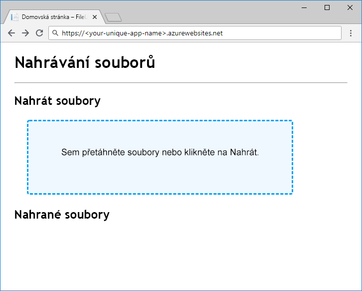

Jakmile budeme mít odkaz na objekt blob, můžeme odesílat a stahovat data. Objekty `ICloudBlob` mají metody `Upload` a `Download`, které jako zdroje a cíle podporují pole bajtů, datové proudy a soubory. Pro usnadnění práce mají konkrétní typy i další metody &mdash; například `CloudBlockBlob` podporuje nahrávání a stahování řetězců pomocí metod `UploadTextAsync` a `DownloadTextAsync`.

## <a name="creating-new-blobs"></a>Vytváření nových objektů blob

Pokud chcete vytvořit nový objekt blob, zavoláte jednu z metod `Upload` pro objekt blob, který v úložišti neexistuje. Stanou se dvě věci: v úložišti se vytvoří objekt blob a načtou se příslušná data.

## <a name="moving-data-to-and-from-blobs"></a>Přesun dat do a z objektů blob

Přesun dat do a z objektů blob je síťová operace, která nějakou dobu trvá. V sadě Azure Storage SDK pro .NET Core všechny metody, které vyžadují síťovou aktivitu, vracejí `Task`. Proto zkontrolujte, že v metodách kontroleru správně používáte `await`.

Při práci s velkými datovými objekty se běžně doporučuje namísto struktur v paměti, jako jsou pole bajtů nebo řetězce, používat datové proudy. Vyhnete se tak uložení celého obsahu ve vyrovnávací paměti před odesláním do cíle. ASP.NET Core podporuje čtení a zápis datových proudů z požadavků a odpovědí.

## <a name="concurrent-access"></a>Souběžný přístup

Jiné procesy mohou přidávat, měnit nebo odstraňovat objekty blob v době, kdy je vaše aplikace využívá. Vždycky kódujte opatrně a zamýšlejte se nad problémy způsobovanými souběžným přístupem, jako jsou třeba objekty blob odstraněné přesně v okamžiku, kdy se z nich pokoušíte stahovat, nebo objekty blob, jejichž obsah se změní, když to nečekáte. Projděte si část Další materiály na konci tohoto modulu. Najdete tam informace o použití AccessConditions a zapůjčení objektů blob ke správě souběžného přístupu k objektům blob.

## <a name="exercise"></a>Cvičení

Naši aplikaci dokončíme nahráním a stažením kódu a potom ji nasadíme do Azure App Service a otestujeme.

### <a name="upload"></a>Nahrávání

Pro nahrávání objektů blob jsme implementovali metodu `BlobStorage.Save` s využitím `GetBlockBlobReference`, abychom z kontejneru získali `CloudBlockBlob`. `FilesController.Upload` předá stream souboru operaci `Save`, abychom mohli kvůli maximální účinnosti k nahrání použít `UploadFromStreamAsync`.

V editoru, nahraďte operaci `Save` v `BlobStorage.cs` následujícím kódem:

```csharp
public Task Save(Stream fileStream, string name)
{
    CloudStorageAccount storageAccount = CloudStorageAccount.Parse(storageConfig.ConnectionString);
    CloudBlobClient blobClient = storageAccount.CreateCloudBlobClient();
    CloudBlobContainer container = blobClient.GetContainerReference(storageConfig.FileContainerName);
    CloudBlockBlob blockBlob = container.GetBlockBlobReference(name);
    return blockBlob.UploadFromStreamAsync(fileStream);
}
```

> [!NOTE]
> Uvedený kód pro nahrání je založený na streamu, a je proto efektivnější než načtení souboru do pole bajtů a jeho následné odeslání do Azure Blob Storage. Technika `IFormFile` ASP.NET Core, kterou jsme využili k získání souboru od klienta, ale není skutečně komplexní implementace streamování a je vhodná jenom pro nahrávání malých souborů. V části Další materiály na konci tohoto modulu najdete informace o plně streamovaném nahrávání souborů.

### <a name="download"></a>Stahování

`BlobStorage.Load` vrací `Stream`. To znamená, že náš kód nemusí fyzicky přesouvat bajty z úložiště objektů blob &mdash; stačí nám vrátit odkaz na datový proud objektů blob. K tomu můžeme využít `OpenReadAsync`. ASP.NET Core se postará o načtení a zavření datového proudu, když sestavuje odpověď klienta.

`Load` nahraďte tímto kódem a práci uložte:

```csharp
public Task<Stream> Load(string name)
{
    CloudStorageAccount storageAccount = CloudStorageAccount.Parse(storageConfig.ConnectionString);
    CloudBlobClient blobClient = storageAccount.CreateCloudBlobClient();
    CloudBlobContainer container = blobClient.GetContainerReference(storageConfig.FileContainerName);
    return container.GetBlobReference(name).OpenReadAsync();
}
```

### <a name="deploy-and-run-in-azure"></a>Nasazení a spuštění v Azure

Naše aplikace je dokončená. Pojďme ji nasadit a podívat se, jak funguje. Vytvořte aplikaci App Service a nakonfigurujte ji nastavením aplikace pro připojovací řetězec účtu úložiště a názvem kontejneru. Získejte připojovací řetězec účtu úložiště pomocí `az storage account show-connection-string` a nastavte název kontejneru na `files`.

Název aplikace musí být globálně jedinečný, takže si ho vymyslete a zadejte do `<your-unique-app-name>`.

```azurecli
az appservice plan create --name blob-exercise-plan --resource-group <rgn>[sandbox resource group name]</rgn>
az webapp create --name <your-unique-app-name> --plan blob-exercise-plan --resource-group <rgn>[sandbox resource group name]</rgn>
CONNECTIONSTRING=$(az storage account show-connection-string --name <your-unique-storage-account-name> --output tsv)
az webapp config appsettings set --name <your-unique-app-name> --resource-group <rgn>[sandbox resource group name]</rgn> --settings AzureStorageConfig:ConnectionString=$CONNECTIONSTRING AzureStorageConfig:FileContainerName=files
```

Teď aplikaci nasadíme. Následující příkazy publikují web do složky `pub`, zazipují ji do souboru `site.zip` a tento soubor nasadí do služby App Service.

> [!NOTE]
> Před spuštěním následujících příkazů se ujistěte, že je prostředí stále v adresáři `mslearn-store-data-in-azure/store-app-data-with-azure-blob-storage/src/start`.

```azurecli
dotnet publish -o pub
cd pub
zip -r ../site.zip *
az webapp deployment source config-zip --src ../site.zip --name <your-unique-app-name> --resource-group <rgn>[sandbox resource group name]</rgn>
```

Pokud se chcete podívat na spuštěnou aplikaci, otevřete v prohlížeči `https://<your-unique-app-name>.azurewebsites.net`. Měla by vypadat jako na obrázku níže.



Otestujte aplikaci tak, že zkusíte nahrát a stáhnout nějaké soubory. Po nahrání několika souborů spusťte v prostředí následující příkazy pro zobrazení objektů blob, které se do kontejneru nahrály:

```console
az storage blob list --account-name <your-unique-storage-account-name> --container-name files --query [].{Name:name} --output table
```