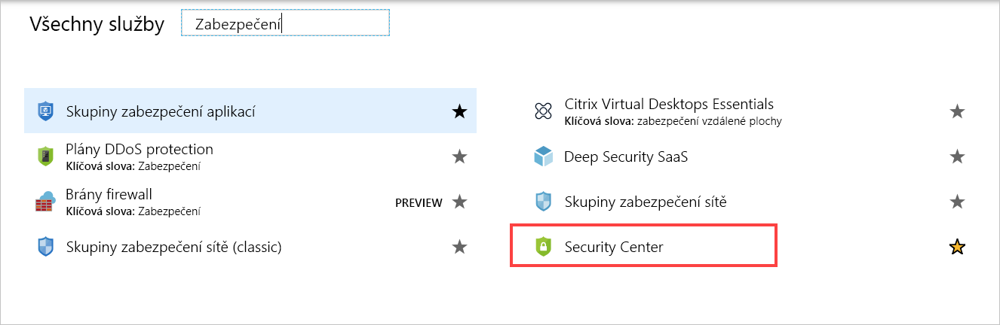
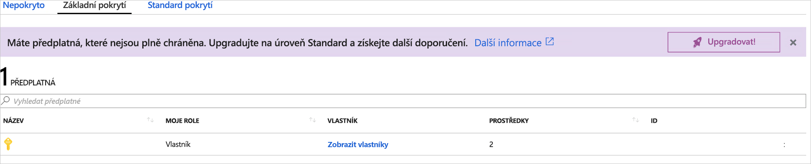
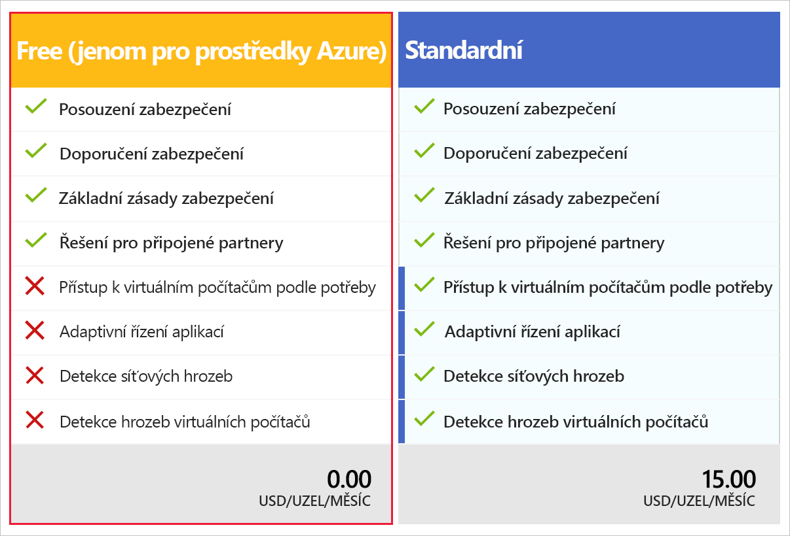

Jedním z největších problémů se zabezpečením je nepřehlédnout žádnou oblast, která je potřeba zabezpečit, a najít ohrožení zabezpečení dřív než hackeři. Azure poskytuje službu s názvem Azure Security Center, která tohle všechno usnadňuje.

## Co je Azure Security Center?

Azure Security Center (ASC) je monitorovací služba, která poskytuje ochranu před hrozbami všem službám v Azure i místním službám. Dokáže:

- Poskytnout doporučení pro zabezpečení na základě konfigurací, prostředků a sítí.
- Monitorovat nastavení zabezpečení u místních i cloudových úloh a automaticky uplatňovat požadované zabezpečení u služeb, když přechází do režimu online.
- Průběžně monitorovat všechny vaše služby a automaticky provádět bezpečnostní vyhodnocování, aby se potenciální ohrožení zabezpečení identifikovala před jejich zneužitím.
- Používat strojové učení k detekci malwaru a zablokování jeho snahy nainstalovat se do vašich služeb nebo virtuálních počítačů. Aplikace můžete také umístit na seznam povolených, aby se mohly spouštět pouze aplikace, které ověříte.
- Analyzovat a identifikovat potenciální příchozí útoky a pomoct zkoumat hrozby a aktivitu po porušení zabezpečení, ke kterému mohlo dojít.
- Řídit přístup za běhu u portů a zmenšit prostor pro útoky umožněním pouze takového síťového provozu, který potřebujete.

ASC je součástí doporučení organizace [Center for Internet Security](https://www.cisecurity.org/cis-benchmarks/) (Centrum pro internetovou bezpečnost).

## Aktivace služby Azure Security Center

Azure Security Center zajišťuje jednotnou správu zabezpečení a pokročilou ochranu před hrozbami napříč hybridními cloudovými úlohami a nabízí se ve dvou úrovních: bezplatná a standardní. Bezplatná úroveň poskytuje zásady zabezpečení, hodnocení a doporučení a standardní úroveň poskytuje robustní sadu funkcí, včetně analýzy hrozeb.

Vzhledem k výhodám ASC se váš bezpečnostní tým rozhodl tuto službu zapnout u všech vašich předplatných. Ráno vám přišel e-mail, že si ji máte u aplikací zapnout. Pojďme se tedy podívat, jak to udělat.

> [!IMPORTANT]
> Azure Security Center není v bezplatném sandboxu Azure podporováno. Tyto kroky můžete provést ve vlastním předplatném nebo můžete jenom postupovat podle navrženého postupu, abyste pochopili, jak aktivovat službu ASC.

1. Otevřete web [Azure Portal](https://portal.azure.com?azure-portal=true) a v levé nabídce vyberte **Azure Security Center**. Pokud ho tam nevidíte, můžete vybrat **Všechny služby** a **Security Center** najít v části zabezpečení podle obrázku níže.

   

1. Pokud jste ASC ještě nikdy neotvírali, otevře se okno na položce **Začínáme**, která vás může požádat o upgrade předplatného. Prozatím to ignorujte, vyberte dole na stránce **Skip** (Přeskočit) a potom vyberte **Overview** (Přehled).
    - Tím se u všech prvků dostupných v předplatném zobrazí „celkový obraz zabezpečení“,
    - který obsahuje spoustu skvělých informací k prozkoumání.

1. V dalším kroku vyberte v části Zásady a dodržování předpisů možnost **Pokrytí**. Zobrazí se prvky předplatného, které jsou (nebo nejsou) službou ASC pokryté. Zde můžete ASC zapnout pro každou službu, ke které máte přístup. Zkuste přepnout mezi třemi oblastmi pokrytí: „Not covered“ (Nepokryté), „Basic coverage“ (Základní pokrytí) a „Standard coverage“ (Standardní pokrytí).

1. Nepokrytá předplatná zobrazí výzvu k aktivaci ASC. Pokud chcete ASC povolit u všech prostředků v předplatném, můžete kliknout na Upgradovat.

### Bezplatná vs. standardní cenová úroveň

Přestože můžete bezplatnou cenovou úroveň předplatného Azure u služby ACS použít, je omezená pouze na vyhodnocování a doporučení u prostředků Azure. Pokud chcete ACS skutečně využívat, budete muset upgradovat na standardní cenovou úroveň, jak je znázorněné výše. Své předplatné můžete upgradovat, jak jsme již zmiňovali, prostřednictvím tlačítka „Upgrade Now“ (Upgradovat nyní) v okně **Coverage** (Pokrytí). Nebo se můžete v nabídce ASC přepnout do okna **Getting Started** (Začínáme), které váš změnou cenové úrovně předplatného provede. Ceny a funkce se mohou v závislosti na oblasti lišit. Úplný přehled získáte na [stránce s cenami](https://azure.microsoft.com/pricing/details/security-center/).

> [!NOTE]
> K upgradu předplatného na úroveň Standard musíte mít přiřazenou roli Vlastník předplatného, Přispěvatel předplatného nebo Správce zabezpečení.

> [!IMPORTANT]
> Po 60denním zkušebním období se vám bude **měsíčně účtovat 15 USD za uzel** a fakturace proběhne na váš účet.

## Vypnutí služby Azure Security Center

U produkčních systémů budete určitě chtít ponechat službu Azure Security Center zapnutou, aby mohla monitorovat hrozby u všech prostředků. Pokud však službu ASC jen zkoušíte a zapnuli jste ji, budete ji pravděpodobně chtít vypnout, aby se vám za ni neúčtovaly poplatky. Pojďme to tedy udělat.

1. Otevřete web [Azure Portal](https://portal.azure.com?azure-portal=true) a v levé nabídce vyberte **Azure Security Center**. Pokud ho tam nevidíte, můžete vybrat **Všechny služby** a **Security Center** najít v části zabezpečení podle obrázku níže.

    

1. V levé nabídce vyberte **Zásady zabezpečení**.

1. Potom vedle předplatného, u kterého chcete ASC downgradovat, vyberte **Edit settings >** (Upravit nastavení >).

1. Na další obrazovce vyberte z levé nabídky „Pricing Tier“ (Cenová úroveň).

1. Otevře se nová stránka vypadající jako obrázek níže. Klikněte na pole vlevo s označením bezplatné cenové úrovně (pouze pro prostředky Azure).

    

1. V horní části obrazovky klikněte na tlačítko **Uložit**.

Teď jste předplatné downgradovali na bezplatnou úroveň služby Azure Security Center.

Blahopřejeme, udělali jste první (a nejdůležitější) krok směrem k zabezpečení aplikací, dat a sítě.