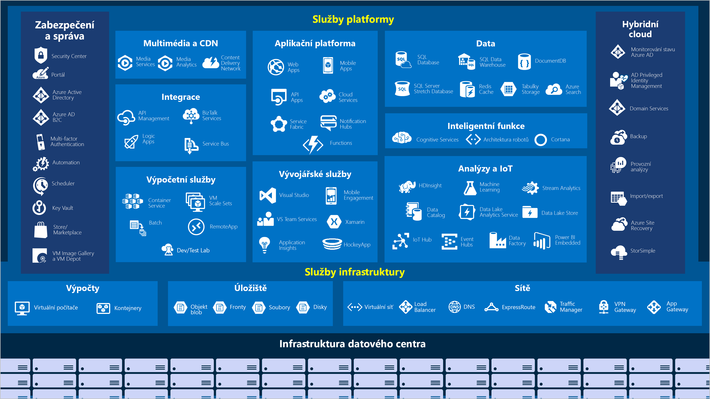

Microsoft Azure je neustále se rozšiřující sada cloudových služeb, které pomáhají vaší organizaci překonávat aktuální i budoucí obchodní výzvy. Azure vám dává volnost při sestavování, správě a nasazování aplikací v obrovské globální síti a umožňuje vám používat oblíbené nástroje a architektury. Pojďme si udělat krátkou prohlídku základních služeb, které Azure nabízí.

#### Azure: Celkový přehled

> [!VIDEO https://www.microsoft.com/videoplayer/embed/RE2yuas]

## Služby Azure

Azure poskytuje širokou škálu cloudových služeb a každý měsíc přibývají nové a vylepšené funkce.

Podívejme se podrobněji na některé z nejčastěji používaných funkcí:

- Výpočetní prostředky
- Sítě
- Úložiště
- Mobilní
- Databáze
- Web

### Výpočetní prostředky

Výpočetní služby často patří mezi hlavní důvody, proč společnosti přecházejí na platformu Azure. Azure nabízí celou řadu možností hostování aplikací a služeb. Tady je několik příkladů výpočetních služeb v Azure:

|  Název služby             | Funkce služby                                                         |
|---------------------------|--------------------------------------------------------------------------|
| Azure Virtual Machines    | Virtuální počítače s Windows nebo Linuxem hostované v Azure                  |
| Azure Virtual Machine Scale Sets | Škálování pro virtuální počítače s Windows nebo Linuxem hostované v Azure                  |
| Azure Kubernetes Service  | Umožňuje správu clusteru virtuálních počítačů, na kterých běží kontejnerizované služby.   |
| Azure Service Fabric      | Platforma pro distribuované systémy. Běží v Azure nebo místním prostředí               |
| Azure Batch               | Spravovaná služba pro paralelní a vysoce výkonné výpočetní aplikace |
| Azure Container Instances | Poskytuje kontejnery bez potřeby zřizování virtuálních počítačů nebo vyšších služeb.    |
| Azure Functions           | Bezserverová výpočetní služba založená na událostech                              |

### Sítě

Klíčovou funkcí sítí Azure je propojení výpočetních prostředků a poskytování přístupu k aplikacím. Funkce sítí v Azure zahrnuje řadu možností propojení vnějšího světa se službami a funkcemi v globálních datových centrech Microsoft Azure.

Síťová zařízení Azure mají následující funkce:

|  Název služby             | Funkce služby                                                                     |
| -------------             | -------------                                                                        |
| Azure Virtual Network     | Propojení virtuálních počítačů s připojeními k virtuální privátní síti (VPN)                   |
| Nástroj pro vyrovnávání zatížení Azure       | Vyrovnávání zatížení příchozích a odchozích připojení k aplikacím nebo koncovým bodům služby       |
| Azure Application Gateway | Optimalizace poskytování serverové farmy aplikace při zvýšení zabezpečení aplikace             |
| Azure VPN Gateway         | Přístupy k virtuálním sítím Azure prostřednictvím vysoce výkonných bran VPN                |
| Azure DNS                 | Poskytnutí mimořádně rychlé odezvy DNS a domény s extrémně vysokou dostupností                 |
| Azure Content Delivery Network  | Poskytování obsahu zákazníkům na celém světě za použití vysoké šířky pásma                          |
| Azure DDoS Protection     | Ochrana aplikací hostovaných v Azure před distribuovanými útoky s cílem odepření služeb (DDoS) |
| Azure Traffic Manager     | Distribuce datových přenosů v síti do oblastí Azure po celém světě                           |
| Azure ExpressRoute        | Připojení k Azure přes vyhrazená zabezpečená připojení s velkou šířkou pásma                   |
| Azure Network Watcher     | Monitorování a diagnostika problémů se sítí prostřednictvím analýzy založené na scénářích                  |
| Brána Azure Firewall            | Implementace brány firewall s vysokým zabezpečením, vysokou dostupností a neomezenou škálovatelností      |
| Azure Virtual WAN         | Vytvoření jednotné sítě WAN (Wide Area Network) propojující místní a vzdálené lokality         |

### Úložiště

Azure poskytuje čtyři hlavní typy služeb úložiště. Jsou to tyto služby:

|  Název služby       | Funkce služby                                                                     |
| -------------       | -------------                                                                        |
| Azure Blob Storage  | Služba úložiště pro velmi velké objekty, například videosoubory nebo rastrové obrázky               |
| Azure File Storage  | Sdílené složky, které můžete používat a spravovat jako souborový server                        |
| Azure Queue Storage | Úložiště pro řazení zpráv do front a jejich spolehlivé doručování mezi aplikacemi       |
| Azure Table Storage | Úložiště NoSLQ, které hostuje nestrukturovaná data nezávislá na schématech                 |

Všechny tyto služby mají následující společné vlastnosti:

- Odolnost, vysoká dostupnost a možnosti redundance a replikace
- Zabezpečení prostřednictvím automatického šifrování a řízení přístupu na základě rolí
- Škálovatelnost s prakticky neomezeným úložištěm
- Spravované služby, které se starají o údržbu a řeší za vás veškeré kritické potíže
- Možnost přístupu prostřednictvím protokolu HTTP nebo HTTPS odkudkoli na světě

### Mobilní

Azure umožňuje vývojářům rychle a snadno vytvářet poutavé aplikace pro iOS, Android a Windows v široké škále jazyků a libovolném vývojovém prostředí. Tato platforma umožňuje snadné zahrnutí funkcí, které dříve bývaly časově náročné a zvyšovaly rizikovost projektu. Jde například o přidání podnikového přihlašování a připojování k místním prostředkům, jako je SAP, Oracle, SQL Server nebo SharePoint.

Kromě toho tato služba zahrnuje následující funkce:

- Synchronizace offline dat
- Možnost připojení k datům v místním prostředí
- Vysílání nabízených oznámení
- Automatické škálování na základě obchodních potřeb

### Databáze

Azure poskytuje několik databázových služeb, které umožňují ukládání různých typů a objemů dat. Vzhledem ke globálním možnostem připojení jsou data dostupná uživatelům okamžitě.

|  Název služby              | Funkce služby                                                                                |
| -------------              | -------------                                                                                   |
| Azure Cosmos DB            | Globálně distribuovaná databáze, která podporuje možnosti NoSQL                                       |
| Azure SQL Database         | Plně spravovaná relační databáze s automatickým škálováním, zabudovanou inteligencí a robustním zabezpečením    |
| Azure Database for MySQL   | Plně spravovaná a škálovatelná relační databáze MySQL s vysokou dostupností a zabezpečením        |
| Azure Database for PostgreSQL   | Plně spravovaná a škálovatelná relační databáze PostgreSQL s vysokou dostupností a zabezpečením   |
| SQL Server na virtuálních počítačích          | Hostování podnikových aplikací SQL Serveru v cloudu                                                    |
| Azure SQL Data Warehouse   | Plně spravovaný datový sklad s integrovaným zabezpečením na všech úrovních škálování bez dalších poplatků    |
| Azure Database Migration Service    | Migrace databází do cloudu beze změn kódu aplikace                  |
| Azure Cache for Redis      | Ukládání často používaných a statických dat do mezipaměti za účelem snížení latence dat a aplikace                   |
| Azure Database for MariaDB | Plně spravovaná a škálovatelná relační databáze MariaDB s vysokou dostupností a zabezpečením        |

### Web

Webové služby v Azure zahrnují následující funkce:

| Název služby | Popis |
|--------------|-------------|
| Azure App Service | Rychlé vytváření výkonných cloudových aplikací pro webové a mobilní prostředí |
| Azure Notification Hubs |Posílání nabízených oznámení na jakoukoli platformu z jakéhokoli back-endu |
| Azure API Management | Bezpečné a škálovatelné publikování rozhraní API pro vývojáře, partnery a zaměstnance |
| Azure Search | Plně spravované hledání jako služba |
| Funkce Web Apps služby Azure App Service | Vytvoření a nasazení důležitých webových aplikací se škálováním |
| Služba Azure SignalR | Snadné přidání webových funkcí v reálném čase |

Když jsme teď identifikovali několik oblastí, které by mohly zajímat společnost plánující migraci do Azure, pojďme se podívat, kde v cloudu se tyto služby nacházejí.
