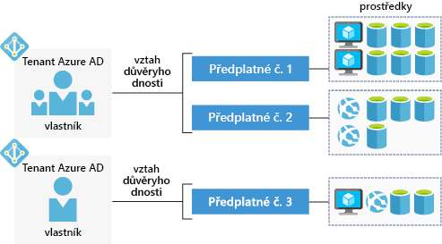

Bezplatný účet a předplatné Azure umožňují vytvářet, testovat a nasazovat podnikové aplikace, vytvářet vlastní webové a mobilní prostředí a získat přehled o svých datech prostřednictvím strojového učení a výkonné analýzy.

## Co je účet Azure?

_Účet Azure_ je svázaný s konkrétní identitou. Obsahuje například tyto informace:

- jméno, e-mail a kontaktní předvolby,
- fakturační údaje, například informace o platební kartě.

Účet Azure se používá k přihlášení k portálu Azure Portal nebo Azure CLI. Každý účet Azure je spojený s jedním nebo několika _předplatnými_.

## Co je předplatné Azure?

_Předplatné Azure_ je logický kontejner, který se používá ke zřizování prostředků v Microsoft Azure. Obsahuje podrobnosti o všech vašich prostředcích, jako jsou virtuální počítače, databáze atd.

K fakturaci dochází na úrovni předplatného – pro každé předplatné Azure je každý měsíc vygenerována jedna faktura. U každého předplatného můžete nastavit limity útraty, abyste na konci měsíce nebyli překvapení.

## Co je tenant Azure AD?

Azure AD (Azure Active Directory) je moderní zprostředkovatel identity, který podporuje více ověřovacích protokolů pro zabezpečení aplikací a služeb v cloudu. _Není_ stejný jako služba Windows Active Directory, která se používá k zabezpečení stolních počítačů a serverů s Windows. Služba Azure AD využívá webové ověřovací standardy, jako je OpenID nebo OAuth.

Uživatelé, aplikace a další entity zaregistrované v Azure AD nejsou všechny soustředěné do jediné globální služby. Místo toho je Azure AD rozdělené na samostatné _tenanty_. Tenant je vyhrazená, izolovaná instance služby Azure Active Directory, která je vlastněná a spravovaná organizací.

Pokud jde o tenanty Azure AD, neexistuje žádná konkrétní definice „organizace“ – tenanty můžou vlastnit jednotlivci, týmy, společnosti nebo jiné skupiny uživatelů. Tenanti bývají často přidruženi ke společnostem. Pokud se zaregistrujete v Azure s e-mailovou adresu, která není přidružená k existujícímu tenantovi, proces registrace vás provede vytvořením vlastního tenanta, který bude vlastněn výhradně vámi.

> [!NOTE]
> E-mailovou adresu, kterou se přihlašujete k Azure, je možné přidružit k více než jednomu tenantovi. Toho si můžete všimnout, pokud máte vlastní účet Azure a pro cvičení používáte sandbox Azure pro Microsoft Learn. Na portálu Azure Portal uvidíte vždy jenom prostředky, které patří do jednoho tenanta. Pokud budete chtít přepnout tenanta, pro kterého si prohlížíte prostředky, vyberte ikonu **knihy a filtru** v horní části portálu a v části **Přepnout adresář** zvolte jiného tenanta.

Tenanti a předplatná Azure AD mají vztah důvěryhodnosti M:1: Tenant může být přidružený k více předplatným Azure, ale každé předplatné je přidružené jenom k jednomu tenantovi. Tato struktura umožňuje organizacím spravovat více předplatných a nastavovat pravidla zabezpečení pro všechny prostředky zahrnuté do předplatného.

Tady je jednoduché znázornění spolupráce účtů, předplatných, tenantů a prostředků.

Všimněte si, že každý tenant Azure AD má _vlastníka účtu_. Jde o původní účet Azure, který zodpovídá za fakturaci. Do tenanta můžete přidat další uživatele a dokonce pozvat hosty z jiných tenantů Azure AD, abyste jim umožnili přístup k prostředkům jednoho nebo více předplatných.

## Typy předplatného Azure

Azure nabízí několik typů předplatného, které jsou určené různým typům zákazníků. Toto jsou nejpoužívanější typy předplatného:

- Bezplatné
- Průběžné platby
- Smlouva Enterprise
- Student

### Bezplatné předplatné Azure

Bezplatné předplatné Azure zahrnuje **kredit ve výši 200 USD** na výdaje v prvních 30 dnech, bezplatný přístup k nejoblíbenějším produktům Azure na 12 měsíců a přístup k více než 25 produktům, které jsou zdarma vždy. Pro nové uživatele je to vynikající způsob, jak začít. K nastavení bezplatného předplatného potřebujete telefonní číslo, platební kartu a účet Microsoft.

> [!NOTE]
> Informace o platební kartě se používají jen k ověření identity. Nebudou vám účtovány žádné služby, dokud neprovedete upgrade.

### Předplatné Azure s průběžnými platbami

U předplatného s průběžnými platbami se vám měsíčně účtují poplatky za použité služby. Tento typ předplatného je vhodný pro široké spektrum uživatelů od jednotlivců přes malé firmy až po řadu velkých organizací.

### Smlouva Enterprise Azure

Smlouva Enterprise zajišťuje flexibilitu pro nákup cloudových služeb a softwarových licencí v rámci jedné smlouvy se slevami pro nové licence a programem Software Assurance. Cílovou skupinou tohoto typu předplatného jsou velké organizace.

### Předplatné Microsoft Azure for Students

Předplatné Microsoft Azure for Students zahrnuje **kredity Azure v hodnotě 100 USD**, které lze využít v prvních 12 měsících, a k tomu výběr bezplatných služeb, aniž by se při registraci vyžadovala platební karta. Statut studenta musíte ověřit prostřednictvím e-mailové adresy organizace.

## Shrnutí

Jednotlivci, malé firmy, velké organizace i studenti potřebují k používání služeb Azure předplatné. Většinou začínáte s bezplatným předplatným, abyste si mohli služby Azure vyzkoušet. Jakmile zkušební období skončí, přejdete z bezplatného předplatného na předplatné s průběžnými platbami.