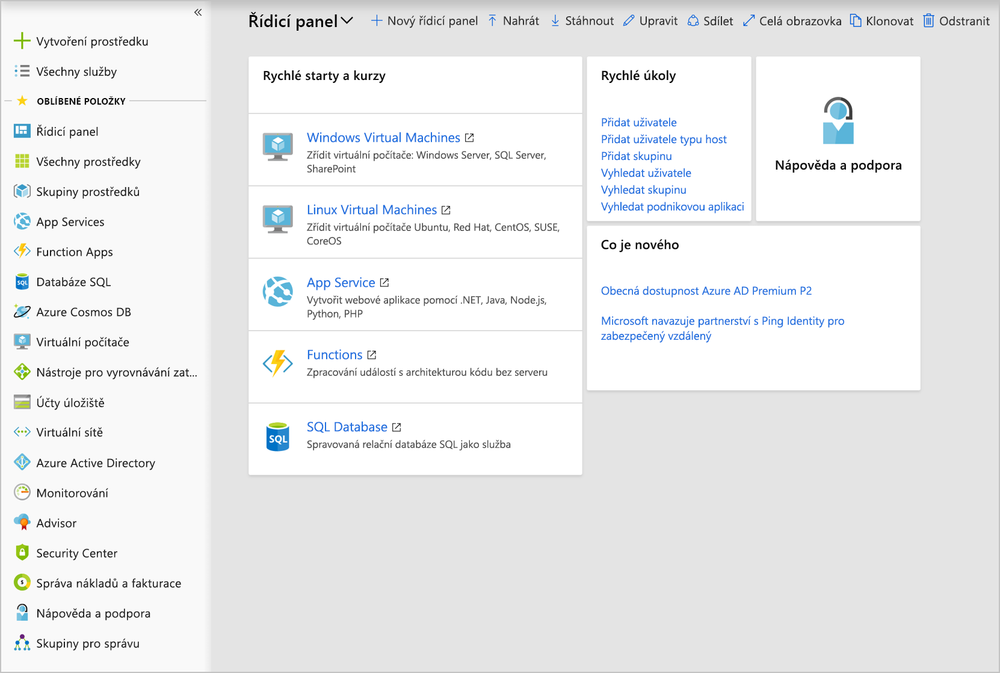

Nyní máme účet a můžeme se přihlásit k webu **Azure Portal**. Portál je webové prostředí pro správu, které vám umožňuje pracovat se všemi předplatnými a prostředky, které jste vytvořili. Téměř všechny akce, které s Azure provádíte, můžete dělat přes toto webové rozhraní.

## Rozvržení webu Azure Portal

Azure Portal je primární grafické uživatelské rozhraní (GUI) pro správu Microsoft Azure. Na portálu můžete provádět většinu akcí správy a je to také obvykle nejlepší rozhraní pro provádění jednotlivých úloh nebo pro podrobné zjišťování informací o konfiguraci.

:::row:::
    :::column:::
    
    :::column-end:::
    :::column span="3":::
    **Panel prostředků**
    
    Na levém bočním panelu portálu je podokno prostředků, kde jsou zobrazené hlavní typy prostředků. Nezapomeňte ale, že Azure má více typů prostředků, než jen ty, které se tu zobrazují. Uvedené prostředky patří k vašim _oblíbeným_. 

    Můžete je přizpůsobit pomocí konkrétních typů prostředků, které plánujete vytvořit nebo které nejčastěji spravujete. 

    Toto podokno můžete také sbalit pomocí stříšky **<<**. Minimalizuje se na pouhé ikony, což může být užitečné, když pracujete s omezenou velikostí obrazovky.
    :::column-end:::
:::row-end:::

Zbývající část zobrazení portálu slouží pro konkrétní prvky, s nimiž pracujete. Výchozí (hlavní) stránkou je _řídicí panel_. Tomu se budeme věnovat později, ale řídicí panel představuje přizpůsobitelné celkové zobrazení prostředků. Z řídicího panelu můžete přejít rovnou na konkrétní prostředky, které chcete spravovat, nebo na něm můžete vyhledávat prostředky pomocí položky **Všechny prostředky** na panelu prostředků. Při správě prostředku, například virtuálního počítače nebo webové aplikace, budete pracovat s _oknem_, ve kterém se zobrazují konkrétní informace o daném prostředku.

## Co je okno?

Na webu Azure Portal se pro navigaci používá model oken. _Okno_ je vysouvací panel, který obsahuje uživatelské rozhraní pro jednu úroveň v navigační sekvenci. Například každý z těchto elementů v této sekvenci by byl reprezentovaný jedním oknem: **Virtuální počítače** > **Compute** > **Ubuntu Server**.

Každé okno obsahuje informace a konfigurovatelné možnosti. Některé z těchto možností otevírají další okna, která se vysouvají doprava z existujících oken. V novém okně mohou další konfigurovatelné možnosti otvírat další okna a tak dále. Velmi brzy zjistíte, že máte otevřeno několik oken najednou. Okna můžete také maximalizovat, aby vyplnila celou obrazovku.

Protože nová okna se vždy přidávají napravo od vlastníka, můžete se pomocí posuvníku v dolní části okna vrátit zpět a podívat se, jak jste se dostali na toto místo v konfiguraci. Okna můžete také zavřít jednotlivě kliknutím na tlačítko `X` v horním rohu okna. Pokud máte neuložené změny, Azure zobrazí oznámení, abyste věděli, že o změny přijdete, pokud budete pokračovat.

## Konfigurace nastavení na webu Azure Portal

Na webu Azure Portal se zobrazuje několik možností konfigurace, převážně na stavovém řádku v pravém horním rohu obrazovky.

### Oznámení

Kliknutím na ikonu zvonku zobrazíte podokno **Oznámení**. Toto podokno obsahuje poslední provedené akce spolu s jejich stavem.

### Cloud Shell

Kliknutím na ikonu **Cloud Shell** (>_) vytvoříte novou relaci služby Azure Cloud Shell. Azure Cloud Shell je interaktivní prostředí pro správu prostředků Azure, které je dostupné z webového prohlížeče. Poskytuje flexibilitu při výběru prostředí, které nejlépe vyhovuje vašemu stylu práce. Uživatelé Linuxu si můžou zvolit prostředí Bash, zatímco uživatelé Windows si můžou zvolit PowerShell. Tento terminál v prohlížeči umožňuje řídit a spravovat všechny prostředky Azure v aktuálním předplatném přes rozhraní příkazového řádku, které je nedílnou součástí samotného portálu.

### Nastavení

Kliknutím na ikonu **ozubeného kola** můžete změnit nastavení portálu Azure Portal. Mezi tato nastavení patří:

- Čas odhlášení
- Barva a kontrastní motivy
- Informační zprávy (do mobilního zařízení)
- Jazyk a místní formát

Pokud nastavení změníte, potvrďte je kliknutím na **Použít**.

### Okno Váš názor

Ikona **smajlíku** otevře okno **Pošlete nám svůj názor**. Tady můžete společnosti Microsoft odeslat zpětnou vazbu týkající se Azure. Všimněte si, že můžete určit, jestli Microsoft může reagovat na vaši zpětnou vazbu prostřednictvím e-mailu.

### Okno Nápověda

Okno **Nápověda** zobrazíte kliknutím na ikonu **otazníku**. Tady si můžete vybrat z několika možností, včetně těchto:

- Co je nového
- Plán nasazení produktů Azure
- Spustit průvodce
- Klávesové zkratky
- Zobrazit diagnostiku
- Ochrana osobních údajů a podmínky

### Adresář a předplatné

Kliknutím na ikonu **knihy a filtru** otevřete okno **Adresář a předplatné**.

Azure umožňuje přidružit k jednomu adresáři více než jedno předplatné. V okně **Adresář a předplatné** můžete přecházet mezi předplatnými. Tady můžete změnit své předplatné nebo přejít na jiný adresář.

### Nastavení profilu

Pokud kliknete na své jméno v pravém horním rohu, otevře se nabídka s několika možnostmi:

- Přihlaste se pomocí jiného účtu nebo se úplně odhlaste.
- Zobrazte si profil účtu, kde můžete změnit heslo.
- Zkontrolujte svá oprávnění.
- Prohlédněte si účet (klikněte na tlačítko „...“ na pravé straně).
- Aktualizujte kontaktní údaje (klikněte na tlačítko „...“ na pravé straně).

Když kliknete na „...“ a pak na **Zobrazit účet**, přejdete v Azure na stránku **Správa nákladů a Fakturace – Faktury**, na které můžete analyzovat, kde Azure generuje náklady.

Azure je rozsáhlý produkt a uživatelské rozhraní portálu Azure Portal tomu odpovídá. Posuvná okna vám umožňují snadno přecházet tam a zpět mezi různými úlohami správy. Pojďme si s uživatelským rozhraním trochu pohrát, abyste získali nějakou praxi.
